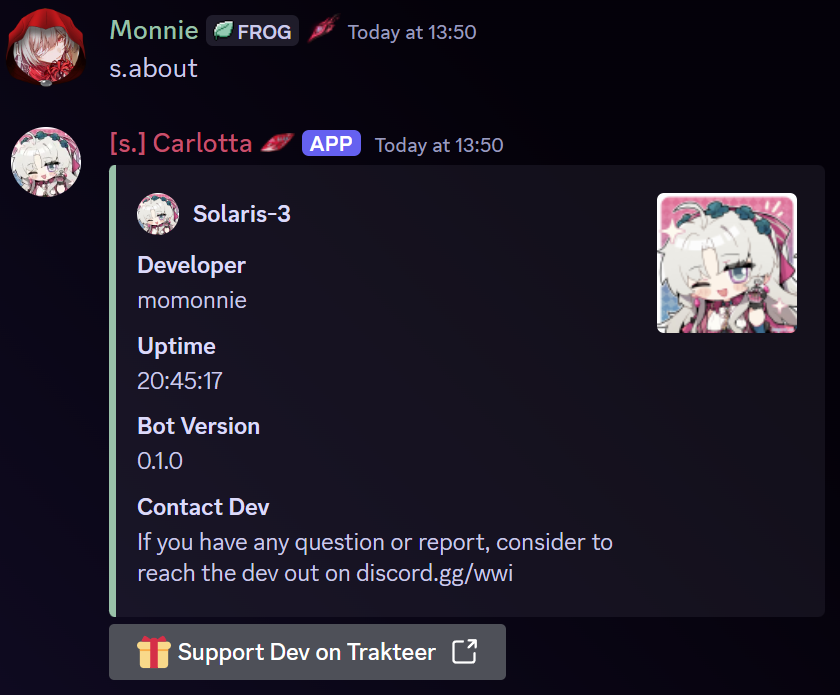
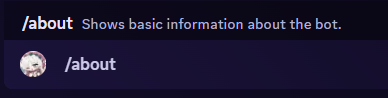
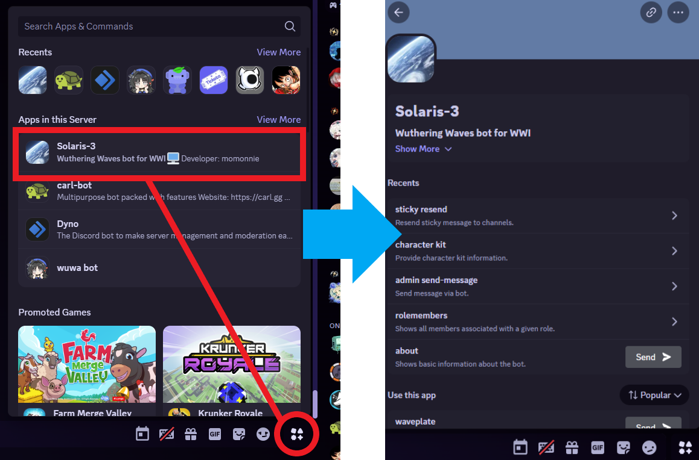
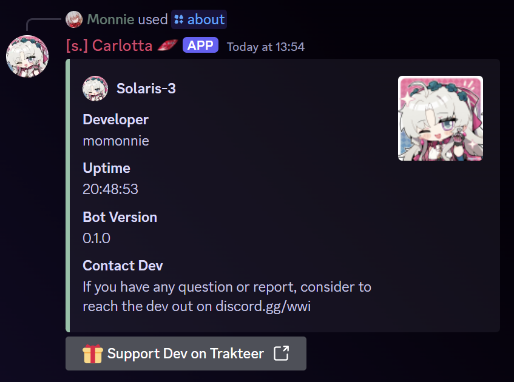

# ⚙️ Commands


FYI, currently the bot is **not public** yet and only effective when you trigger it on WWI discord server.


## Command Type

There are 2 types to call the command for the bot.



This command requires a prefix to trigger the bot.


Solaris-3 Bot has prefix `s.` or `S.`


<mark style="color:yellow;">**Example**</mark>: `s.about`

Write it on the bot channel, and then the bot will be triggered.

<figure><figcaption>
Result
</figcaption></figure>



Slash command or application command can be triggered after typing `/` first before any text in the chat.

<mark style="color:yellow;">**Example**</mark>: `/about`

<figure><figcaption>
Tyoe <code>/</code>on the chat then it will show a command suggestion. Choose your desired command.
</figcaption></figure>

The command can also be called by using an application button like this below.

<figure><figcaption></figcaption></figure>

<figure><figcaption>
Result
</figcaption></figure>



***

## Command List

Here is the table list for all available Solaris-3 bot commands that can be used by members.

<table data-full-width="true"><thead><tr><th>Name</th><th>Prefix command</th><th>Slash command</th><th>Purpose</th></tr></thead><tbody><tr><td>Help</td><td><code>s.help</code></td><td><code>/help</code></td><td>Show all available commands that can be used.</td></tr><tr><td>About</td><td><code>s.about</code></td><td><code>/about</code></td><td>Show basic information about the bot itself and the dev.</td></tr><tr><td>Weapon</td><td><code>s.weapon</code></td><td><code>/weapon &#x3C;query></code></td><td>Provide certain weapon descriptions.</td></tr><tr><td>Echo</td><td><code>s.echo</code></td><td><code>/echo &#x3C;query></code></td><td>Provide certain echo descriptions.</td></tr><tr><td>Sonata Effect</td><td><code>s.sonata</code></td><td><code>/sonata &#x3C;query></code></td><td>Provide certain sonata effect descriptions.</td></tr><tr><td>Character Kit</td><td><code>s.kit</code></td><td><code>/character kit &#x3C;resonator></code></td><td>Provide complete character kit descriptions.</td></tr><tr><td>Resonance Chain</td><td><code>s.rc</code></td><td><code>/character resonance_chain &#x3C;resonator></code></td><td>Provide complete character resonance chain descriptions.</td></tr><tr><td>Ascension Information</td><td><code>s.ascension</code></td><td><code>/character ascension &#x3C;resonator></code></td><td>Provide a poster of resonator ascension materials.</td></tr><tr><td>Waveplate Reminder</td><td><code>s.waveplate</code></td><td><code>/waveplate</code></td><td>Reminder when your waveplate is full.</td></tr><tr><td>Patch Calendar</td><td><code>s.calendar</code></td><td><code>/guide calendar</code></td><td>Provide a poster of the current patch calendar.</td></tr></tbody></table>


We actually have more commands but they are related to moderation tools so it won't be written in this documentation.


***


We are still developing more commands. So stay tuned!

