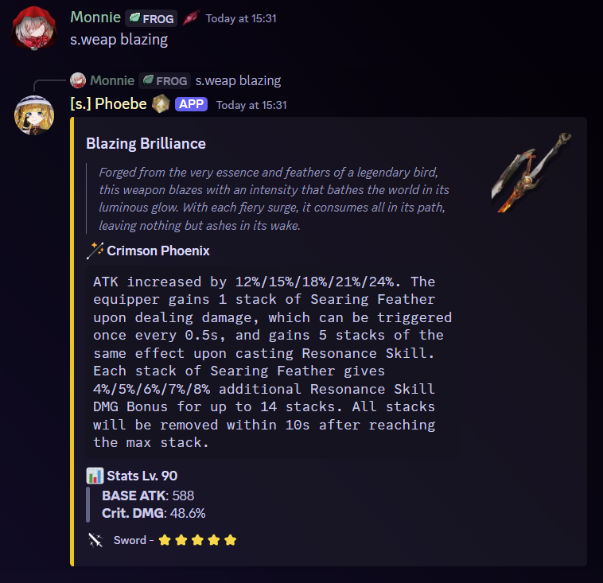
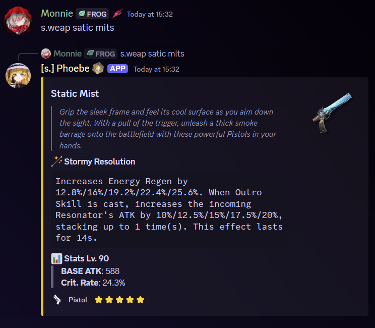

# Weapon

## Alias

`weap`

## Usage



* `s.weapon <query>`
* `s.weap <query>`



`/weapon <query>`&#x20;




You can freely input the query without worrying about entering the exact weapon name since the query will try to find the nearest similar text with your input.


## Example

<figure><figcaption>
Partial text is acceptable
</figcaption></figure>

<figure><figcaption>
It's also fine if you have small typo
</figcaption></figure>
