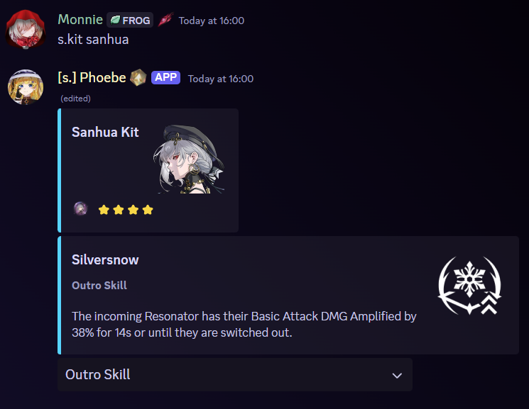
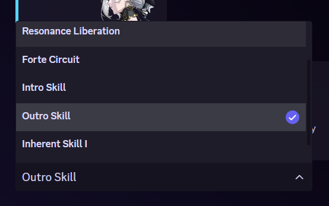

# Character Kit

## Alias

<mark style="color:red;">None</mark>

## Usage



`s.kit <resonator>`



`/character kit <resonator>`



## Example

<figure><figcaption></figcaption></figure>

<figure><figcaption>
There will be a dropdown to choose which skill you want to check.
</figcaption></figure>
