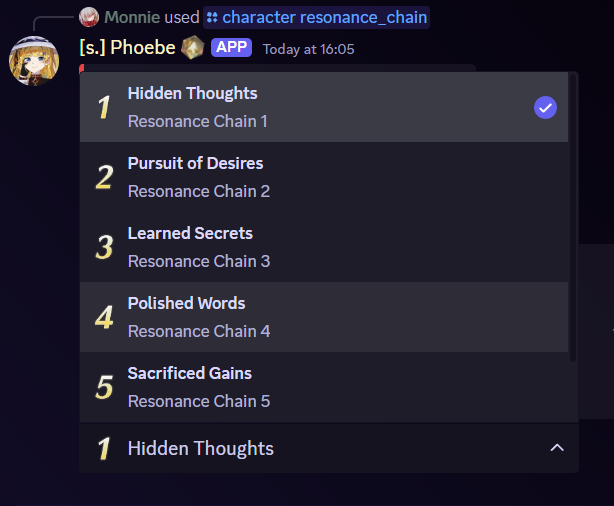

# Resonance Chain

## Alias

<mark style="color:red;">None</mark>

## Usage



`s.rc <resonator>`



`/character resonance_chain <resonator>`



## Example

<figure><figcaption></figcaption></figure>

<figure><figcaption>
There will be a drop down button where you can pick which RC you want to see.
</figcaption></figure>
