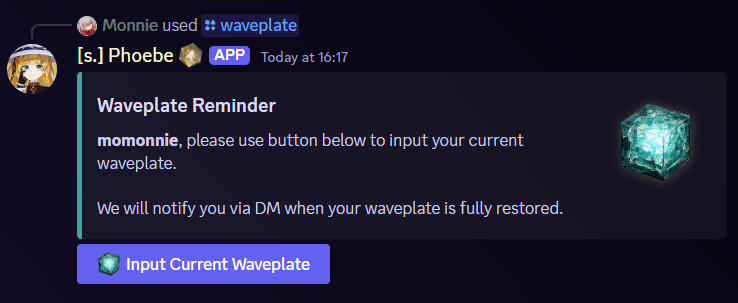
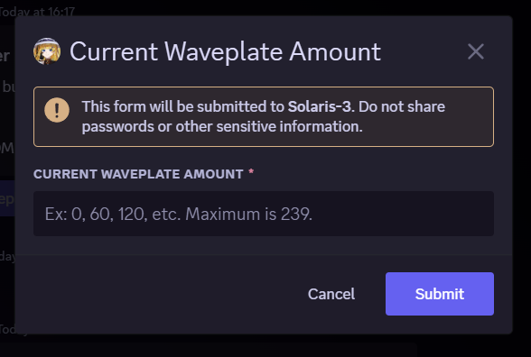
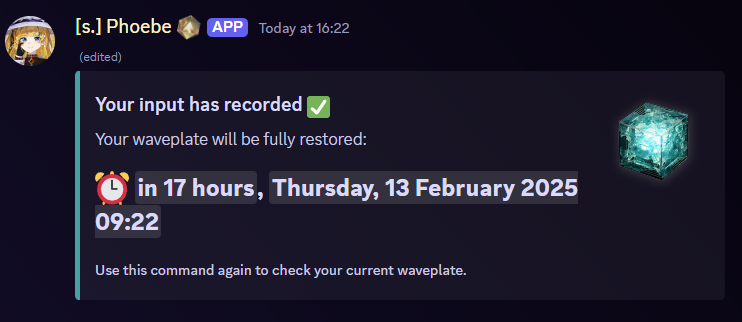
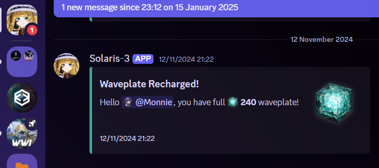
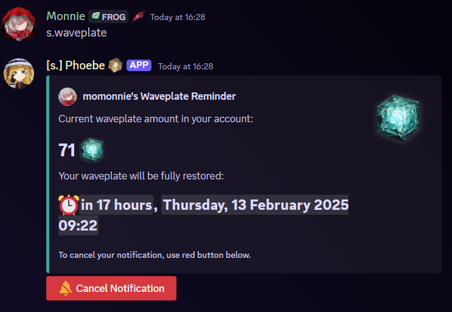
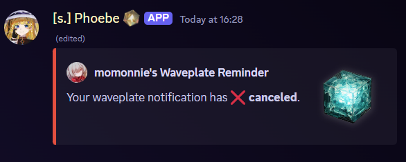

# Waveplate Reminder

## Alias

`wp`

## Usage



* `s.waveplate`
* `s.wp`



`/waveplate`



## Example

### The condition when you have not entered your waveplate amount before

<figure><figcaption>
There will be a button to press to input your current in-game waveplate amount
</figcaption></figure>

<figure><figcaption>
Input your current waveplate. Maximum is 239.
</figcaption></figure>

<figure><figcaption>
Submit then you will see the embed has changed and show you the time when your waveplate will be full.
</figcaption></figure>

<figure><figcaption>
The bot will DM and remind you when the time comes.
</figcaption></figure>

### The condition when you have entered your waveplate amount

<figure><figcaption>
Instead of asking the waveplate amount, triggering the same command will show how many waveplate your account currently have. A cancel button will be provided as well.
</figcaption></figure>

<figure><figcaption>
You can cancel the reminder whenever you want
</figcaption></figure>
