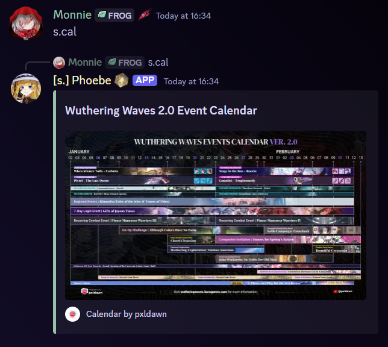

# Patch Calendar

## Alias

`cal`

## Usage



* `s.calendar`
* `s.cal`



`/guide calendar`



## Example

<figure><figcaption>
Credit to <em><strong>pxldawn</strong></em>. Check out their YT channel for the support.
</figcaption></figure>
