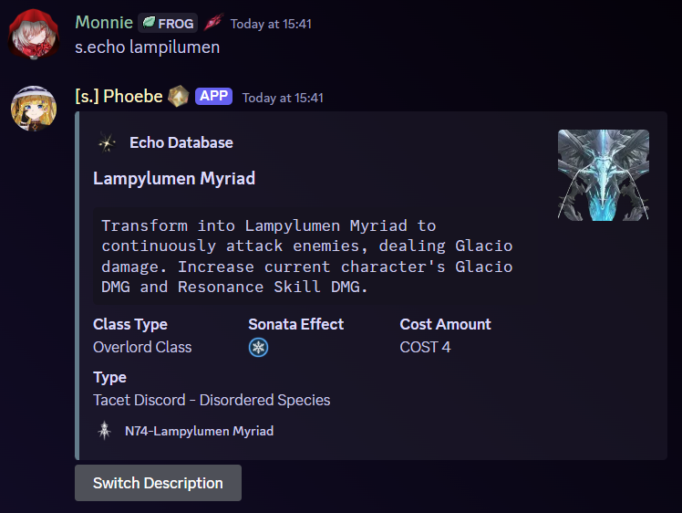

# Echo

## Alias

`ech`

## Usage



* `s.echo <query>`
* `s.ech <query>`



`/echo <query>`&#x20;




You can freely input the query without worrying about entering the exact echo name since the query will try to find the nearest similar text with your input.


## Example

<figure><figcaption>
Partial text is acceptable
</figcaption></figure>

<figure><figcaption>
Typo + partial text is also fine
</figcaption></figure>
