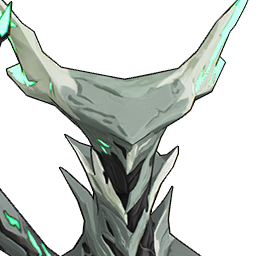

---
layout:
  title:
    visible: true
  description:
    visible: false
  tableOfContents:
    visible: true
  outline:
    visible: true
  pagination:
    visible: true
---

# Cost-1


Semua data angka Echo Skill berdasarkan status Echo Rank 5 (Gold)


## Common Class

<table data-full-width="true"><thead><tr><th width="149" align="center">Nama</th><th width="86" align="center">Icon</th><th width="85" align="center">Sonata</th><th width="113" align="center">CD (detik)</th><th>Echo Skill</th></tr></thead><tbody><tr><td align="center">Aero Predator</td><td align="center"></td><td align="center"></td><td align="center">8</td><td>Memanggil <strong>Aero Predator</strong> yang melemparkan dart ke depan. Dart akan memantul di antara musuh hingga tiga kali, memberikan <mark style="color:blue;"><strong>20,70%</strong></mark> <mark style="background-color:green;"><strong>Aero DMG</strong></mark> setiap kali mengenai musuh.</td></tr><tr><td align="center">Aero Prism</td><td align="center"></td><td align="center"></td><td align="center"></td><td></td></tr><tr><td align="center">Baby Viridblaze Saurian</td><td align="center"></td><td align="center"></td><td align="center">2</td><td>Berubah menjadi <strong>Baby Viridblaze Saurian</strong> untuk diam di tempat, dan perlahan memulihkan <strong>HP</strong>.</td></tr><tr><td align="center">Calcified Junrock</td><td align="center"></td><td align="center"></td><td align="center"></td><td></td></tr><tr><td align="center">Chest Mimic</td><td align="center"></td><td align="center"></td><td align="center">15</td><td>Memanggil <strong>Chest Mimic</strong> untuk menyerang musuh dengan <mark style="color:blue;"><strong>3</strong></mark> <strong>serangan berturut-turut</strong>, masing-masing memberikan <mark style="color:blue;"><strong>42,79%</strong></mark> <mark style="background-color:yellow;"><strong>Spectro DMG</strong></mark>.</td></tr><tr><td align="center">Chirpuff</td><td align="center"></td><td align="center"></td><td align="center">8</td><td>Memanggil <strong>Chirpuff</strong> yang mengembangdan menghembuskan <strong>angin kencang</strong> ke depan sebanyak <mark style="color:blue;"><strong>3</strong></mark> <strong>kali</strong>. Setiap hembusan memberikan <mark style="color:blue;"><strong>3</strong></mark> <mark style="background-color:green;"><strong>Aero DMG</strong></mark> dan mendorong musuh ke belakang.</td></tr><tr><td align="center">Chop Chop: Headless</td><td align="center"></td><td align="center"></td><td align="center">8</td><td>Memanggil <strong>Chop Chop: Headless</strong> untuk menyerang musuh, memberikan <mark style="color:blue;"><strong>86,40%</strong></mark> <mark style="background-color:red;"><strong>Fusion DMG</strong></mark>.</td></tr><tr><td align="center">Chop Chop: Leftless</td><td align="center"></td><td align="center"></td><td align="center">8</td><td>Memanggil Chop Chop: Leftless untuk menyerang musuh, memberikan <mark style="color:blue;"><strong>86,40%</strong></mark> <mark style="background-color:yellow;"><strong>Spectro DMG</strong></mark>.</td></tr><tr><td align="center">Chop Chop: Rightless</td><td align="center"></td><td align="center"></td><td align="center">8</td><td>Memanggil Chop Chop: Rightless untuk menyerang musuh, memberikan <mark style="color:blue;"><strong>86,40%</strong></mark> <strong>Havoc DMG</strong>.</td></tr><tr><td align="center">Clang Bang</td><td align="center"></td><td align="center"></td><td align="center">8</td><td>Memanggil <strong>Clang Bang</strong> yang mengikuti musu<strong>h</strong> dan meledakkan dirinya, memberikan <mark style="color:blue;"><strong>23,00% + 46</strong></mark> <mark style="background-color:blue;"><strong>Glacio DMG</strong></mark>.</td></tr><tr><td align="center">Cruisewing</td><td align="center"></td><td align="center"></td><td align="center">8</td><td>Memanggil <strong>Cruisewing</strong> yang memulihkan <strong>HP</strong> untuk semua karakter tim saat ini sebesar <mark style="color:blue;"><strong>1,20%</strong></mark> dari <strong>Max HP</strong> mereka ditambah <mark style="color:blue;"><strong>80</strong></mark> <strong>poin HP</strong> tambahan, hingga <mark style="color:blue;"><strong>4</strong></mark> kali.</td></tr><tr><td align="center">Diamondclaw</td><td align="center"></td><td align="center"></td><td align="center">8</td><td>Berubah menjadi <strong>Crystal Scorpion</strong> dan memasuki <strong>Parry State</strong>. Melancarkan serangan balik setelah <strong>Parry State</strong> berakhir, memberikan <mark style="color:blue;"><strong>34,50% + 69</strong></mark> <strong>Physical DMG</strong>.</td></tr><tr><td align="center">Diggy Duggy</td><td align="center"></td><td align="center"></td><td align="center">15</td><td>Berubah menjadi <strong>Diggy Duggy</strong> dan melompat ke udara untuk menghantam musuh, memberikan <mark style="color:blue;"><strong>178,80%</strong></mark> <strong>Physical DMG</strong>.</td></tr><tr><td align="center">Dwarf Cassowary</td><td align="center"></td><td align="center"></td><td align="center">8</td><td>Memanggil <strong>Dwarf Cassowary</strong> yang mengikuti dan menyerang musuh, memberikan <strong>27,6%</strong> <strong>Physical DMG</strong> sebanyak <mark style="color:blue;"><strong>3</strong></mark> kali.</td></tr><tr><td align="center">Electro Predator</td><td align="center"></td><td align="center"></td><td align="center">8</td><td>Memanggil <strong>Electro Predator</strong> untuk menembak musuh sebanyak <mark style="color:blue;"><strong>5</strong></mark> kali. <mark style="color:blue;"><strong>4</strong></mark> tembakan pertama memberikan <mark style="color:blue;"><strong>12,42%</strong></mark> <mark style="background-color:purple;"><strong>Electro DMG</strong></mark>, dan tembakan terakhi<strong>r</strong> memberikan <strong>33,12%</strong> <mark style="background-color:purple;"><strong>Electro DMG</strong></mark>.</td></tr><tr><td align="center">Excarat</td><td align="center"></td><td align="center"></td><td align="center">2</td><td>Berubah menjadi <strong>Excarat</strong> dan menggali ke bawah untuk maju. Dalam keadaan ini, pemain memiliki kemampuan untuk mengubah arah dan <strong>kebal terhadap DMG</strong>.</td></tr><tr><td align="center">Fae Ignis</td><td align="center"></td><td align="center"></td><td align="center">8</td><td>Memanggil <strong>Fae Ignis</strong> untuk menyerang musuh, memberikan <strong>86,40%</strong> <strong>Havoc DMG</strong>.</td></tr><tr><td align="center">Fission Junrock</td><td align="center"></td><td align="center"></td><td align="center">15</td><td>Memanggil <strong>Fission Junrock</strong>. Menghasilkan <strong>Resonance Effect</strong> yang <strong>memulihkan </strong><mark style="color:blue;"><strong>2%</strong></mark><strong> HP</strong> untuk unit sekutu. Jika <strong>tidak dalam pertempuran</strong>, pemain dapat mengambil <strong>mineral atau tanaman</strong> di sekitar.</td></tr><tr><td align="center">Frostscourge Stalker</td><td align="center"></td><td align="center"></td><td align="center">8</td><td>Memanggil <strong>Frostscourge Stalker</strong> untuk menyerang musuh, memberikan <strong>86,40%</strong> <mark style="background-color:blue;"><strong>Glacio DMG</strong></mark>.</td></tr><tr><td align="center">Fusion Dreadmane</td><td align="center"></td><td align="center"></td><td align="center">8</td><td>Memanggil <strong>Fusion Dreadmane</strong> yang <strong>menyerang musuh</strong>, memberikan <strong>23% + 46</strong> <mark style="background-color:red;"><strong>Fusion DMG</strong></mark>.</td></tr><tr><td align="center">Fusion Prism</td><td align="center"></td><td align="center"></td><td align="center">8</td><td>Memanggil <strong>Fusion Prism</strong> untuk menembakkan <strong>serpihan kristal</strong>, memberikan <mark style="color:blue;"><strong>23% + 46</strong></mark> <mark style="background-color:red;"><strong>Fusion DMG</strong></mark>.</td></tr><tr><td align="center">Fusion Warrior</td><td align="center"></td><td align="center"></td><td align="center">15</td><td>Berubah menjadi <strong>Fusion Warrior</strong> untuk melakukan <strong>Counterattack</strong>. Jika <strong>Counterattack</strong> berhasil, <strong>cooldown skill</strong> ini akan berkurang sebesar <strong>70,00%</strong>, dan <mark style="color:blue;"><strong>207%</strong></mark> <mark style="background-color:red;"><strong>Fusion DMG</strong></mark> akan dihasilkan.</td></tr><tr><td align="center">Galescourge Stalker</td><td align="center"></td><td align="center"></td><td align="center">8</td><td>Memanggil <strong>Galescourge Stalker</strong> yang memulihkan <strong>HP</strong> anggota tim terdekat sebesar <mark style="color:blue;"><strong>1,80%</strong></mark> dari <strong>Max HP</strong> mereka, hingga <mark style="color:blue;"><strong>3</strong></mark> kali.</td></tr><tr><td align="center">Glacio Predator</td><td align="center"></td><td align="center"></td><td align="center">8</td><td>Memanggil <strong>Glacio Predator</strong> yang melemparkan <strong>tombak es</strong>, memberikan <mark style="color:blue;"><strong>33,12%</strong></mark> <mark style="background-color:blue;"><strong>Glacio DMG</strong></mark> saat mengenai musuh. Memberikan <mark style="color:blue;"><strong>3,31%</strong></mark> <mark style="background-color:blue;"><strong>Glacio DMG</strong></mark> hingga <mark style="color:blue;"><strong>10</strong></mark> kali selama waktu pengisian, dan <mark style="color:blue;"><strong>16,56%</strong></mark> <mark style="background-color:blue;"><strong>Glacio DMG</strong></mark> saat tombak meledak.</td></tr><tr><td align="center">Glacio Prism</td><td align="center"></td><td align="center"></td><td align="center">8</td><td>Memanggil <strong>Glacio Prism</strong> yang terus-menerus menembakkan <strong>tiga serpihan kristal</strong>, masing-masing memberikan <mark style="color:blue;"><strong>27,60%</strong></mark> <mark style="background-color:blue;"><strong>Glacio DMG</strong></mark>.</td></tr><tr><td align="center">Gulpuff</td><td align="center"></td><td align="center"></td><td align="center">8</td><td>Memanggil <strong>Gulpuff</strong> yang meniup gelembung sebanyak <mark style="color:blue;"><strong>5</strong></mark> kali, masing-masing memberikan <mark style="color:blue;"><strong>5</strong></mark> <mark style="background-color:blue;"><strong>Glacio DMG</strong></mark>.</td></tr><tr><td align="center">Golden Junrock</td><td align="center"></td><td align="center"></td><td align="center"></td><td></td></tr><tr><td align="center">Havoc Prism</td><td align="center"></td><td align="center"></td><td align="center">8</td><td>Memanggil <strong>Havoc Prism</strong> untuk menembakkan lima serpihan kristal, masing-masing memberikan <mark style="color:blue;"><strong>16,56%</strong></mark> <strong>Havoc DMG</strong>.</td></tr><tr><td align="center">Havoc Warrior</td><td align="center"></td><td align="center"></td><td align="center">15</td><td>Berubah menjadi <strong>Havoc Warrior</strong> untuk menyerang hingga <mark style="color:blue;"><strong>3</strong></mark> kali, memberikan <mark style="color:blue;"><strong>123,43%</strong></mark> <strong>Havoc DMG</strong> setiap hit.</td></tr><tr><td align="center">Hoartoise</td><td align="center"></td><td align="center"></td><td align="center">2</td><td>Berubah menjadi <strong>Hoartoise</strong> dan perlahan memulihkan <strong>HP</strong>. Gunakan <strong>Echo skill</strong> lagi untuk keluar dari transformasi.</td></tr><tr><td align="center">Hocus Pocus</td><td align="center"></td><td align="center"></td><td align="center">8</td><td>Memanggil <strong>Hocus Pocus</strong> untuk menyerang musuh dengan <mark style="color:blue;"><strong>3</strong></mark> serangan berturut-turut, masing-masing memberikan <mark style="color:blue;"><strong>28,80%</strong></mark> <strong>Havoc DMG</strong>.</td></tr><tr><td align="center">Hooscamp</td><td align="center"></td><td align="center"></td><td align="center">8</td><td>Berubah menjadi <strong>Hooscamp Flinger</strong> dan melompat ke musuh, memberikan <mark style="color:blue;"><strong>34,50% + 69</strong></mark> <mark style="background-color:green;"><strong>Aero DMG</strong></mark>.</td></tr><tr><td align="center">Lava Larva</td><td align="center"></td><td align="center"></td><td align="center">8</td><td>Memanggil <strong>Lava Larva</strong> yang terus-menerus menyerang musuh, memberikan <mark style="color:blue;"><strong>27,6%</strong></mark> <mark style="background-color:red;"><strong>Fusion DMG</strong></mark> setiap kali terkena. Lava Larva menghilang ketika pemanggil diganti atau bergerak terlalu jauh.</td></tr><tr><td align="center">Lottie Lost</td><td align="center"></td><td align="center"></td><td align="center">8</td><td>Memanggil <strong>Lottie Lost</strong> untuk menyerang musuh, memberikan <mark style="color:blue;"><strong>86,40%</strong></mark> <mark style="background-color:yellow;"><strong>Spectro DMG</strong></mark>.</td></tr><tr><td align="center">Nimbus Wraith</td><td align="center"></td><td align="center"></td><td align="center">15</td><td>Memanggil <strong>Nimbus Wraith</strong> yang memulihkan <strong>HP</strong> Resonator aktif sebesar <mark style="color:blue;"><strong>1,80%</strong></mark> dari <strong>Max HP</strong> mereka, hingga <mark style="color:blue;"><strong>4</strong></mark> kali.</td></tr><tr><td align="center">Sabyr Boar</td><td align="center"></td><td align="center"></td><td align="center">8</td><td>Memanggil <strong>Sabyr Boar</strong> untuk menanduk musuh ke udara, memberikan <mark style="color:blue;"><strong>23,00% + 46</strong></mark> <strong>Physical DMG</strong>.</td></tr><tr><td align="center">Snip Snap</td><td align="center"></td><td align="center"></td><td align="center">8</td><td>Memanggil <strong>Snip Snap</strong> yang melemparkan bola api ke musuh, memberikan <mark style="color:blue;"><strong>23% + 46</strong></mark> <mark style="background-color:red;"><strong>Fusion DMG</strong></mark> saat mengenai.</td></tr><tr><td align="center">Spectro Prism</td><td align="center"></td><td align="center"></td><td align="center">8</td><td>Memanggil <strong>Spectro Prism</strong> untuk menembakkan laser yang mengenai musuh hingga <mark style="color:blue;"><strong>8</strong></mark> kali, memberikan <mark style="color:blue;"><strong>10,35%</strong></mark> <mark style="background-color:yellow;"><strong>Spectro DMG</strong></mark> setiap hit.</td></tr><tr><td align="center">Tick Tack</td><td align="center"></td><td align="center"></td><td align="center">15</td><td>Memanggil <strong>Tick Tack</strong> yang melakukan <strong>Charg</strong>e dan menggigit musuh. <strong>Charge</strong> dari <strong>Tick Tack</strong> akan memberikan <mark style="color:blue;"><strong>49,22%</strong></mark> <strong>Havoc DMG</strong> kepada musuh, dan gigitan akan memberikan <mark style="color:blue;"><strong>73,83%</strong></mark> <strong>Havoc DMG</strong> kepada musuh. Mengurangi <strong>Vibration Strength</strong> musuh hingga <strong>5,00%</strong> selama <mark style="color:blue;"><strong>5</strong></mark> detik.</td></tr><tr><td align="center">Traffic Illuminator</td><td align="center"></td><td align="center"></td><td align="center">15</td><td>Memanggil <strong>Traffic Illuminator</strong>, yang membuat musuh terhenti hingga <mark style="color:blue;"><strong>1</strong></mark> detik. <strong>Imobilisasi</strong> akan hilang begitu musuh terkena serangan.</td></tr><tr><td align="center">Vanguard Junrock</td><td align="center"></td><td align="center"></td><td align="center">8</td><td>Memanggil <strong>Vanguard Junrock</strong> yang menyerang ke depan, memberikan <mark style="color:blue;"><strong>23,00% + 46</strong></mark> <strong>Physical DMG</strong> kepada musuh di jalurnya.</td></tr><tr><td align="center">Voltscourge Stalker</td><td align="center"></td><td align="center"></td><td align="center">8</td><td>Memanggil <strong>Voltscourge Stalker</strong> untuk melakukan <mark style="color:blue;"><strong>3</strong></mark> kali serangan pada musuh, masing-masing memberikan <mark style="color:blue;"><strong>28,80%</strong></mark> <mark style="background-color:purple;"><strong>Electro DMG</strong></mark>.</td></tr><tr><td align="center">Whiff Whaff</td><td align="center"></td><td align="center"></td><td align="center">15</td><td>Memanggil <strong>Whiff Whaff</strong> yang memicu ledakan udara, memberikan <mark style="color:blue;"><strong>36,92%</strong></mark> <mark style="background-color:green;"><strong>Aero DMG</strong></mark> dan menghasilkan <strong>Low-pressure Zone</strong>. <strong>Low-pressure Zone</strong> secara terus-menerus menarik musuh di sekitar ke tengah selama <mark style="color:blue;"><strong>2</strong></mark> detik, memberikan <mark style="color:blue;"><strong>14,35%</strong></mark> <mark style="background-color:green;"><strong>Aero DMG</strong></mark> hingga <mark style="color:blue;"><strong>6</strong></mark> kali.</td></tr><tr><td align="center">Young Roseshroom</td><td align="center"></td><td align="center"></td><td align="center">8</td><td>Memanggil <strong>Baby Roseshroom</strong> yang menembakkan laser, memberikan <mark style="color:blue;"><strong>23% + 46</strong></mark> <strong>Havoc DMG</strong>.</td></tr><tr><td align="center">Zig Zag</td><td align="center"></td><td align="center"></td><td align="center">15</td><td>Memanggil <strong>Zig Zag</strong> yang meledakkan <strong>energi Spectro</strong>, memberikan <mark style="color:blue;"><strong>34,50% + 69</strong></mark> <mark style="background-color:yellow;"><strong>Spectro DMG</strong></mark> dan menciptakan <strong>Stagnation Zone</strong> yang bertahan selama <mark style="color:blue;"><strong>1,8</strong></mark> detik.</td></tr></tbody></table>

