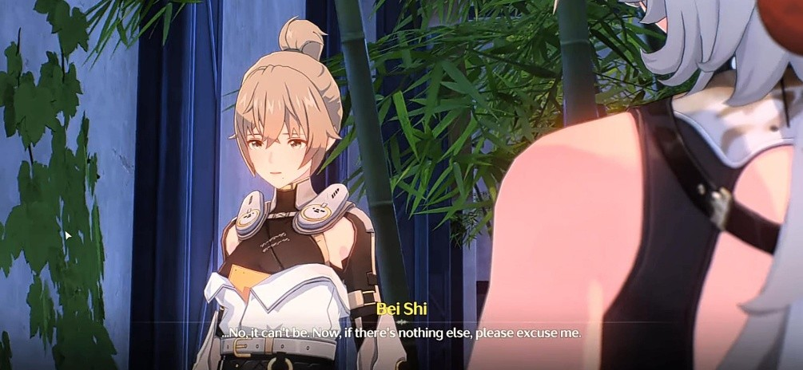

# Lingyang - Wild Heart's Return

Dua anak yang penasaran bermain dengan seorang anak remaja, nampak bertanya tanya mengenai rumor yang ada pada remaja tersebut

> &#x20;_“Mereka bilang kau punya cakar”_
>
> _“Kami dengar kau dapat mencabik monster – monster tersebut”_

Mencoba memenuhi rasa penasaran kedua anak polos tersebut, remaja tersebut mencoba mengagetkan mereka. Meskipun pada akhirnya hanya memberikan permen demi menutup kekecewaan mereka karena tak dapat membuktikan rumor yang mereka tanyakan

> _“Lihat? Dia tak menyeramkan sama sekali”_

Salah satu anak terlihat puas sambil mengonfirmasi sifat remaja tersebut pada anak yang lain—merasa penasaran mereka terpenuhi, kedua anak itu berterima kasih kepada remaja bernama Lingyang itu dan pergi.

<figure><figcaption></figcaption></figure>

Lingyang menyadari Rover yang melihat kejadian barusan, Lingyang membuka percakapan dengan menyinggung bau Rover...

> _“Hmm... Baumu asing, namun sangat kuat, dan murni“_

Lingyang mencoba berkenalan dengan mengajak berjabat tangan dengan Rover. (Ada 2 opsi yang berbeda dengan respon masing masing tergantung pilihan pemain)

Menerima jabat tangan

_“Kau benar benar berbeda dengan orang lain”_

_“Jadi kita telah berjabatan, sekarang kita berteman!”_

Menolak jabat tangan

_“Hmm... Bahkan kau juga takut padaku...”_

_“Omong omong, selamat datang di kota Jinzhou”_

<figure><figcaption></figcaption></figure>

Menanyakan apa yang dilakukannya, Lingyang menjelaskan bahwa saat ini ia sedang mempersiapkan acara besar yang akan dilakukan keesokan hari. Lingyang merupakan bagian dari _<mark style="color:blue;">**Liondance Troupe**</mark>_, sebuah rombongan yang mendedikasikan diri mereka pada pementasan Liondance, salah satu tradisi kita Jinzhou.

Merasa lapar, Lingyang mengajak Rover untuk ditraktir di perjalanan sambil menunjukkan kegiatan **Liondance Troupe**. Rover  merasa agak curiga dengan perlakuan baik Lingyang terlepas dari ini merupakan pertemuan pertama mereka. Namun lingyang meyakinkannya kalau ini hanyalah salah satu bentuk kebiasaan warga Jinzhou untuk menyambut dengan baik orang luar sebagai cara menunjukkan keramahan mereka.

<figure><figcaption></figcaption></figure>

Namun sebelum itu, Lingyang ingin menyelesaikan beberapa hal seperti permintaan pentas yang jadwalnya saling bertabrakan. Dengan seberapa pentingnya tradisi pentas Liondance di kota Jinzhou, ia tak bisa mengabaikan permintaan mereka dan berakhir memiliki ide untuk menyatukan semua jadwalnya menjadi satu pentas yang besar.

Lingyang  Rover untuk pergi bersamanya, ia ingin mendengar secara langsung permintaan khusus setiap klien sekaligus menyampaikan ide yang disampaikan barusan. Dan juga, mengajak Rover berkeliling menikmati makanan di kota Jinzhou.

Menyetujui ajakannya, mereka bergegas pergi menuju klien pertama. Klien pertama yang bernama Ganxue ingin merayakan ulang tahun kakeknya yang ke 60 tahun, maka dari itu Lingyang akan melakukan 6 putaran berturut – turut sebagai simbolisasi 6 dekade kehidupan yang telah dijalani sang kakek

<figure><figcaption></figcaption></figure>

Menuju klien kedua, kali ini permintaan datang dari sepasang kekasih yang ingin merayakan pernikahan mereka dengan pentas Liondance. Pentas yang ingin dilakukan adakah simbolisasi dari sumpah kedua pasangan untuk mengeratkan hubungan mereka selamanya, namun karena pentas yang diharuskan menyatukan semua permintaan klien maka Lingyang harus membuat jenis aksi yang lebih sederhana. Ia menawarkan agar kedua pasangan untuk saling bertukar koin disaat kepala sang singa mencapai tempat tertinggi dikala pentas, yang mana Lingyang menyimbolkan itu sebagai:

> _“Hingga ujung dunia hati kalian sejajar, hingga tepi langit takdir kalian terjalin!”_

Memahami situasinya, sang klien kedua yang bernama Linling menyetujui hal tersebut.

<figure><figcaption></figcaption></figure>

Melanjutkan pekerjaannya, mereka berdua pergi menemui Shuncai, klien berikutnya yang merupakan pemilik sebuah kedai makanan. Sesampainya disana Lingyang langsung menjelaskan sedikit situasinya namun Shuncai memahami situasinya dan mengatakan untuk tak usah terlalu memikirkan dirinya dan fokus pada pentas lain. Mengalihkan topik, ia menawarkan makanan pada kedua tamunya tersebut— saat memakannya, Lingyang berencana untuk memesan makanan untuk para penonton

Menurutnya itu ide yang bagus, namun ia merasa kesulitan untuk mengumpulkan bahan bahan dikarenakan ada rumor bahwa terdapat monster bernama _<mark style="color:blue;">**Jingle Beast**</mark>_ yang berkeliaran di hutan belakangan ini. Terlepas dari namanya yang bersahabat, mereka membunyikan semacam suara lonceng saat berburu dan dikatakan makhluk tersebut memiliki taring sepanjang setengah meter lebih

> _“Bukan, itu tidak benar. **Jingle Beast** tak berpenampilan seperti itu”_

Lingyang membantahnya, setelahnya dengan ragu mengatakan bahwa itu adalah temannya saat ditanya oleh Rover jika dia mengetahui sesuat

Shuncai membutuhkan bahan bahan tersebut untuk membuat makanan yang diinginkan Lingyang, namun apa yang tersedia sekarang telah dimonopoli oleh sekumpulan The Exiles yang memasang harga sangat tinggi pada daging – daging tersebut

Lingyang terlihat melamun saat ditanya, namun mengatakan ada hal darurat yang harus diselesaikannya dan langsung pergi disaat itu juga. Rover merasa heran dengan sikapnya, namun dengan santai penjaga kedai mengatakan kalau seperti itulah Lingyang. Ia merupakan anak yang spontan, selalu melakukan apa yang terpikirkan olehnya— ia hanya senang membantu orang orang, sering terlihat berlarian kesana kemari membantu siapapun yang membutuhkan

<figure><figcaption></figcaption></figure>

Shuncai meminta tolong kepada Rover untuk menyusul Lingyang setelah menyelesaikan makanannya— menyusul Lingyang, Rover melihat ia berbicara dengan seorang klien wanita bernama Bei Shi. Namun saat ditanya, klien tersebut menyatakan kalau ia tidak pernah mereservasi pentas Liondance apapun. Lingyang mengingat – ingat kembali dan sadar bahwa yang memesannya adalah benar dari keluarga wanita tersebut namun yang menghubunginya merupakan seorang pria dewasa, lantas apa yang sebenarnya terjadi?

<figure><figcaption></figcaption></figure>

<figure><figcaption></figcaption></figure>

&#x20;Pria tersebut ternyata adalah saudara dari sang wanita, Bei Ji. Mereka berdua sempat bertengkar, sang kakak pergi meninggalkan rumah selama seminggu dan tak terlihat lagi selama itu. Meskipun begitu, Bei Shi masih sering dikirimkan berbagai jenis paket seperti bunga dan daging yang kualitasnya cukup buruk. Ia mengatakan bahwa sang kakak pergi bersama kelompok The Exiles, ia tak mengatakan pada siapapun karena takut hal ini akan membawa masalah pada sang kakak.

Lingyang memutuskan membantunya untuk mencari sang kakak melalui paket yang dikirimkan nya, sang adik yang merasa khawatir juga ingin mengikuti mereka— namun Lingyang melarangnya dikarenakan hal ini terlalu berbahaya dan akan lebih baik jika ia dan Resonator sekuat Rover yang membereskannya. Meskipun begitu ia tetap memaksa ingin ikut, dan dengan sedikit keraguan Lingyang meminta persetujuan dengan Rover apa hal ini akan terlalu merepotkannya nanti, Rover tak masalah dengan hal tersebut dan mereka pun memulai pencarian mereka.

Memulai pencarian dari luar kota, mereka menemukan kurir yang bertanggung jawab atas pengiriman paket sang kakak sedang diserang oleh sekumpulan TD. Segera menyelamatkannya, mereka mulai menanyakan berbagai hal seperti paket yang dikirimkannya sampai mengenai **Jingle Beast** dan The Exiles. Sang kurir menyatakan dia tak tau apapun mengenai paket tersebut dan agak panik saat ditanya untuk memastikan asal paketnya, dia juga tak mau mengatakan apapun tentang lokasi The Exiles karena dianggap membocorkan rahasia klien.

<figure><figcaption></figcaption></figure>

Namun satu hal yang dapat disampaikannya, The Exiles dirumorkan dapat berkomunikasi dengan **Jingle Beast** sehingga mereka dapat menyuruhnya menyerang orang – orang sekitar. Merasa cukup dengan informasi yang diberikannya, sang kurir pergi sambil berterimakasih...

<figure><figcaption></figcaption></figure>

Mengikuti petunjuk yang ada, mereka mencari kemah Exiles terdekat dan diam – diam menyusup sambil menguping pembicaraan orang – orang disana. **Jingle Beast** yang para Exiles itu bicarakan nyatanya hanyalah rumor belaka yang mereka sebarkan untuk menipu orang baru, tak lama mereka langsung pergi menuju suatu tempat...

Lingyang dan kawan-kawan lanjut menyelidiki kemah yang mereka tinggalkan dan menemukan device milik sang kakak tergeletak disana, pendatang baru yang mereka maksud ternyata adalah sang kakak. Sang adik terkejut tidak percaya bahwa kakaknya benar – benar bekerja pada orang orang tersebut. Melanjutkan penyelidikan, mereka menemukan taring palsu yang digunakan Exiles untuk menyebarkan rumor palsu tentang **Jingle Beast**. Mereka juga menemukan daging busuk yang mereka jual dengan harga sangat tinggi

<figure><figcaption></figcaption></figure>

Merasa situasi semakin rumit, mereka memutuskan untuk berpencar. Lingyang mencoba mengikuti Exiles dan melihat apa yang mereka lakukan untuk mencegah korban lain yang mereka jebak, sementara Rover tetap bersama Bei Shi untuk mencari sang kakak

Lingyang pergi, meninggalkan mereka berdua. Bei Shi Ingin mengecek device yang mereka baru saja temukan karena mungkin saja ada pesan yang tertinggal didalamnya, dan ternyata ada pesan hologram yang berisi:

> _“Maaf, Bei Shi.... Aku menghalangi dirimu dan mimpimu”_
>
> _“Mungkin kau benar, kakakmu hanyalah pengecut yang egois”_
>
> _“Aku tidak meminta permintaan maafmu... Tapi tetap saja... Aku ngin Melakukan sesuatu untukmu”_
>
> _“Selamat tinggal, Beli Shi... Aku akan membunuh **Jingle Beast** itu.... Untuk dirimu”_

Pesan berakhir.

Suaranya terdengar dengan rasa bersalah, sang adik menduga hal itu dikarenakan keputusannya menjadi bagian dari **Pioneer association** yang mana hak itu sangat ditentang oleh sang kakak. Dan untuk alasan mengapa ia ingin membunuh **Jingle Beast**, tidak ada yang tau...

<figure><figcaption></figcaption></figure>

Disaat yang bersamaan, mereka mendengar suara bel berdering di sekitar. Bei Shi merasa ketakutan mengatakan kalau **Jingle Beast** berada di dekat mereka— ia yakin dikarenakan tempo hari lalu saat ia sedang dalam sebuah misi, ia diserbu oleh gerombolan TD. Dan disaat sedang berjuang keras untuk kabur, ia terus mendengar deringan bel ya g seolah mengejarnya tanpa henti hingga ke tempat tenang. Meskipun ia tak melihatnya secara langsung dikarenakan kepanikan luar biasa dan fokusnya yang terpaku hanya ingin kabur dari sana.

<figure><figcaption></figcaption></figure> <figure><figcaption></figcaption></figure>

Rover menenangkannya dan menemaninya pergi ke sumber suara, namun hanya melihat Lingyang yang berdua disana menunggu kedatangan mereka— tak ada tanda – tanda keberadaan **Jingle Beast**...

<figure><figcaption></figcaption></figure>

Lingyang mengalihkan topik dan menyampaikan hal yang ia temukan, para Exiles pergi ke sebuah gua bersama sang kakak untuk melakukan sesuatu. Lingyang ingin meminta bantuan Rover untuk ikut pergi kedalam dikarenakan sang kakak kemungkinan sedang dalam bahaya besar, ia meminta sang adik untuk pergi kembali ke kota untuk memanggil petugas keamanan ke gua itu— dengan berat hati ia menyetujuinya dan kembali.

Berfokus pada pencarian, Rover dan Lingyang melewati berbagai halangan rumit untuk mencapai tempat terdalam gua tersebut hingga Sampai ke sebuah ruang besar.

<figure><figcaption></figcaption></figure>

Terlihat Exiles yang sedang mengejar Bei Ji dikarenakan dia mengetahui kebenaran dibalik rumornya— singkat cerita, Lingyang dan Rover mengalahkan para Exiles dan menyerahkan mereka pada penjaga yang telah sampai kesana. Sang kakak beradik tersebut akhirnya bisa bertemu kembali.

<figure><figcaption></figcaption></figure>

Mereka kembali ke kota, alasan sang kakak terobsesi dengan **Jingle Beast** dikarenakan sang kakak menduga makhluk tersebut adalah alasan mengapa sang adik kehilangan keberaniannya. Hal itu pula yang membuatnya termakan oleh rumor Exiles dan bergabung dengan mereka, pada akhirnya ya tak mencapai apapun dan merasa menyesal karena hanya bisa terpuruk dalam kecemasan dan ketakutan. Namun lingyang menyemangati nya karena paling tidak ia memiliki sifat manusiawi yang kuat untuk membuktikan keberanian atas aksinya

Hal – hal yang terjadi membuatnya memahami bahwa **Jingle Beast** hanyalah rumor belaka dan tidak nyata, namun meskipun begitu sang adik masih membantah karena beberapa saat lalu ketika bersama dengan Rover ia masih mendengar suara bel berdering yang menjadi ciri khas kemunculan makhluk itu. Meski pada akhirnya mereka memutuskan untuk kembali saja, Lingyang juga mengingatkan sebelumnya agar mereka datang ke pentas Liondance esok.

***

Hari esok tiba dan Lingyang terlihat sangat sibuk mempersiapkan diri untuk pentas, Rover berkeliling melihati antusiasme orang orang yang menunggu pementasan dimulai. Rover menemui Lingyang sebelum acara dimulai, ia penasaran mengapa Liondance sangatlah penting bagi warah Jinzhou?

> _“Pertunjukan tarian singa bermula sebagai cara untuk menghibur tentara yang pulang dan meningkatkan semangat mereka sebelum pertempuran”_

> _“Seiring berjalannya waktu, tradisi ini berkembang menjadi cara untuk meningkatkan semangat tentara sebelum pertempuran, yang melambangkan keberanian dan harapan akan kemenangan”_

> _“Kemudian, tradisi ini bertransformasi menjadi pertunjukan meriah yang kita lihat hari ini, namun tetap bertujuan untuk mengusir nasib buruk, mengusir ketakutan, dan mewariskan kemakmuran serta perlindungan kepada generasi mendatang”._

Lingyang menjelaskan dengan semangat, ia juga menjelaskan hubungan dari acara ini juga dapat membantu Bei Shi mengatasi rasa takutnya pada **Jingle Beast** yang sebenarnya tak pernah mengejarnya, Namun semata mata hanyalah memori palsu yang diakibatkan kepanikan luar biasa.

<figure><figcaption></figcaption></figure>

<figure><figcaption></figcaption></figure>

Lingyang memulai pementasannya, sudut pandang Lingyang beralih pada salah satu aksinya di masa lalu yang menyelamatkan seorang wanita dari sekumpulan TD di suatu malam...

<figure><figcaption></figcaption></figure>

Pementasan berakhir dengan sangat meriah, Lingyang bertemu kembali dengan kakak beradik dan Rover yang menunggunya. Sang adik mengatakan kalau saat ia dikejar kejar dari segerombolan TD hal yang ia dengar kala itu adalah deringan bel seiring dengan pelariannya, dia sempat mengira kalau suara bel tersebutlah yang mengejarnya Namun sekarang ia yakin bahwa sumber suara tersebut adalah makhluk yang melindunginya saat kejaran para TD. Lingyang merasa senang karena sang adik mendapat keberaniannya kembali dan hubungan bersaudara tersebut kembali membaik.

<figure><figcaption></figcaption></figure>

Rover ingin menanyakan sesuatu kepada Lingyang jadi mereka pergi ke suatu tempat yang sepi, ia ingin bertanya mengenai **Jingle Beast** dan Lingyang pun menjawab

> _“Dikarenakan adanya manusia dengan Resonance Ability”_
>
> _“Maka apa akan ada makhluk buas dengan kemampuan yang sama?”_

Hewan buas yang dapat mengendalikan kemampuan Resonance nya sangatlah jarang, namun mereka ada— Lingyang menceritakan sedikit sejarah dari **Jingle Beast** yang dulunya dikenal sebagai _<mark style="color:blue;">**Suan’ni**</mark>_. Dahulu kala, **Suan’ni** hidup dengan tenang jauh di kedalaman hutan di luar kehidupan manusia. Namun kehadiran Tacet Field dan TD menghancurkan tanah mereka hidup, memaksa mereka masuk ke pemukiman manusia. Dengan kemampuan dan penampilan mereka yang mengerikan, **Suan’ni** dicap sebagai makhluk jahat hingga mengancam populasi mereka sampai hampir punah.

Saat ditanya darimana ia tau seluruh informasi ini Lingyang hanya menjawab kalau ia membacanya di sebuah buku Huanglong. Ia meneruskan kalau menurut arkeolog, Suan’ni terakhir mungkin saja masih hidup dan mencoba berbaur dengan manusia dengan pendekatan nya sendiri

> _“Kemudian, ia menarik habis semua bulunya, mengikir kukunya, mematahkan  tulang-tulangnya, dan belajar untuk berdiri tegak...”_

> _“Mengapa ia begitu ingin menjadi manusia?”_

> _“Mungkin... Ia tertarik oleh hiruk-pikuk dan kegembiraan kota-kota manusia. Pasti ia merasa kesepian sebagai yang terakhir dari jenisnya.”_
>
> _“Mungkin ia tergerak oleh keberanian manusia melawan The Lament, dan ingin menawarkan bantuan. Mungkin ia ingin melawan bencana yang menghancurkan tanah kelahirannya yang dulu”_

Meskipun pada akhirnya, makhluk tersebut tak dapat menjadi manusia. **Jingle Beast** tersebut tak peduli lagi dengan penampilannya dan hidup menjadi dirinya sendiri, ia menyadari bahwa hatinya lah yang menjadi esensi sebuah manusia. Dan dengan penampilannya, ia sudah tak lagi menolak dirinya sendiri dan membantu orang lain dengan kemampuannya

Selesai bercerita, Lingyang memberi hadiah sepasang bel sebagai kenang kenangan untuk Rover. Mereka berjabat tangan dan Lingyang pergi untuk mempersiapkan pentas berikutnya.... Lingyang meminta Rover untuk menyimpan bel tersebut agar sebagai pembawa keberuntungannya...

<figure><figcaption></figcaption></figure>

<figure><figcaption></figcaption></figure>

| \*\*\* |
| :----: |


:notebook: **GLOSARIUM**

* Jingle Beast

> Ras makhluk asli Huanglong yang menghuni pepohonan Violet Banyan di Dim Forest pada dahulu kala. Memiliki suara bergemerincing seperti bel.

* Liondance Troupe

> Grup pertunjukan dan pementasan keliling di Huanglong. Terkenal dengan pertunjukan Liondance mereka.

* Suan'i

> Sebutan lama untuk para Jingle Beast

