# Act 2: Echoing Marche

Menyambut pagi yang cerah di kota Jinzhou, Rover, Yangyang, dan Chixia menikmati sarapan di restoran Panhua. Chixia memesan mi pedas untuk mereka bertiga. Sambil mengobrol santai dan menikmati makanan, mereka membahas kejadian yang terjadi kemarin.

<figure>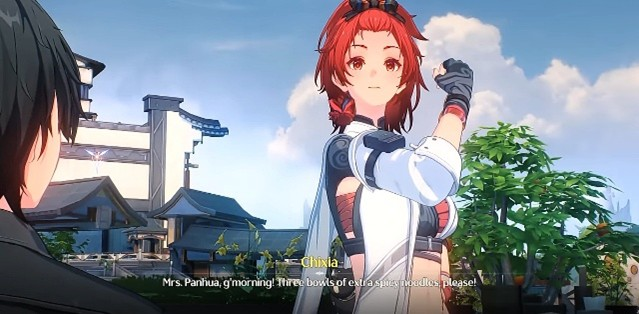<figcaption></figcaption></figure>

Mereka telah berhasil memecahkan teka-teki tentang **Sundial** dan **Sugar Pearl**, sehingga kini hanya tersisa misteri _daun aneh_ dan _manggis_ yang perlu diungkap. Yangyang menyampaikan bahwa buah manggis bukan berasal dari Jinzhou, jadi mereka dapat melacaknya melalui pelabuhan terdekat tempat buah tersebut didistribusikan. Sementara untuk daunnya, Baizhi sempat mengatakan bahwa daun tersebut memiliki frekuensi **TD**. Dari situ, Yangyang menyimpulkan bahwa daun tersebut kemungkinan berasal dari pohon yang tumbuh di dekat sebuah **Tacet Field**.

<figure><figcaption></figcaption></figure>

Yangyang menyarankan untuk pergi keluar kota, namun Rover tidak ingin terburu-buru karena mereka masih memiliki waktu. Ia memutuskan untuk menceritakan “mimpi” yang dialaminya sebelum bertemu dengan Yangyang—dimulai dari sosok wanita berambut hitam, lautan bintang, **Etheric Sea**, dan kemampuan resonansi yang mengalir dari **Tacet Mark** di tangan kanannya.

Yangyang agak terkejut mendengarnya. Berdasarkan penjelasan Rover, wanita tersebut mungkin merupakan kunci bagi ingatan Rover, **Etheric Sea**, serta aliran kemampuan resonansinya yang tampaknya menuju ke suatu arah yang nyata. Kemungkinan besar arah itu menunjuk ke **Gorges of Spirits** dan **Norfall Barrens**. **Gorges of Spirits** adalah tempat di mana Yangyang pertama kali menemukan Rover, sedangkan **Norfall Barrens** dulunya merupakan medan peperangan melawan **Threnodian**, sekaligus sumber wabah **TD**. Pasukan **Midnight Rangers** juga ditempatkan di wilayah tersebut.

Rover kemudian menyinggung kembali soal akses yang diberikan oleh **Magistrate**, yang memungkinkan mereka untuk pergi keluar kota. Memahami maksud dari akses itu, mereka pun segera memikirkan untuk berangkat ke luar kota.

Sesampainya di sana, Yangyang menyadari bahwa pertahanan gerbang kota semakin diperketat dibanding saat terakhir kali ia datang. Tak jauh dari situ, terlihat seorang wanita sedang berselisih dengan seorang penjaga. Dari percakapan mereka, diketahui bahwa wanita tersebut telah berjanji kepada seseorang untuk mencari cucunya yang hilang di garis depan. Namun, penjaga tetap tidak mengizinkannya lewat karena situasi berbahaya yang sedang terjadi di **Norfall Barrens**. Ia meminta wanita itu untuk menunggu laporan dari orang yang dimaksud, apalagi wanita tersebut tidak memiliki akses keluar kota saat ini.

<figure>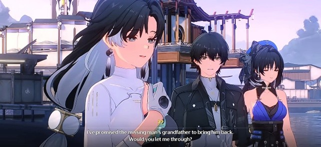<figcaption></figcaption></figure>

Tak lama kemudian, seorang petugas mengonfirmasi akses milik Rover. Wanita tadi pun mendekat dan memperkenalkan dirinya sebagai **Jianxin**. Ia meminta ikut bersama Rover karena tidak memiliki akses sendiri, dan menyebutkan beberapa keahlian yang mungkin bisa membantu perjalanan mereka. Rover menyetujui permintaannya, dan setelah mendapat izin dari petugas, mereka berangkat bersama. Jianxin pun mengucapkan terima kasih kepada mereka.

<figure>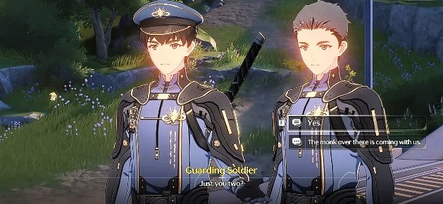<figcaption></figcaption></figure>

Dalam perjalanan, Jianxin menjelaskan bahwa tujuannya keluar kota adalah untuk mencari cucu seorang veteran yang hilang. Ia berkata bahwa ia tidak bisa membiarkan seseorang seperti cucu itu begitu saja terlupakan, meskipun ia belum mengenalnya, bahkan belum pernah bertemu dengannya.

Rover sempat bertanya kepada Jianxin mengenai manggis, namun tidak mendapatkan informasi yang berarti. Ia lalu bertanya lebih jauh tentang Jianxin sendiri. Jianxin menjelaskan bahwa ia dibesarkan di sebuah sekte yang berada di pegunungan. Suatu hari, ia diberitahu bahwa berlatih di gunung saja tidak cukup baginya. Oleh karena itu, ia memulai perjalanannya menjelajahi berbagai tempat untuk meningkatkan kemampuannya.

Menurut Jianxin, orang yang ia cari terakhir kali terlihat di **Desorock Highland**. Ia mengucapkan terima kasih kepada Rover karena telah membantunya meninggalkan kota.

Setelah keluar dari kota, mereka bertemu dengan seorang anggota **Midnight Rangers**. Jianxin langsung menanyakan tentang orang yang sedang ia cari—kebetulan, anggota tersebut mengenali orang itu. Rupanya, yang mereka cari adalah orang biasa yang sangat ingin bergabung dengan **Midnight Rangers** dan telah mengikuti mereka selama setahun. Kemungkinan besar, orang itu berada di barisan belakang, karena mereka tidak akan membiarkan warga sipil berada di garis depan dan terbunuh begitu saja. Jianxin berterima kasih atas informasinya. Sebagai balasan, anggota tersebut meminta mereka untuk memeriksa _suar pendeteksi_ yang tampaknya tidak aktif di sepanjang rute perjalanan mereka.

***

Mereka sampai di salah satu _suar pendeteksi_ yang rusak. Terlihat beberapa orang sedang membongkar dan merusak alat tersebut. Rover dan yang lainnya mengalahkan mereka. Ternyata, orang-orang tersebut adalah anggota _<mark style="color:blue;">**The Exiles**</mark>_ yang berusaha menjual peralatan militer di tengah kondisi perang, saat para prajurit sedang bertarung di garis depan.

<figure>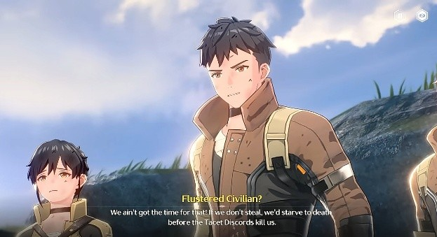<figcaption></figcaption></figure>

Setelah pertempuran, terjadi sedikit perdebatan mengenai tindakan **Exiles** yang dianggap dapat membahayakan banyak nyawa. Jianxin merasa iba dan memberikan mereka sedikit uang serta makanan, agar mereka bisa pergi ke kota Jinzhou. Meskipun awalnya tidak disambut dengan baik dan sempat terjadi pertengkaran kembali, pada akhirnya kelompok **Exiles** tersebut berhasil diusir.

<figure>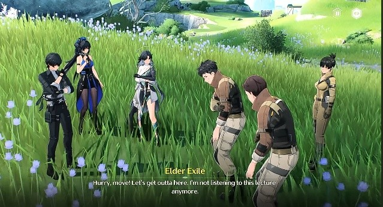<figcaption></figcaption></figure>

Setelah memperbaiki alat pendeteksi itu, mereka melanjutkan perjalanan ke sebuah markas garis belakang. Di sana, mereka berbicara dengan seorang staf yang terlihat sangat sibuk menghadapi kekacauan dan beban tugas yang tidak ada habisnya—mulai dari urusan suplai, keperluan medis, hingga penanganan banyaknya prajurit yang terluka.

Yangyang mencoba memperkenalkan diri di sela kesibukan staf perempuan tersebut, namun wanita itu segera meminta bantuan mereka untuk menangani beberapa pasien, karena ia harus segera menangani seorang _Resonator_ yang mengalami **Overclock**.

<figure>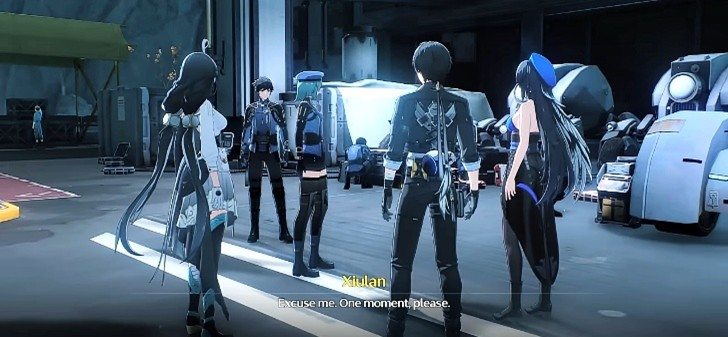<figcaption></figcaption></figure>

Mereka memutuskan untuk membantu, dan masing-masing membawa satu prajurit terluka ke personel medis yang tersedia. Setelah menyelesaikan tugas tersebut, Jianxin sempat mengobrol sejenak dengan petugas medis. Petugas itu kemudian menceritakan bagaimana kondisi yang terjadi di lapangan...

<figure>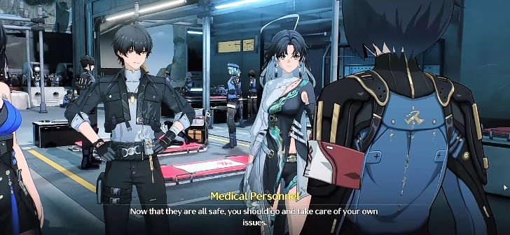<figcaption></figcaption></figure>

> “Jangan khawatir. Mereka sudah menerima perawatan yang tepat sekarang. Mereka akan pulih seiring waktu. Berkat Jenderal Jiyan, jumlah korban telah menurun secara signifikan.”
>
> “Saya mendengar dari para veteran bahwa prajurit kita dulunya hanyalah orang biasa, bukan seorang _Resonator_. Pertempuran saat itu begitu brutal, bahkan bau darah tetap terasa meski hujan turun.”
>
> “Namun, situasinya kini telah membaik. Setiap luka adalah bukti dari banyaknya _Tacet Discord_ yang berhasil disingkirkan oleh para prajurit pemberani kita.”
>
> “_Resonator_ di **Midnight Rangers** adalah para prajurit luar biasa. Jika ada dari mereka yang harus mundur karena luka, itu berarti mereka telah mengalahkan ratusan musuh sebelumnya.”

Petugas medis tersebut mengucapkan terima kasih kepada Jianxin atas bantuannya. Setelah itu, mereka pergi menemui seorang intendan yang bertugas di tempat tersebut. Ia tampak sama sibuknya dengan wanita yang mereka temui sebelumnya, sibuk mengatur berbagai kebutuhan untuk mendukung garis depan.

<figure>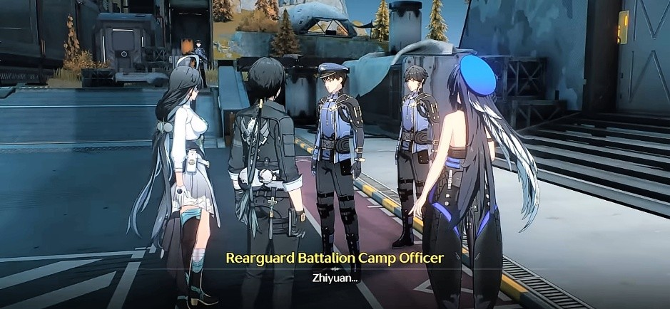<figcaption></figcaption></figure>

Mereka menanyakan tentang orang yang sedang dicari oleh Jianxin. Petugas tersebut ternyata mengenal orang yang dimaksud. Ia sedikit bercerita bahwa anak itu selalu mengikuti mereka, meskipun telah dipulangkan berkali-kali. Namun, dengan kondisi pertempuran yang semakin mengerikan, ia berniat memulangkannya kembali ke kota. Ia ingat bahwa anak tersebut berada di lantai atas.

Mereka segera bergegas naik. Namun sebelum itu, petugas tersebut terkejut melihat apa yang sedang dipegang oleh Rover. Ia menyangka Rover membawa granat, padahal yang dibawa hanyalah sebuah manggis. Karena penasaran dengan pernyataan itu, Rover menanyakan asal-usul buah tersebut. Petugas menjelaskan bahwa manggis tidak berasal dari kota ini, dan biasanya diperoleh melalui jalur impor.

Setelah itu, Rover kembali bertemu dengan Jianxin yang telah berhasil menemui pria yang ia cari. Jianxin berhasil meyakinkan pria tersebut untuk pulang ke kota melalui sebuah pertarungan _sparring_. Ia menyadarkan pria itu akan perbedaan besar kemampuan antara seorang _Resonator_ dan orang biasa. Pria itu pun akhirnya bersedia mengikuti Jianxin kembali ke Jinzhou.

Jianxin berpamitan kepada Rover dan Yangyang, lalu kembali ke kota Jinzhou bersama pria tersebut.

<figure>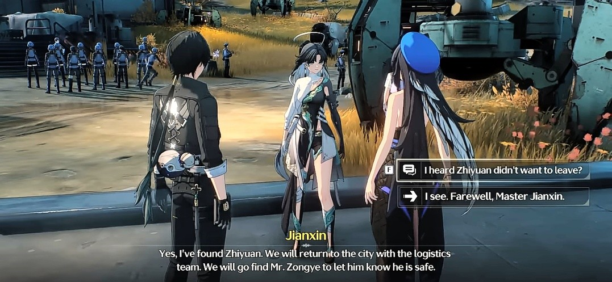<figcaption></figcaption></figure>

Setelah kepergian Jianxin, Yangyang bertanya-tanya tentang maksud sang Magistrate mengarahkan mereka ke tempat ini, dan apa yang sebenarnya harus mereka lakukan. Rover lalu menceritakan informasi yang baru saja ia dapatkan dari petugas sebelumnya, mengenai rute transportasi manggis yang berasal dari wilayah selatan. Ia juga menyebutkan kemungkinan lain: bahwa mereka mungkin diarahkan untuk bertemu dengan Jenderal Jiyan dan terlibat langsung dalam peperangan melawan _Tacet Discord_ di garis depan.

<figure><figcaption></figcaption></figure>

Fokus cerita tiba-tiba berpindah ke sebuah medan perang, kali ini melalui sudut pandang salah satu _Tacet Discord_ yang tengah mengejar seorang prajurit. Saat prajurit itu hampir terpojok, Jenderal Jiyan muncul dan langsung menghadangnya. Dengan kekuatan yang luar biasa, Jiyan menghabisi seluruh _Tacet Discord_ di sana, lalu menyelamatkan prajurit tersebut.

<figure>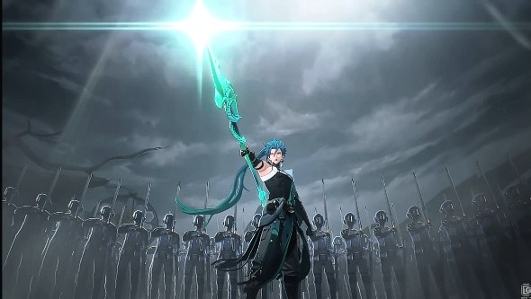<figcaption></figcaption></figure>

<figure><figcaption></figcaption></figure>

Sementara itu, Yangyang menyadari Rover mendadak terdiam dan melamun, menatap ke arah kosong. Ia tampak kebingungan dengan reaksi Rover yang tiba-tiba.

<figure><figcaption></figcaption></figure>

<figure><figcaption>
Hal yang dilihat Rover di dalam pikirannya
</figcaption></figure>

Rover kemudian menjelaskan bahwa ia baru saja "melihat" kejadian yang terjadi di Norfall Barrens. Ia menyaksikan seorang wanita yang tampaknya mampu mengendalikan _Tacet Discord_. Yangyang menduga bahwa penglihatan Rover bukan sekadar bayangan, melainkan sesuatu yang benar-benar sedang terjadi di medan perang saat ini.

<figure>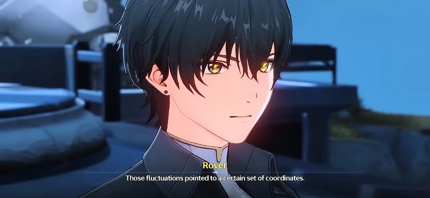<figcaption></figcaption></figure>

Yangyang melanjutkan bahwa sehelai daun yang mereka bawa—menurut Baizhi—menunjukkan jejak residu _Tacet Discord_ yang terdeteksi di sebuah desa bernama **Qichi Village**.

<figure>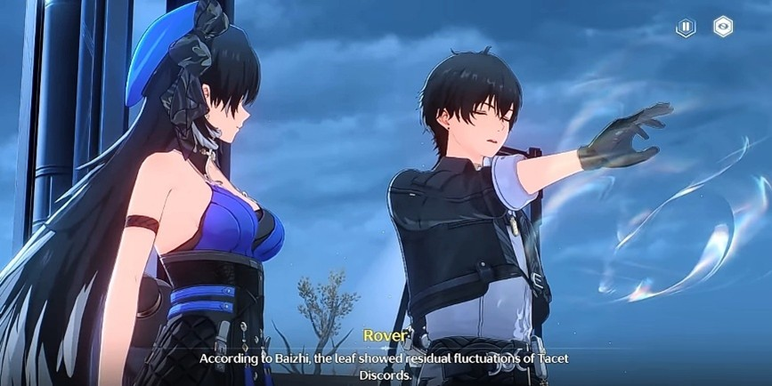<figcaption></figcaption></figure>

***


:notebook: **GLOSARIUM**

* The Exiles

> The Exiles bukanlah organisasi kriminal dengan kepemimpinan yang bersatu. Sebaliknya, istilah tersebut merujuk pada individu yang menolak kendali otoritas lokal dan berkeliaran di alam liar. Mereka berasal dari semua lapisan masyarakat dan membentuk kelompok yang beragam dan bercampur. Meskipun pada dasarnya tidak jahat, mereka tidak ragu melakukan tindakan ilegal seperti pencurian atau perampokan.
>
> Untuk bertahan hidup di alam liar yang keras dan tak terlindungi, mereka memanfaatkan bahan-bahan yang dipungut dan menggunakan teknologi yang sudah dimodifikasi. Setiap Exile biasanya dipersenjatai dengan Senjata Tacetite, yang diperoleh melalui cara-cara ilegal, untuk mempertahankan diri dari ancaman TD atau geng Exile saingan.

