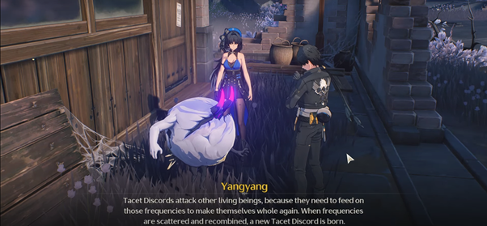
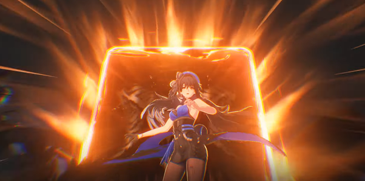
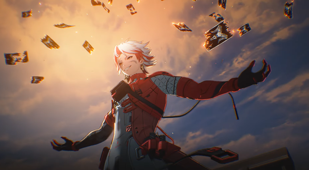
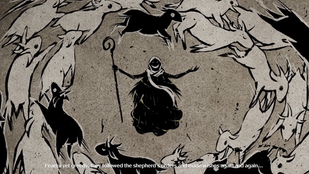
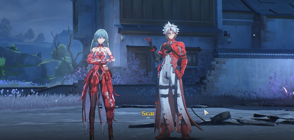

# Act 3: Ominous Star

Atas arahan dari Baizhi terkait _Waveworn Leaf_ dan bantuan navigasi dari _forte_ milik Yangyang, Rover dan Yangyang akhirnya tiba di sebuah desa terpencil yang tampak hancur berantakan, bernama **Qichi Village**. Tanpa perlu berkonsentrasi, Yangyang dapat langsung merasakan betapa tempat ini dipenuhi oleh kebencian dan rasa sakit yang mendalam. Mereka pun mulai menyusuri area sekitar dan menyimpulkan bahwa desa ini pernah digunakan untuk suatu ritual yang kemudian berujung pada pertikaian serta penculikan.

Beberapa saat kemudian, mereka menemukan seekor _Tacet Discord_ yang terus-menerus menirukan kata “tolong” dan “kakak.” Menurut Yangyang, ia dapat merasakan kesedihan yang sangat dalam—sebuah penantian yang panjang dan menyayat hati. Berdasarkan _reverberations_ dari para korban yang masih tersisa dan kondisi reruntuhan di sekeliling mereka, Yangyang menyimpulkan bahwa kejadian ini terjadi belum lama. Ia berkata, “Mungkin... _Tacet Field_-nya lah yang membuat tempat ini sulit ditemukan, atau memang ada seseorang yang sengaja ingin menyembunyikannya.” Rover mengangguk, menyetujui teori tersebut, sebelum akhirnya menghubungi Chixia untuk meminta bantuan dalam bentuk investigasi resmi.

<figure><figcaption></figcaption></figure>

Dari sana, mereka menemukan beberapa kartu yang tampak mencurigakan. Menurut Yangyang, kartu-kartu itu berasal dari kelompok _<mark style="color:blue;">**Fractsidus**</mark>_, yang pernah ia hadapi semasa bertugas sebagai _Outrider_. _Fractsidus_ adalah kelompok ekstremis yang percaya bahwa manusia dan _Tacet Discord_ seharusnya menyatu sebagai satu kesatuan. Kelompok ini telah menyebabkan serangkaian aksi teror, baik dalam skala kecil maupun besar, di berbagai penjuru negeri.

Yangyang menjelaskan bahwa belakangan ini memang telah ditemukan tanda-tanda aktivitas kelompok _Fractsidus_ di Jinzhou, yang tampaknya dilakukan oleh anggota berpangkat rendah yang dikenal sebagai _<mark style="color:blue;">**Artificers**</mark>_. Di atas mereka adalah para _<mark style="color:blue;">**Overseer**</mark>_—pemimpin kelompok yang dikenal memiliki kemampuan mengerikan dan sangat berbahaya.

Tak ada yang benar-benar tahu apa niat sejati dari _Fractsidus_. Beberapa anggotanya menyerukan kehancuran dunia, sementara yang lain mencari kekuasaan yang kekal. Di antara mereka, terdapat satu _Overseer_ yang terkenal gila—bahkan untuk standar _Fractsidus_ sendiri. Berdasarkan dokumen-dokumen dari kasus terdahulu, kartu yang ditemukan sebelumnya diketahui milik sosok tersebut. Namanya adalah **Scar**.

“Wah, wah, gak perlu kenalan lagi dong? Aww, sayang, padahal aku udah gladi resik\~”\
Seperti iblis yang datang ketika dipanggil, Scar tiba-tiba menampakkan diri dan langsung mengurung Yangyang, memisahkannya dari Rover agar bisa berbicara empat mata.

<figure><figcaption></figcaption></figure>

Rover yang terkejut langsung bersiap untuk bertarung. Namun, Scar tampaknya tak tertarik untuk bertarung—setidaknya belum. Ia hanya ingin “bicara”, sambil mengklaim bahwa di antara para pengamat, dialah satu-satunya yang datang ke hadapan Rover dengan “kejujuran.” Tampak seperti sedang menikmati kebersamaannya, Scar terus menumpahkan berbagai fakta, termasuk bagaimana ia tahu Rover kehilangan ingatannya dan bahwa ia telah diam-diam mengikutinya sejak pertama kali menginjakkan kaki di Solaris.

> “Sebelum kamu tahu apapun tentang dunia ini, kamu sudah berada di tengah konflik. Sang faktor tak terduga… yang telah _kami_ tunggu-tunggu.\
> Kekuasaan mencoba merebutmu—termasuk gadis itu—karena mereka tahu betapa berharganya dirimu. Oh, jahatnya dunia… Padahal kamu hanya manusia biasa yang hidup dan bernapas, tapi dianggap tak lebih dari pion oleh banyak pihak.”

<figure><figcaption>
Scar
</figcaption></figure>

Dengan seringai lebar di wajahnya, Scar kemudian mengajukan sebuah "proposal" untuk berteman dengan Rover.

Ia mengajak Rover bermain sebuah permainan—permainan tentang pandangan Rover terhadap kejadian di **Qichi Village**. Menurut Scar, semakin dalam Rover memahami dunia ini, semakin menarik permainan mereka dan semakin dekat pula pada kebenaran di balik niat _Fractsidus_.

Rover pun mulai mengumpulkan petunjuk:

* Sebuah ritual berskala besar
* Warga yang mengalami luka parah
* Kehadiran _Tacet Discord_ yang aneh dan tidak biasa

Awalnya, Rover menuduh _Fractsidus_ sebagai dalang di balik semua ini. Namun Scar menanggapi tuduhan itu dengan ringan. Ia menyebut bahwa cerita tentang serigala buas dan domba tak berdaya terlalu naif. Dunia, menurutnya, tidak sesederhana itu.

Ketika Rover kemudian menebak bahwa justru warga desa itu saling membunuh, Scar terlihat sangat puas dengan jawaban tersebut.

“_Mereka_ benar tentang kamu,” katanya dengan senyum mengerikan. “Tentang kemampuan analisismu, dan pemahamanmu terhadap naluri dasar umat manusia.”

Scar yang senang berbicara mulai memberikan Rover beberapa "tips" tentang para pemain, serta tema utama dari kisah yang akan Rover rajut sesuai interpretasinya sendiri. Ia lalu bercerita tentang kisah seorang penggembala dan kambing hitam—sebuah alegori yang sarat makna. Kisah itu berkisah tentang penggembala yang memberi kebaikan sebagai gantinya kepatuhan mutlak dari para domba.

Rover menanggapi, “Kita semua diciptakan setara. Seharusnya tak ada hierarki.”\
Mendengar itu, Scar kembali tersenyum, merasa bahwa Rover mungkin mulai memahami sudut pandangnya.

Ia melanjutkan ceritanya: sang penggembala tidak pernah memaksa, hanya menawarkan pilihan. Namun para domba mengikuti dengan patuh karena mereka menginginkan impian mereka menjadi kenyataan—apa pun harganya. Hingga suatu saat, seekor domba hitam datang dan mengacaukan semuanya.

Cerita ini memiliki dua akhir—Scar menyampaikannya layaknya pilihan berganda:

1. Kambing hitam dikorbankan demi kesejahteraan sang penggembala dan para domba.
2. Kambing hitam menyulut pemberontakan, mengajak domba lain menentang penggembala.

<figure><figcaption></figcaption></figure>

Bagi Scar, ia dan Rover adalah sang kambing hitam—mereka yang tak tunduk pada aturan. Sebuah anomali dalam sistem yang telah ditentukan sejak lama oleh kekuasaan dan peradaban. Cerita tersebut adalah cara Scar untuk mempersuasi Rover agar bergabung dengan _Fractsidus_, dengan menyampaikan bahwa mereka yang mencoba menjadikan Rover sebagai pion—seperti Jinzhou—mungkin memiliki agenda tersembunyi.

Namun, seperti yang bisa diduga, Rover menolak. Pertarungan pun dimulai.

Rover terperangkap dalam _Asylum_ milik Scar—sebuah medan pertarungan yang diciptakan untuk menguji keyakinannya. Ia melawan gelombang demi gelombang musuh sebelum akhirnya berhadapan langsung dengan Scar. Selama pertarungan, Scar terus melemparkan pertanyaan:

> “Apakah kau ingin menjadi penggembala—si pembuat kebijakan? Atau kambing hitam—si pembangkang sejati?”
>
> “Jika seorang waras mampu bertahan hidup dalam dunia yang sinting... Apakah dia adalah akal sehat terakhir? Atau justru utusan terakhir? Pikirkanlah—penggembala bukanlah kebenaran yang ditakdirkan. Dan ketika ia mati, kambing hitam bisa kembali dipercaya kawanan. Pada akhirnya, tak akan ada lagi korban... atau penindas.”

Sementara itu, Yangyang yang berhasil membebaskan diri dari kurungan Scar menyerang dari luar. Serangan gabungan dari dalam dan luar _Asylum_ berhasil menekan Scar hingga akhirnya ia terpaksa mundur. Sebelum pergi, ia sempat bertemu dengan rekan sesama _Overseer_ dan meninggalkan **Qichi Village**.

<figure><figcaption></figcaption></figure>

Setelah pertarungan usai, Rover dan Yangyang menemukan sisa-sisa kayu ritual yang telah digunakan. Mereka juga menemukan sebuah goa bawah tanah yang memancarkan berbagai macam frekuensi yang mengganggu. Di sana, mereka mengantar _Tacet Discord_ yang terus menyuarakan permintaan tolong ke dalam tempat tersebut—mungkin sebagai bentuk pelepasan atau penyelesaian yang tertunda.

Setelah semuanya selesai, mereka kembali untuk membuat laporan. Di sisi lain, Sanhua memastikan bahwa Rover dan Yangyang dalam keadaan aman—sesuai dengan arahan dari Jinhsi.

***


:notebook: **GLOSARIUM**

* Artificer

> Cecunguk Fractsidus yang memiliki implant anggota tubuh TD pada dirinya.

* Fractsidus

> Fractsidus adalah kelompok ekstremis yang terobsesi untuk menggabungkan manusia dengan Tacet Discord. Mereka telah menyebabkan serangan teror dalam berbagai skala di seluruh dunia.
>
> Konon, anggota Fractsidus telah menjalankan misi selama beberapa waktu, dan mereka terkenal karena menggunakan topeng pengekang. Topeng ini tampaknya digunakan untuk menekan reaksi penolakan komponen Tacet Discord dalam tubuh, dan efek sampingnya adalah emosi manusia normal juga ikut tertekan. Topeng ini juga digunakan untuk mendorong overclocking
>
> Informasi yang tersedia menunjukkan bahwa Fractsidus telah melakukan penelitian untuk menginduksi kemampuan resonansi secara artifisial. Ini termasuk mengintegrasikan Echo dengan tubuh manusia melalui modifikasi mekanis, yang bertujuan untuk memberikan kekuatan resonator kepada orang biasa.

* Overseer

> Atasan Artificers dengan kekuatan mengerikan dan berbahaya.

