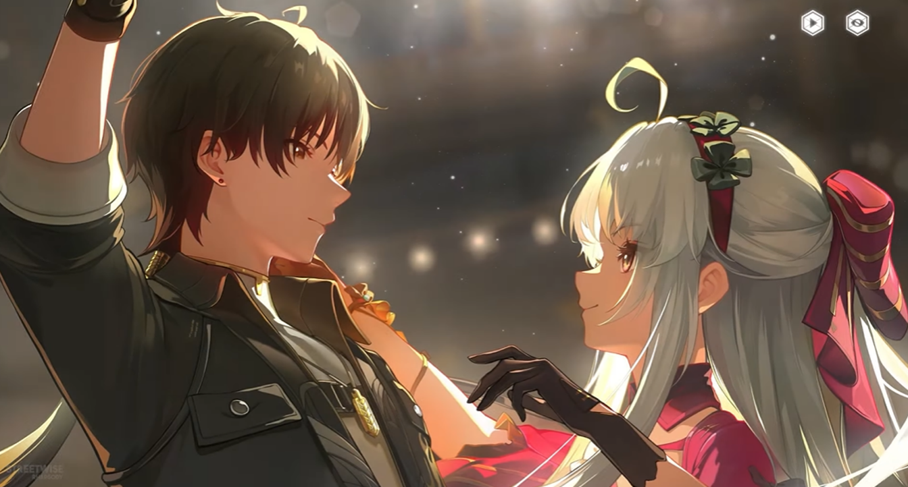
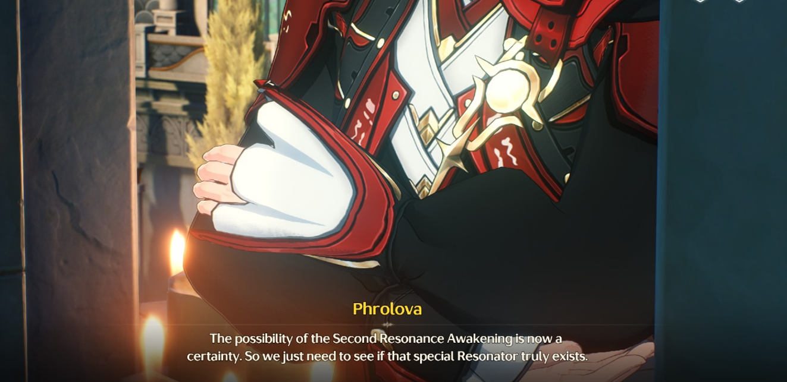

# Act 3: What Yesterday Wept, Today Doth Sing

<figure><figcaption></figcaption></figure>

Di pulau tempat mereka terdampar, Rover dan Roccia menemukan bahwa wilayah tersebut dipenuhi oleh _Remnant Clouds_ yang berasal dari _Sea of Clouds_ di _<mark style="color:blue;">**Nimbus Sanctum**</mark>_. Kehadiran energi ini menarik para _Tacet Discord_, mengubah pulau yang dulunya merupakan tempat ritual _Pilgrim Sail_ menjadi wilayah terkutuk yang kini disebut _Penitent’s End_.

Roccia menjelaskan bahwa _Pilgrim Sail_ berasal dari legenda _Primus_ pertama yang berlayar dengan perahu tua mengikuti arus laut hingga akhirnya bertemu dengan _Sentinel_. Namun kini, makna spiritual dari tradisi tersebut telah hilang. Kabut di pulau ini sangat berbahaya karena dapat memerangkap _Reverberations_, yang bila terkumpul akan berubah menjadi _TD_. Untuk perlindungan, Rover dibekali sebuah alat berbentuk _pistol_ guna membantu mereka menghindari bahaya selama penelusuran.

<figure><figcaption></figcaption></figure>

Forte milik _Resonator_ menjadi sulit digunakan karena kabut sarat _Remnant Energy_ yang telah terkorupsi. Karena Resonator memanipulasi frekuensi tertentu, frekuensi yang tidak stabil membuat Forte tidak dapat dikeluarkan dengan baik. Dalam kondisi kritis tersebut, _Golden Phantom_—residu frekuensi yang membawa sisa-sisa kesadaran manusia—membantu Rover dan Roccia keluar dari bahaya.

<figure><figcaption></figcaption></figure>

Pulau _Penitent’s End_ memiliki karakteristik unik:

* _Golden Phantom_ adalah hasil _Reverberations_ yang bercampur dengan frekuensi orang yang telah meninggal.
* Jika seseorang meninggal dengan keinginan yang belum terpenuhi, kabut akan mewujudkan keinginan itu dalam bentuk _Phantom_.
* Keinginan tersebut memungkinkan Phantom bertahan lebih lama sebelum menjadi _TD_, sehingga beberapa Phantom membantu manusia melarikan diri dari pulau.
* Namun jika kabutnya hilang, Phantom akan lenyap; dan jika kabut tetap ada, mereka pada akhirnya akan berubah menjadi _TD_.

<figure><figcaption></figcaption></figure>

Pulau ini merupakan tempat akhir _Pilgrim Sail_. Mereka yang dianggap melanggar doktrin suci _The Order_ akan dicap sebagai _Fools_ dan dikirim ke pulau ini sebagai bentuk pertobatan. Di sana, Rover akhirnya bertemu _Brant_ yang sedang berpatroli dan menyelamatkan korban dari ritual tersebut. Korban-korban itu kemudian direkrut menjadi bagian dari _Fool’s Troupe_.

Brant, Rover, dan Roccia kemudian menyelamatkan korban lainnya dari serangan naga. Setelah pertempuran, _Abby_ tersadar dan mengungkap bahwa ia mendeteksi sesuatu yang tidak wajar pada frekuensi naga tersebut: naga itu dikendalikan oleh _Fenrico_, dijadikan sebagai algojo untuk menguji para pendosa dalam _Pilgrim Sail_.

<figure><figcaption></figcaption></figure>

Secara alami, frekuensi _TD_ akan terus menurun hingga habis—itulah mengapa mereka terus mengonsumsi frekuensi lain. Namun, _The Order_ memanfaatkan kondisi ini dan mempercepat penurunan frekuensi naga agar menjadi agresif. Semua ini dilakukan dengan bantuan kelompok _Fractsidus_, yang juga menjadi penyebab keganasan makhluk seperti _Cetus The Tidebreaker_.

<figure><figcaption></figcaption></figure>

Setelah itu, mereka menuju markas _Fool’s Troupe_ dan bertemu dengan para anggotanya, termasuk _Lario_, sebuah _Echo_ raksasa yang membawa panggung pertunjukan. Brant bercerita bahwa ia dulunya dibuang ke pulau ini karena mempertanyakan bagaimana bisa ada patung Sentinel yang dibuat oleh _The Order_ padahal tidak ada seorang pun yang benar-benar pernah melihat wujud Sentinel secara langsung.

Rover kemudian bertemu dengan _Laureate_ sebelumnya, _Tuan Bardolino_, yang menjelaskan bahwa pada masanya _Blessed Maiden_ masih memimpin rakyat Rinascita, sebelum digantikan oleh _Fenrico_.

Setelah mengatasi Bardolino yang sempat membuat kehebohan, Carlotta kembali dan memberi kabar bahwa rencana _The Order_ telah terbongkar. Pamannya kini telah diselamatkan, dan sisanya tengah ditangani oleh sang kakek. Carlotta kemudian menjelaskan ulang keseluruhan situasi yang telah terjadi:

* _Sentinel_ terakhir kali terlihat sepuluh tahun lalu. Kemunculannya menyebabkan _Ragunna_ dikelilingi kabut yang berasal dari _Nimbus Sanctum_—kabut yang seharusnya disucikan oleh _Lorelei_. Namun, karena gangguan dari _Fractsidus_, _Sea of Clouds_ berubah menjadi energi niat jahat yang memperburuk kondisi _Echo_, membuat mereka menjadi agresif.
* Seorang pengkhianat dari keluarga _Montelli_ menggunakan bunga _Phrolova_ dalam eksperimen yang bertujuan mengubah _Echo_ menjadi _TD_. Jika eksperimen ini berhasil, mereka bisa menciptakan kembali _TD_ yang menyerang sepuluh tahun lalu—namun, hal ini telah digagalkan oleh kakek Carlotta.
* _The Order_ memanipulasi seekor naga untuk digunakan sebagai senjata utama dalam tragedi berikutnya, yang akan diluncurkan saat festival _Carnevale_. Rencana mereka adalah mengulang kekacauan masa lalu agar bisa tampil sebagai penyelamat, lalu memperketat kontrol atas warga _Rinascita_.

<figure><figcaption></figcaption></figure>

<figure><figcaption></figcaption></figure>

Sebagai tanggapan, mereka menyusun rencana dengan melibatkan _Fool’s Troupe_, yang memiliki gaya bertarung unik: mengubah gangguan dari musuh menjadi pertunjukan teatrikal. Brant mengajak Carlotta dan Rover untuk gladi resik, mempersiapkan sebuah pementasan bertema “Pertarungan Melawan Raja Iblis”, seperti kisah yang dikaitkan dengan _Blessed Maiden_. Rencana ini dibuat agar warga _Ragunna_ mengira kekacauan yang terjadi hanyalah bagian dari pentas, demi menghindari kepanikan massal—dan, jika berhasil, mereka juga berpeluang memenangkan gelar _Laureate_ tahun ini.

<figure><figcaption></figcaption></figure>

Carlotta dan Rover lalu kembali diam-diam ke _Ragunna_ untuk mengambil topeng sebagai identitas mereka dalam penyamaran saat _Carnevale_. Dalam perjalanan, Carlotta membagikan pandangannya: warga Ragunna adalah orang-orang yang mudah berubah seperti ombak, dan keluarga _Montelli_ selalu bersyukur “terdampar”, karena itulah mereka bisa menyerap budaya, pengetahuan, dan teknologi dari luar.

Carlotta juga menjelaskan bahwa pertemuan Rover dengan _Fool’s Troupe_ bukan kebetulan—melainkan bagian dari rencananya. Ketika _Black Shores_ diundang lewat rute laut khusus, ia memastikan utusan mereka akan bertemu dengan Brant dan kawan-kawan.

<figure><figcaption></figcaption></figure>

Ia kemudian mempertanyakan kehadiran _Genesis Nexus_—patung yang sudah ada bahkan sebelum manusia pertama menginjakkan kaki di _Rinascita_. Jika tak ada yang tahu siapa yang membuatnya, bagaimana bisa orang-orang yakin bahwa patung itu menggambarkan _Sentinel_? Bagi Carlotta, ini adalah bukti bahwa _The Order_ telah merekayasa sejarah demi mengendalikan rakyat.

Carlotta juga menceritakan kisah _Fleurdelys_ sang _Blessed Maiden_, yang tanpa sadar menciptakan parade dengan tarian dan nyanyiannya yang spontan. Semua orang terkesan—kecuali _The Order_. Jika _Sentinel_ memilih utusan seperti Fleurdelys, maka kegembiraan dan festival adalah bagian dari kehendak _Sentinel_ itu sendiri.

<figure><figcaption></figcaption></figure>

Carlotta lalu menjelaskan asal-usul dan kondisi sosial _Rinascita_:

* Warganya berasal dari beragam budaya, bermigrasi ke pulau ini.
* Perbedaan tersebut sempat memicu konflik, lalu dibentuklah keluarga-keluarga dan _The Order_ sebagai peran stabilisator.
* Seiring waktu, peran ini menjadi kaku dan menimbulkan stratifikasi sosial: rakyat jelata dan bangsawan.
* Padahal, visi awal _Rinascita_ adalah kesetaraan dan kebebasan. Kini, rakyat hanya menuruti _Order_ dalam ketakutan.
* Legenda dan sejarah dijadikan alat untuk melanggengkan kebodohan, dan agama menjadi alat hukuman.
* _Rinascita_ adalah sangkar transparan: rakyat terjebak tanpa sadar.
* _Carnevale_ tahun ini menjadi kesempatan untuk menyalakan api pemberontakan—awal dari perlawanan terhadap kebodohan dan ketakutan.

Setelah semua penjelasan itu, Rover beristirahat di hotel. Esok harinya, mereka menghadiri _Carnevale_. Di tengah kemeriahan, mereka bertemu dengan _Phrolova_ yang tiba-tiba kabur dan memancing Rover mengejarnya. Sepanjang jalan, ia menebar bunga _Phrolova_ yang mengubah _Echo_ menjadi _TD_. Rover bertarung menghadapi mereka hingga akhirnya berhadapan dengan Phrolova.

<figure><figcaption></figcaption></figure>

Phrolova bersandiwara, seolah semua hanyalah bagian dari sebuah pertunjukan. Sebelum menghilang, ia menyampaikan bahwa kisah _Blessed Maiden_ tidak berhenti sampai di situ. Menurutnya, sang Maiden jatuh ke dalam kegelapan, memperoleh kekuatan sesat, dan menuntun rakyat ke dalam kebejatan.

<figure><figcaption></figcaption></figure>

Setelah _Phrolova_ memanggil _Hecate_, pertarungan besar pun terjadi. Namun berkat rencana yang telah disusun, Rover dan kawan-kawan mampu mengubah pertempuran ini menjadi seolah-olah bagian dari pertunjukan teater _Carnevale_, dengan tiga babak yang menggambarkan kemenangan atas kegelapan. Phrolova akhirnya dikalahkan, dan sebagai puncaknya, Rover dinobatkan sebagai _Laureate_—sebuah kehormatan yang membuka jalur komunikasi langsung dengan _Sentinel_.

Saat koneksi terjalin, _Sentinel_ meminta bantuan. Ia terkurung di _Inverted Tower_ (Menara Terbalik), dan memperingatkan bahwa sesuatu yang disebut _The Lost_ telah menyusup ke antara manusia. Rover ditugaskan untuk mencarinya.

<figure><figcaption></figcaption></figure>

Usai festival, Rover bertemu kembali dengan Carthethiya—sosok yang hanya bisa dilihat oleh dirinya. Ia hampir keceplosan menyebut julukannya sendiri: _Fleurdelys_. Keesokan harinya, Rover diundang ke _safe house_ milik keluarga _Montelli_ untuk berpesta bersama _Brant_ dan _Roccia_. Di sana, _Carlotta_ mengungkap bahwa setelah berbicara dengan _Phoebe_, ia mengetahui nama asli sang _Blessed Maiden_ sebelum mendapat julukan sucinya adalah _Carthethiya_. Keluarga _Montelli_ kini bertekad menyelidiki kebenaran sejarah ini lebih lanjut.

<figure><figcaption></figcaption></figure>

Dari interogasi terhadap _Gilberto_, terungkap bahwa _Fisalia_ adalah penyembah _Threnodian_ dari bawah laut. Nama aslinya adalah _Leviathan_, dan ia telah berada di pulau ini sejak awal berdirinya _Rinascita_. Carlotta berspekulasi bahwa jika benar terdapat dua _Sentinel_ atau dewa, maka satu di antaranya mungkin adalah _Threnodian_. Karena keduanya terhubung secara spiritual, bertemu satu pihak bisa membuka jalan pada pihak lainnya.

<figure><figcaption></figcaption></figure>

Setelah pesta, Rover menerima undangan dari _Primus Fenrico_ untuk berdiskusi secara pribadi. Dari pembicaraan itu, Rover mendapatkan informasi penting:

* Fenrico mengaku akan menyampaikan pesan Rover kepada _Sentinel_.
* _Dark Tide_ dua dekade lalu lahir dari luka _Sentinel_ yang berdarah.
* _Fleurdelys_ mengorbankan dirinya untuk menyegel _Dark Tide_, dan menurut Fenrico, ia meninggal dalam prosesnya.
* Ketika berkorban, sang _Blessed Maiden_ sekali lagi beresonansi dengan _Sentinel_, memberikan kekuatan suci yang cukup untuk menghentikan ancaman tersebut.
* Karena _Sentinel_ belum sepenuhnya pulih, mereka masih membutuhkan perantara manusia. Fenrico menyatakan bahwa dirinya telah dipilih sebagai utusan untuk menuntaskan sisa-sisa ancaman tersebut.
* Penjelasan Fenrico ini membuat Rover bingung—jika benar ini adalah _Second Awakening_, seharusnya pewarisan kekuatan Sentinel hanya bisa dilakukan dengan persetujuan Rover sendiri.
* Fenrico menuding _Fleurdelys_ sebagai penipu dan utusan dari _Threnodian_. Ia mengklaim bahwa sang Perawan Suci yang sejati belum memperlihatkan dirinya.
* Menurut Fenrico, sebagai musuh utama umat manusia, _Threnodian_ juga memiliki peluang untuk mengimbangi _Sentinel_, termasuk dalam hal memiliki _Resonator_ sendiri.

<figure><figcaption></figcaption></figure>

Sementara itu, di tempat lain, _Phrolova_ dan _Cristoforo_ berdiskusi. Dari percakapan mereka, beberapa hal terkonfirmasi:

* _<mark style="color:blue;">**Second Awakening**</mark>_ memang dimungkinkan.
* Ada **kemungkinan** keberadaan _Special Resonator_—individu yang bisa menggunakan kekuatan baik dari _Threnodian_ maupun _Sentinel_.

***


:notebook: **GLOSARIUM**

* Dark Tide

> Bencana berbentuk awan hitam yang banyak terkumpul disatu tempat dan akhirnya akan jatuh dalam bentuk hujan deras seperti air terjun. Melahirkan Tacet Discord dan merubah area ground zero yang terdampak jadi Tacet Field. Sepanjang sejarah Rinascita, sudah terjadi sebanyak dua kali. Yang pertama dihadang Napoli II dan kedua diatasi Fluerdelys sang Blessed Maiden.

* Nimbus Sanctum

> Satu satunya Sonoro Sphere yang bermanifestasi di dunia nyata yang didalamnya tersegel Sea of Clouds.

* Second Awakening

> Disebut juga sebagai Second Resonance Awakening adalah tabrakan 2 frekuensi yang saling beresonasi yang mana dalam kondisi spesifik dapat meningkatkan kekuatan Resonator secara drastis. Contoh setelah bertarung dengan Jue, Jinhsi sudah bisa membetulkan _Temporal Barrier_ di Mt.Firmament.

