# Act 4: The Maiden, The Defier, The Death Crier

<figure><figcaption></figcaption></figure>

Cerita diawali dengan Abby yang makin lama makin lambat merespons panggilan Rover. Ia malah ngide bikin trampolin raksasa agar bisa langsung meluncur ke atas, karena sedang kesulitan terbang. Namun sebelum sempat menjalankan rencananya, Rover dan Abby bertemu dengan **Ciaccona**, seorang _bard_ yang dikirim oleh **Carlotta** setelah Rover memberitahunya tentang **Blessed Maiden**—yang hingga kini masih belum ditemukan. Ciaccona lalu menunjukkan _forte_-nya, sebuah kemampuan untuk merekonstruksi **Frequency** lewat emosi dan memori. Ia menjelaskan bahwa cara kerjanya seperti gambar 360 derajat, namun kalian bisa bebas bergerak di dalamnya.

Setelah mengaktifkan _forte_-nya, Ciaccona mengirim Rover ke dalam ingatan masa lalu—namun melalui perspektif orang lain. Ternyata, di situlah **Cartethyia** yang asli pertama kali bertemu dengan Rover.

Cartethyia mulai berbagi cerita. Ia bingung tentang siapa dirinya sebenarnya. Apakah ia seorang **Sentinel Resonator**? Rover sendiri tidak yakin, karena memorinya telah terpecah. Namun ia mengingat bahwa dulunya ia dinamai **Fleurdelys**, dan pernah bertarung melawan sesuatu… meskipun hasil dari pertarungan itu tidak jelas. Ia sudah lama mencari jawaban.

Abby yang tersadar kemudian menjelaskan bahwa **frequency** mereka sedang “terpisah”. Setelah melihat **frequency** Abby yang mulai melemah, Cartethyia pun mulai memahami tujuan Rover.

<figure><figcaption></figcaption></figure>

Saat ini, Cartethyia hanyalah sebuah **frequency**. Wujud aslinya berada di dalam **Inverted Tower**, dan pintu masuknya dikunci oleh tiga segel. Di balik segel itu, Cartethyia merasa ada sesuatu—atau seseorang—yang memanggilnya. Saat mendengar percakapan mereka, Abby mencium aroma **Threnodian** dari Cartethyia, yang membuatnya cukup terkejut. Namun Rover menenangkannya karena hal itu belum pasti. Cartethyia memilih untuk percaya. Terjebak lama di **Sonoro** (_Inverted Tower_) membuatnya sadar akan banyaknya kemungkinan, dan ia telah memantapkan hati untuk menerima apa pun jawaban yang akan ia temukan. Ia pun berjanji akan bertemu kembali dengan Rover di Sonoro, dengan catatan Rover harus menemukan “pelindungnya” dan seseorang dengan **frequency** mirip ubur-ubur—yang mungkin tahu sesuatu soal Sonoro.

Setelah itu, Rover kembali sadar dan mendengar Ciaccona yang sedang heboh membicarakan inspirasi lagu barunya. Ia bilang akan segera pergi ke Carlotta untuk melapor. Namun sebelum sempat melangkah, seorang pelayan dari _<mark style="color:blue;">**Fisalia Family**</mark>_ datang—mengundang Rover atas perintah langsung kepala keluarga. Rover tidak langsung menerima undangan itu dan terlebih dahulu menggali informasi lewat Ciaccona. Rumornya cukup kelam: kepala keluarga Fisalia saat ini disebut-sebut telah meracuni pendahulunya. Bahkan, semua kandidat pewaris dikabarkan harus meminum racun, dan hanya yang bertahanlah yang diakui. Walau semua itu hanya rumor, keluarga Fisalia dikenal memiliki garis keturunan yang bahkan lebih tua daripada **The Order**.

Dalam perjalanan menuju kediaman keluarga Fisalia, Carlotta menelepon dengan nada cemas. Ia berkata, kalau terjadi apa-apa, ia siap mendobrak pintu depan mansion Fisalia demi membantu Rover.

<figure>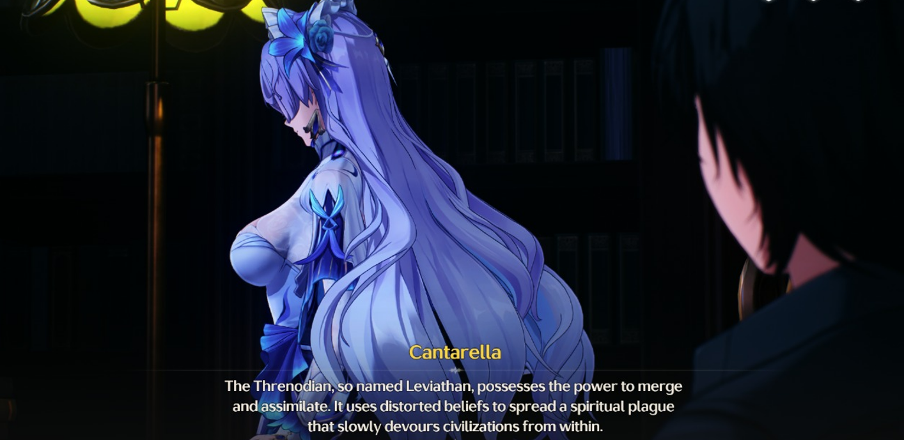<figcaption></figcaption></figure>

Sesampainya di dalam, Rover bertemu dengan kepala keluarga ke-36 dari **Fisalia**, **Cantarella**. Awalnya, Cantarella hanya berniat menjadikan Rover sebagai _Mediator_ antara keluarga Fisalia dan Montelli. Namun arah pembicaraan berubah ketika Rover mulai menanyakan sesuatu. Cantarella sudah tahu apa yang ingin ditanyakan: invasi **Threnodian** ke **Rinascita** sebenarnya telah lama berakhir. Karena itulah Threnodian dan **Sentinel** tidak pernah lagi menampakkan diri.

Salah satu Threnodian yang paling berbahaya adalah **Leviathan**, makhluk dengan kemampuan untuk _bergabung_ dan _menyatu_. Ia menyebarkan kepercayaan menyimpang bagaikan wabah spiritual yang perlahan menggerogoti peradaban dari dalam. Cantarella mengimplikasikan bahwa—seburuk apa pun—masih ada kebenaran dalam cara kerja **The Order**. Ia juga mengungkapkan bahwa keluarganya telah lama dibisiki oleh Threnodian hingga jiwa mereka retak, dan akhirnya hidup bak boneka yang tak lagi mampu berpikir sendiri.

Rover kemudian dibawa ke sebuah tempat suci, tempat di mana wujud asli Sentinel diperlihatkan: **seekor kuda putih yang menunggangi angin**—bukan makhluk setengah kuda setengah ikan seperti yang dipuja The Order. Bentuk setengah-setengah itu adalah wujud Sentinel yang telah terkorupsi oleh Threnodian. Meskipun Sentinel belum sepenuhnya hilang, tak ada yang tahu sampai kapan ia bisa bertahan.

Cantarella meminta bantuan Rover untuk memanggil **Jue**, namun Rover menolak. Jue masih dalam masa pemulihan, dan ia tak boleh meninggalkan lokasi yang telah ditentukan Sentinel. Sebagai gantinya, Rover bercerita tentang ramalan dari kaca patri berwarna yang ia temukan bersama Carlotta. Ia mencurigai ramalan itu bias terhadap The Order. Cantarella menanggapi: bagian tentang **Maiden** tidak sepenuhnya salah. Memang, pengangkatannya tidak seperti yang terjadi di **Carnevale**, tetapi melalui sebuah pedang suci bernama _<mark style="color:blue;">**The Sword of Divinity - Tyrvine**</mark>_ yang menyimpan kekuatan Sentinel.

Meski Rover skeptis karena **Jinhsi** tidak dipilih oleh Jue melalui artefak apa pun, Cantarella menjelaskan lebih lanjut: Sentinel (Imperator) memiliki kemampuan untuk _membelah_ dan _memanipulasi ruang_, sehingga keberadaan Tyrvine sebagai manifestasi kekuatan mereka adalah hal yang memungkinkan.

<figure><figcaption></figcaption></figure>

Setiap tahun, keluarga Fisalia melaksanakan ritual untuk beresonansi dengan Tyrvine—yang berarti juga dengan Sentinel. Ritual ini dilakukan dalam keadaan **Overclock**. Walaupun tidak pernah ada yang berhasil sepenuhnya, sebagian dari mereka sempat melihat petunjuk—kebenaran yang tersembunyi dalam pedang itu. Cantarella adalah salah satunya. Ia melihat wujud Sentinel yang terkorupsi, **Inverted Tower**, dan menyadari bahwa Tyrvine adalah kunci untuk masuk ke sana. Ia juga mendapat pesan bahwa **“Blessed Maiden telah tewas.”**

Rover pun menyadari bahwa **Second Resonance Awakening** memang membutuhkan Overclock, seperti halnya Jinhsi, namun ia masih heran mengapa tidak ada reaksi terhadap perizinannya sendiri. Untuk meyakinkan dirinya, Rover meminta melihat langsung pedang tersebut.

Setelah melakukan resonansi dengan Tyrvine, Rover berbagi penglihatannya dengan Cantarella. Cantarella terkejut mengetahui bahwa Maiden yang dianggap sudah menjadi martir ternyata masih hidup—dan bahwa Rover adalah **Arbiter** dari Sentinel yang selama ini disembah keluarga Fisalia. Ia lalu meminta bantuan Rover untuk menyelamatkan Sentinel mereka, dan bersama-sama mereka menuju **Sonoro**—yang dahulu bernama _<mark style="color:blue;">**Avinoleum**</mark>_, tempat sang Maiden pernah belajar.

Sepanjang perjalanan, mereka membahas rumor tentang Cantarella yang meracuni pendahulunya. Ia juga menceritakan tentang seorang teman berpangkat tinggi dari **Mingting** yang pernah membantunya di saat kehabisan petunjuk—dan orang itu pula yang bercerita tentang Rover. Keluarga Fisalia yang telah dibisiki Threnodian selama ratusan tahun akhirnya menciptakan sebuah _ritual pencegahan_: ketika kepala keluarga telah tercemar, penerusnya harus membunuhnya dengan racun buatan sendiri.

**Avinoleum** adalah titik nol dari gelombang **Dark Tide** kedua—yang muncul saat penobatan **Blessed Maiden**. Menurut Cantarella, entah Sentinel atau Cartethyia yang telah mencegah Dark Tide menyebar ke **Ragunna**, dengan membuat Avinoleum terbang ke angkasa. Ia juga berpesan agar Rover tidak mudah percaya pada siapa pun hingga semua menjadi jelas. Karena Threnodian akan tahu—dan menyerang—ketika hati mulai melemah.

<figure><figcaption></figcaption></figure>

Begitu berhasil masuk, mereka langsung disambut oleh **Cartethyia**. Cantarella segera menyadari bahwa Cartethyia tidak menua sama sekali, padahal semestinya mereka berdua seumuran. Namun Cartethyia sendiri mengaku tidak tahu apa yang sebenarnya terjadi pada dirinya. Saat itu juga, ia mendapatkan tambahan ingatan—seolah dipicu oleh kehadiran Cantarella dan Rover.

Dalam ingatan tersebut, ia mengetahui keberadaan dua pedang lainnya: _<mark style="color:blue;">**Sword of Discord – Hognis**</mark>_ dan _<mark style="color:blue;">**Sword of Virtue – Haultir**</mark>_. Kedua pedang itu, bersama **Tyrvine**, merupakan kunci untuk membuka tiga segel di **Avinoleum**. Cantarella memperingatkan Cartethyia agar tidak ikut campur jika belum siap menghadapi kenyataan. Sementara Rover menegaskan untuk tidak buru-buru menyimpulkan Cartethyia ini Resonator siapa. Cartethyia langsung merespons dengan meminta maaf dan bersikap sigap.

Menurut Cantarella, menghadapi orang seperti Cartethyia memang harus dengan pendekatan yang _agak keras_. Setelah bersiap untuk menuju tumpuan pedang pertama, bangunan di sekitar mereka—bahkan tubuh mereka sendiri—mulai mengapung. Untungnya, berkat _Forte_ milik Cartethyia, mereka masih bisa menapak tanah.

Semua tempat di sana tampak terbalik. Menurut Cartethyia, inilah fungsi asli **Sonoro**: membalikkan realitas untuk menahan pengaruh **Tacet Discord, Dark Tide,** dan menghentikan kehancuran bangunan yang menyertainya. Mereka pun naik **gondola** untuk melanjutkan perjalanan, namun Cantarella sengaja ditinggal agar Rover memahami tempat ini lebih dalam—melalui Cartethyia.

Di perjalanan, Cartethyia tampak ragu. Ketika Rover bertanya apakah keraguan itu karena ucapan Cantarella, ia menyangkal. Ia mengaku bukan takut akan jawabannya, tapi takut kalau ternyata tidak menemukan jawaban sama sekali. Selama perjalanan itu juga, mereka memurnikan sisa-sisa Dark Tide—yang disebut **Remnant**—dengan menggunakan **Spark** dari Primus pertama. Jalur air emas yang mereka lewati dulunya adalah Dark Tide itu sendiri. Di tempat ini, bukan hanya gravitasi yang terbalik—bahkan _esensi dunia_ pun ikut terbalik.

Setelah itu, mereka sampai di tumpuan pertama di **Tower of Salvation**. Di sana, Cartethyia bergumam bahwa lebih baik dirinya menjadi penjahat yang tahu dirinya siapa, ketimbang menjadi pengelana tersesat di dunia yang tidak ia pahami. Menurutnya, hidup tanpa masa lalu tidak jauh berbeda dengan memilih mengakhiri hidup... Ia harus menemukan jawaban demi bertanggung jawab pada ingatan yang ia bawa.

“Dan untukmu... kalau aku sesungguhnya...” tanya Cartethyia dengan ragu.

“Jangan khawatir. Aku bisa jaga diri,” jawab Rover dengan tegas. “Kalau akhirnya memang begitu, akan kuingat wanita yang masih cukup peduli padaku.”

<figure>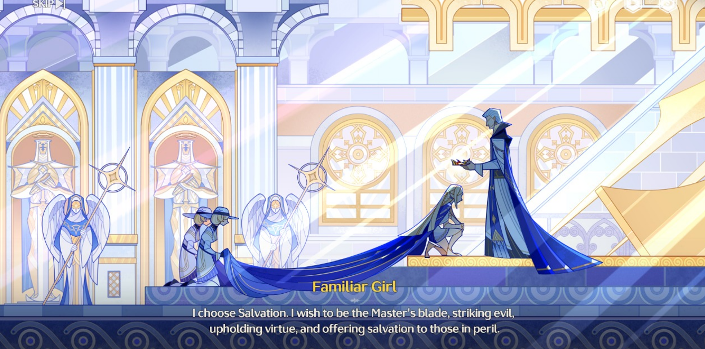<figcaption></figcaption></figure>

Setelah sampai, Cartethyia kembali menjemput Cantarella. Ketika mereka bertiga sudah berkumpul, Tyrvine diletakkan pada tumpuan pertama. Seketika itu muncul sebuah _flashback_, namun masing-masing dari mereka melihat hal yang berbeda:

1. **Rover** menyaksikan pengangkatan Cartethyia menjadi **Blessed Maiden**, serta pilihannya terhadap doktrin _Salvation_—menjadi eksekutor bagi yang jahat dan penolong bagi yang lemah.
2. **Cartethyia** melihat hal yang sama, tetapi dengan tambahan momen saat **Dark Tide** turun untuk pertama kalinya.
3. **Cantarella** hanya melihat gambar-gambar buram dari bagian lain di Avinoleum.

Tak lama setelah itu, **Abby** terbangun secara tiba-tiba dengan komplain: sebuah bola biru raksasa—berbau mirip _Sentinel Jue_—masuk ke **Tacet Mark** milik Rover. Menurut Cantarella, seharusnya hanya **Blessed Maiden** yang bisa masuk ke ruang ini bersama pedangnya. Ia menambahkan, Sentinel mempercayakan kekuatannya pada Resonator-nya agar bisa melawan korupsi dari Threnodian yang telah mengubahnya.

Namun semua ini juga mengindikasikan bahwa **rencana awal Imperator telah gagal**. Dan kini, hanya Cartethyia yang bisa menjadi pemandu mereka menuju kebenaran.

<figure><figcaption></figcaption></figure>

Setelah selesai di tumpuan pertama, mereka memutuskan untuk beristirahat demi memastikan bahwa _Frequency_ yang tersimpan tetap aman. Saat malam mulai tenang, Rover berbincang dengan **Cantarella**.

Cantarella mulai membuka kisah lama tentang:

* Keluarga **Fisalia**, yang pernah memimpin konflik di _kaca berwarna_—bagian sejarah saat kepercayaan mulai terpecah. Setelah mengalami kekalahan, fraksi persatuan yang mereka bentuk bubar, dan akhirnya Fisalia berpindah kepercayaan.
* **Tyrvine**, ternyata adalah pemberian dari **Primus pertama**, _Napoli II_. Dalam pertemuan privat dengan Fisalia, Napoli membocorkan fakta kelam: ziarah yang mereka jalani adalah palsu. Di ujung _Dark Tide_ pertama, yang menanti bukanlah keselamatan, melainkan kesengsaraan dan perang. Suara surgawi yang mereka dengar ternyata hanyalah _bisikan Threnodian_. Ia butuh boneka—dan Napoli menjadi alatnya untuk menyebarkan suara tersebut.
* Saat akhirnya menyadari rencana jahat Threnodian, pada momen yang bersamaan _Dark Tide_ pertama mulai turun. **Sentinel** segera membagikan kekuatannya kepada Tyrvine dan Napoli II agar mereka dapat menghadapi ancaman tersebut. Kekuatan itu keluar melalui **lentera Napoli**, memberinya kemampuan untuk menyucikan Dark Tide dan membantu para **Echo** melawannya.
* Namun kekuatan Sentinel ternyata tak cukup. Ia melemah dan mulai dirasuki oleh Threnodian. Dalam kondisi seperti itu, Napoli yang sudah tak sepenuhnya waras mulai bertindak buruk terhadap rakyatnya. Dalam pertemuan privat terakhir, ia meminta kepada Kepala Keluarga Fisalia saat itu untuk mengakhiri hidupnya. Setelah kalah dalam konflik besar itu, Fisalia hanya bisa diam dan mengikuti permintaan tersebut.
* _<mark style="color:blue;">**Divine Trial Fisalia**</mark>_ yang dijalani Cantarella selama ini sangat berat. Mereka dipaksa terus-menerus beresonansi dengan Tyrvine—sebuah pengalaman yang nyaris meretakkan jiwa. Ia pun mengakhiri topik ini, menolak untuk membahas lebih jauh.

***

Setelahnya, Rover berbicara dengan **Cartethyia**, membahas lebih dalam tentang _Dark Tide_.

Menurut Cartethyia, _Dark Tide_ adalah “**Surga**”—bukan dalam arti baik, melainkan sebagai akhir dari semua rasa. Di sana tidak ada sakit, tidak ada rasa lapar, tidak ada kesedihan, tidak ada harapan. Yang tersisa hanyalah hati yang tumpul, dan **pendeta** yang menyanyikan **lagu ilahi** tanpa henti.

Pada tahap awal, Dark Tide akan merambat ke area terdampak dan menyatukan seluruh kehidupan menjadi satu entitas yang menyebarkan kehendaknya. Mereka akan menumbuhkan mulut dan menyanyikan lagu itu siang dan malam. Mereka tak butuh mata ataupun telinga—tujuan mereka hanyalah menyebarkan **kebutaan** dan **kegilaan**.

Yang mengerikan, bahkan mereka yang awalnya tidak percaya pun perlahan tertarik pada kepercayaan **Leviathan**. Dan bagi mereka yang telah tertipu, tidak ada jalan kembali. Ketika jiwa telah rusak sampai ke intinya, ia akan terus menyanyikan lagu ilahi itu tanpa henti, dalam perjalanan tanpa akhir menuju penggabungan total dengan _Dark Tide_.

Dan ketika semua jiwa “setia” telah kembali ke “Surga” itu, tanah yang sudah dilahap akan bergerak, ditarik oleh langit yang gelap, menyebarkan “**Injil**”-nya ke tempat tujuan berikutnya. Itulah babak terakhir dari Dark Tide: **Perjalanan ke Surga**.

Obrolan kemudian beralih ke **Avinoleum**, tempat Cartethyia dahulu belajar. Ia mengingat kembali masa-masa mempelajari seni bertarung, geografi, sejarah, dan kitab suci milik _The Order_. Avinoleum dibangun di atas sebuah pulau dan juga menjadi suaka suci untuk para **Echo Naga**—tempat yang hanya bisa dimasuki oleh **Resonator**. Saat belajar di sana, **Haultir** adalah pedang yang pernah menjadi milik Cartethyia sendiri.

***

Sebelum benar-benar beristirahat, Rover sempat berbicara dengan **Abby** mengenai _Frequency_ misterius yang baru masuk ke **Tacet Mark**-nya. Menurut Abby, isinya adalah campuran berbagai Frequency, namun semuanya dalam kondisi aman.

Mereka pun akhirnya beristirahat. **Cantarella** terbangun lebih dulu saat merasakan kehadiran Tacet Discord yang mendekat. Ia segera membangunkan Rover, lalu setelah situasi aman, Cantarella berpamitan. Ia pergi membawa Tyrvine dan bertukar kontak dengan Rover sebelum meninggalkan tempat itu.

***

Cartethyia dan Rover memulai perjalanan mereka untuk mencari **Hognis**, _Sword of Discord_, melalui jalur yang telah lama runtuh. Mereka harus melewati berbagai rintangan dan teka-teki untuk membangun kembali aliran air suci yang menjadi satu-satunya jalan menuju pedang tersebut.

Di tengah perjalanan, mereka dihadang oleh seekor **TD naga** yang berukuran kecil. Rover tertawa ringan melihat ukurannya dan tak bisa menahan diri untuk menggodanya. Dalam dialog tersebut, terungkap bahwa naga itu menyebut dirinya sebagai **Gehinnom**, yang dulunya merupakan kendaraan sekaligus sahabat bagi Cartethyia. Nama itu membangkitkan kenangan lama yang samar dan menyakitkan.

Selama eksplorasi reruntuhan menuju Hognis, Rover sempat bercanda tentang _naskah konyol_ yang pernah ditulis oleh **Cristoforo**, membuat Cartethyia tak tahan dan _cringe_ mendengarnya. Dalam jeda keheningan, Rover menoleh dan berkata lembut, “Selama kamu jujur pada dirimu sendiri… tak peduli apa yang orang lain bilang. Entah itu Threnodian atau Sentinel, mereka tak bisa mengubah siapa kamu yang sebenarnya.”

Ucapannya seperti menenangkan badai kecil di dalam hati Cartethyia.

<figure>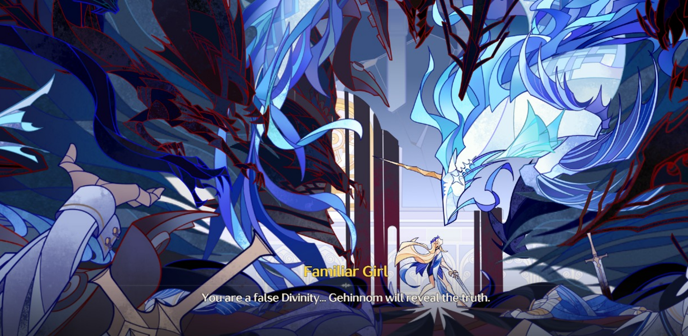<figcaption></figcaption></figure>

Begitu Hognis ditancapkan di tumpuannya, sebuah _flashback_ mengguncang kesadaran Cartethyia.

Ia berdiri sendirian menghadapi **Levi-Rator**, Leviathan dalam wujud Imperator. Sosok itu, dengan suara agung namun sarat kekecewaan, bertanya:

> _“Kenapa kamu membangkang, padahal kamu adalah Resonator terkasihku? Mengapa kau tetap melawan meskipun Gehinnom telah kabur… dan teman-temanmu telah gugur?”_

> _Namun Cartethyia tak gentar. “Aku takkan melupakan tujuanku!” teriaknya dengan penuh semangat._

> _“Jika sang dewa menindas yang tak bersalah, maka kuhunuskan pedangku pada dewa itu! Dengan harapan dan bantuan dari jiwa-jiwa yang telah jatuh, aku berdiri di hadapanmu sekarang. Mereka gugur agar aku bisa bangkit!”_

<figure>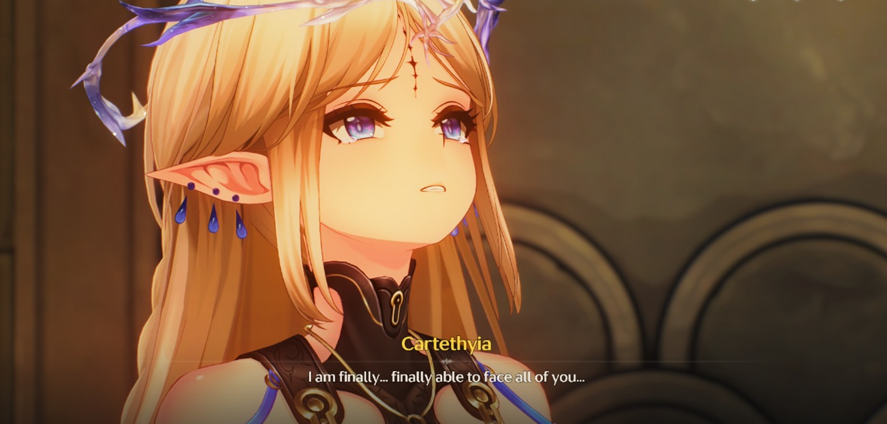<figcaption></figcaption></figure>

Tangis pun jatuh dari pipi Cartethyia. Namun kali ini bukan karena kehilangan—melainkan karena keyakinan. Ia akhirnya memahami, ia berdiri bukan demi para dewa, melainkan **untuk manusia**. Ia tahu sekarang siapa yang harus ia lindungi… dan siapa yang harus ia tebas.

***

Saat energi Hognis terpancar, **Abby** muncul dan berkata bahwa energi biru itu terasa seperti Threnodian—namun bercampur dengan sesuatu yang lain. Hal ini membuat Cartethyia termenung. Bila **Tyrvine** adalah pecahan energi murni Sentinel yang diberikan kepada Blessed Maiden “asli”, kenapa Hognis—yang memuat pecahan energi Threnodian—juga terikat dengan mereka yang mengangkat segel?

Apakah mungkin... Frequency Sentinel dan Threnodian bukan saling menolak, tetapi saling menyeimbangkan? Atau justru Cartethyia sendiri adalah hasil dari **gabungan keduanya**?

Tak ada jawaban pasti. Tapi satu hal yang mulai jelas: semua itu berkaitan dengan **Frequency campuran** yang kini ada dalam Abby.

Mereka pun bersiap melanjutkan perjalanan untuk mencari **pedang ketiga**, **Haultir**, _Sword of Virtue_.

<figure><figcaption></figcaption></figure>

Sebelum tidur, Rover dan Cartethyia berbincang tentang masa lalu Cartethyia. Ia menjelaskan bahwa **Gehinnom** adalah **TD** asli dari **Rinascita** yang berhasil dijinakkan menjadi **Echo** oleh **The Order**. Dijelaskan bahwa **Gehinnom** memiliki kecerdasan dan hierarki sosial tersendiri di antara para naga—dan **Gehinnom** adalah raja mereka. Para naga percaya bahwa **Gehinnom** mampu menghadapi gempuran **Dark Tide** dan membawa mereka pada kebenaran, namun ternyata ia gagal.

Cartethyia kemudian mengutarakan kebingungannya tentang bagaimana rasanya menjadi **Sentinel Resonator**, karena ia dilahirkan dari gabungan **Threnodian** dan **Sentinel**. Rover pun menceritakan kisah **Jinhsi**, yang membuat Cartethyia terkagum dan mengatakan bahwa suatu saat ia ingin bertemu dengannya.

Mereka pun bersiap untuk beristirahat. Rover menawarkan makanan. Cartethyia merasa jijik dengan **Pizza Tropicale**, menyukai **Pizza Classica**, dan sangat menyukai **Laurus Salad**. Ia kemudian mengungkapkan bahwa sebenarnya suara yang didengar oleh para **Laureate** adalah suara dirinya, bukan suara **Imperator**. Namun, ia menolak makanan tersebut karena ia tidak bisa merasakan apa pun, tidak membutuhkan makan untuk bertahan hidup, dan hanya bisa melihat dalam hitam putih.

Akhirnya, Rover bersiap untuk tidur. Ia memanggil Abby untuk membahas dua energi yang tampaknya saling berkaitan, namun karena masih kurang jelas, mereka sepakat untuk melanjutkan pembahasannya besok.

***

<figure><figcaption></figcaption></figure>

Suara nyanyian lembut membangunkan Rover. Ia melihat Cartethyia sendirian, menyanyikan lagu perpisahan _Rinascita_. Cartethyia yang dulunya belum yakin apakah dirinya pantas bahkan hanya untuk mengucapkan selamat tinggal, kini memutuskan untuk memberi penghormatan dan berterima kasih kepada mereka yang telah gugur.

> “Apakah menurutmu… aku membohongi diri sendiri?” tanyanya dengan lirih, sembari menahan air mata.

Rover yang mendengar itu menjelaskan bahwa mereka yang telah mati dan yang masih hidup sebenarnya masih dapat berinteraksi. Ia menceritakan tentang temannya yang memiliki sahabat yang sudah meninggal dalam keadaan bermusuhan, namun akhirnya bisa berdamai setelah bertemu kembali di _Sonoro Sphere_ (Xiangli Yao). Karena pada dasarnya, _Frequency_ yang tersisa dan terkonsentrasi masih bisa mengandung kesadaran manusia. Dengan kata lain, kematian bukanlah akhir mutlak, karena ada kemungkinan mereka masih bisa mendengar dan berinteraksi dengan yang hidup.

<figure><figcaption></figcaption></figure>

Cartethyia yang mendengar itu memantapkan diri. Ia memutuskan untuk menahan kata selamat tinggal, dan membawa mereka menuju kemenangan. Melihat perubahan itu, Rover bertanya karena ia sudah tidak membawa rasa bersalah, ia ingin dipanggil siapa.\
“Cartethyia,” jawabnya.

Mereka pun tertidur dalam pelukan satu sama lain. Setelah terbangun, Cartethyia menelepon Cantarella yang kemudian menjawab dengan nada bercanda sebelum menutup telepon.

Sesampainya di _Haultir_, mereka dihadang oleh berbagai rintangan dan oleh Cadanto, _Echo_ pertama Cartethyia setelah bergabung dengan _The Order_. Ia adalah teman latihan sekaligus penyelamat nyawa Cartethyia dalam pertarungan melawan _Threnodian_. Sayangnya, kini ia telah berubah menjadi _TD_. Setelah mengalahkannya, Cadanto menatap Cartethyia untuk terakhir kalinya, lalu menunduk dengan bangga, seolah melihat sang putri telah selamat seperti dalam kisah-kisah fantasi.

Rover pun menyerap Cadanto menjadi _Echo_, atas permintaan Cartethyia yang menginginkan ia bergabung dengan Rover.

Setelah itu, mereka akhirnya menaruh _Haultir_ pada tempatnya, dan sebuah _flashback_ kembali muncul.

<figure>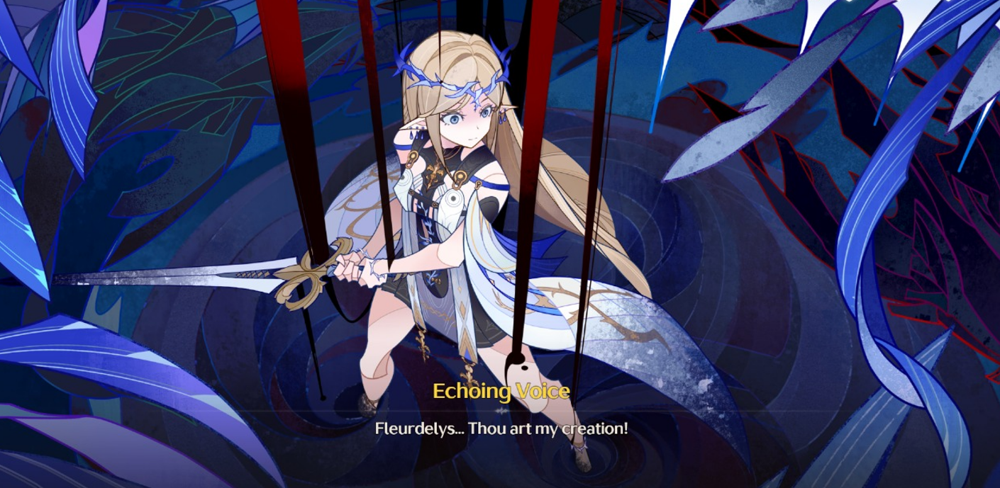<figcaption></figcaption></figure>

> _“Fleurdelys, maukah engkau kembali padaku?” lirihnya._

> _“Seseorang harus membongkar kebohonganmu. Selama masih ada secercah harapan, aku tidak akan menyerah,” kata gadis tersebut dengan penuh keyakinan._

Kali ini makhluk hina itu menyampaikan sebuah kebenaran.

> _“Mengapa engkau mendengar orang yang beriman? Mengapa engkau bergerak sebagai peramalku? Semua ini, engkau tidak menyangkalnya??”_

> _“Jawabannya adalah... Engkau adalah BUATANKU! Akulah penciptamu. Hidup, harapan, masa lalu—SEMUA yang membentuk dirimu, kubuat UTUH, kubuat SEMPURNA!”_

Suaranya bergema dalam ruangan tersebut.

> _“Diriku mengkonsumsi kepercayaan, pemujaan, dan kedambaan orang banyak... Resonasimu denganku adalah yang membawa Dark Tide kedua!” bentaknya._

<figure><figcaption></figcaption></figure>

_Frequency_ yang sebelumnya bertabrakan pun akhirnya mereda, seiring Cartethyia mulai mengingat kembali sebagian besar memorinya. Inilah yang ia ingat:

* Tenaga yang memodulasi _Frequency_ Threnodian dan Sentinel ternyata berasal dari dirinya sendiri.
* Mahkota yang dikenakan oleh Cartethyia digunakan untuk mengontrol Resonator Threnodian.
* Ketika Threnodian melepaskan _Dark Tide_, Fleurdelys—bagian dari dirinya—memisahkan diri karena keinginannya untuk tetap hidup setelah menyaksikan korupsi yang terbentang di hadapannya. Cartethyia memilih untuk menjadi "rusak" sejak awal demi menghindari pengaruh Threnodian.
* Bagian dirinya yang ditinggalkan, yaitu “Fleurdelys”, telah dirasuki Threnodian segera setelah kekalahannya. Fleurdelys adalah sisi yang menyimpan kekuatan besar dan kini bertekad untuk menghancurkan segalanya—termasuk dirinya sendiri.
* Threnodian menggerogoti pikiran Fleurdelys dengan bisikan-bisikannya. Itulah alasan Cartethyia harus memisahkan dirinya sendiri: demi membeli waktu. Namun, sebagai konsekuensinya, ia kehilangan sebagian besar memori karena ia memerlukan wadah baru untuk dihuni. Kini, inti dari Threnodian masih tertinggal dalam diri Fleurdelys.

Perjalanan bersama Cartethyia selama ini adalah bagian dari rencananya: menghancurkan Leviathan dan masa depan yang telah dirancang oleh dewa palsu itu. Ia bertekad mengambil semua yang telah diberikan Threnodian dan mengubahnya menjadi senjata untuk melawannya. Cartethyia yang telah menemani Rover selama tiga hari terakhir adalah sisi dirinya yang ingin terus hidup.

Cartethyia pun sekali lagi memohon, agar Rover bersedia menemani perjuangannya—untuk terakhir kalinya.

<figure><figcaption></figcaption></figure>

Mereka pun bergerak menuju tempat di mana segalanya dimulai—tempat Blessed Maiden dimahkotai, sekaligus lokasi terjadinya _Dark Tide_ kedua. Cartethyia memohon bantuan kepada Rover, yang kini memiliki kemampuan “Pemisahan” dan “Penyatuan” melalui tiga pedang itu, untuk membawa kesadaran Fleurdelys yang tersiksa ke hadapannya agar mereka bisa bertemu.

Rencana Cartethyia adalah agar Rover menggabungkan kembali mereka, lalu membunuhnya, agar Threnodian selamanya terperangkap dalam wadah yang tak bernyawa dan tak akan mampu kembali ke dunia.

> “Tapi bukankah itu artinya akhir dari bagian darimu yang ingin hidup?” tanya Rover.

> “Cartethyia telah hidup tercukupi dan keinginannya pun sudah terwujud. Sekarang giliran Fleurdelys… Ia mengincar kehancuran diri sendiri, untuk mengakhiri dewa palsu sekaligus siksaan yang ia tanggung. Dia telah putus asa dan percaya bahwa tak ada yang mampu menolongnya. Ini satu-satunya cara…” pikirnya dengan wajah sedih.
>
> \
> “Aku terlahir terkutuk di dunia ini. Threnodian mau aku hidup sebagai ancaman bagi orang lain. Tapi boneka yang lahir dari kekejianya akan menjadi akhirnya! Aku akan menjadi UTUH dan jujur pada diriku sendiri! Akhir yang cocok, bukankah begitu? Terima kasih… dan maaf…” lirihnya, sembari mengarahkan pedang Rover ke lehernya sendiri.

Namun Rover, meski mendengar permintaan Cartethyia, memilih untuk melakukannya dengan caranya sendiri. Ia memisahkan Fleurdelys dan Cartethyia, lalu berjalan pergi untuk melawan Fleurdelys, meskipun tangis Cartethyia menggema.

Cartethyia menjelaskan bahwa baik dirinya maupun Fleurdelys seharusnya tidak hidup lagi, namun Rover tetap melangkah.

<figure>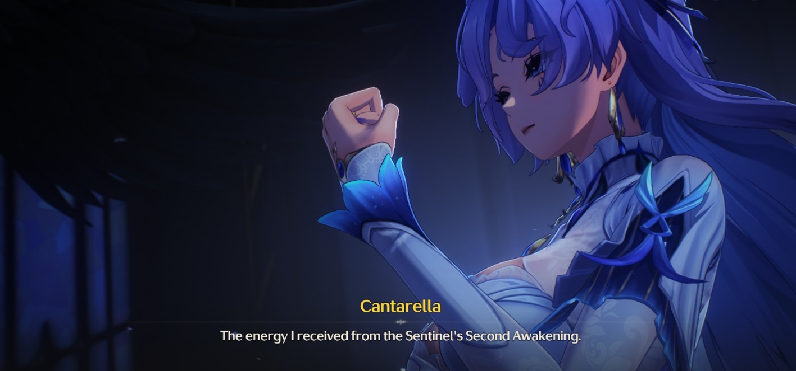<figcaption></figcaption></figure>

Tak lama setelah Rover pergi, Cantarella muncul bersama Tyrvine, yang telah diisi oleh energi para anggota Fisalia yang gagal dalam ujian keluarga. Energi itu memuat memori yang hilang serta bercak kekuatan Sentinel, yang kini diserap oleh Tyrvine. Menurut Cantarella, dirinya sudah lebih dari cukup untuk memegang “Pedang Blessed Maiden.”

Cartethyia bertanya, apakah pengorbanan ini termasuk miliknya?

Cantarella menggeleng, karena pengorbanan Cartethyia telah digunakan sejak lama—yakni ketika ia menyerahkan kekuatan dari _Second Awakening_ pada Imperator, agar Imperator bisa mengendalikan tubuhnya sesaat dan memungkinkan Fleurdelys membunuh Sentinel yang telah terkorupsi.

> “Blessed Maiden yang asli telah berpulang. Namun, tiada alasan yang palsu tak bisa menjadi yang asli, kan? Nasib orang tak seharusnya ditentukan oleh pedang. Kita berdua dikutuk untuk menjadi pion Threnodian, namun bukan berarti kita tak bisa membuat jalan kita sendiri…” serunya.

<figure>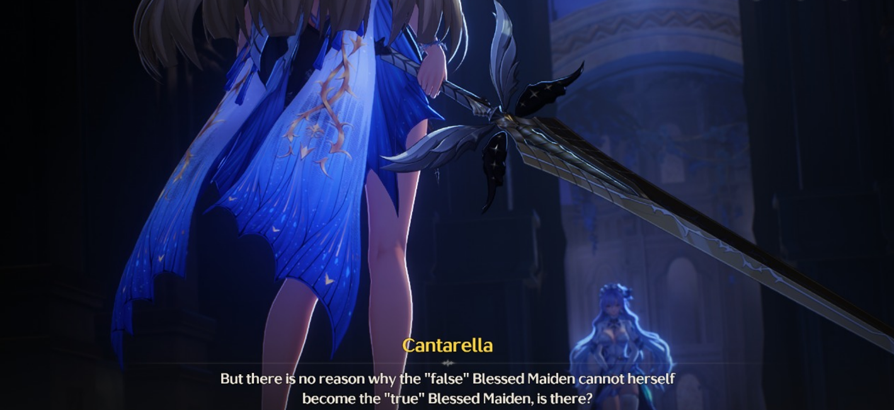<figcaption></figcaption></figure>

Akhirnya Cartethyia bangkit dan berlari mengejar Rover, sementara Cantarella, meski lemah, tetap bertarung untuk menahan TD agar tidak mengganggu mereka.

Abby yang tampak khawatir memperingatkan bahwa saat ini Rover hanya memiliki sisa energi yang sebelumnya sudah dimakan oleh Abby. Namun dengan yakin, Rover berkata bahwa ia harus tetap melakukannya.

Akhirnya, Rover dan Abby tiba di hadapan Fleurdelys.

> “Kemari kau… pembunuh dewa yang perkasa!” serunya.

Pertarungan sengit pun dimulai. Rover, yang kini nyaris kehabisan tenaga, mulai kewalahan.

> “Kau lebih lemah…” ejek Fleurdelys.

> “Aku datang… untuk menyelamatkanmu!” teriak Rover.

> “Akhiri aku, atau… kuakhiri kau!” ancam Fleurdelys dengan marah.

Namun sebelum serangan terakhir menebas Rover, Cartethyia datang dan berhasil menghalau serangan itu—meski ia sendiri terpukul mundur.

> “Kamu… mengkhianati dirimu sendiri?” tanya Fleurdelys.

> “Tidak… ini bukan pengkhianatan,” sangkal Cartethyia.

Sembari berjalan tertatih untuk menyelamatkan Rover, Cartethyia mengingat ucapan Cantarella dan Rover. Namun Fleurdelys mencemoohnya, menganggap semua usahanya sia-sia. Cartethyia membalas,

> “Kalau aku bisa menyelamatkan Rover… maka aku berguna.”

<figure>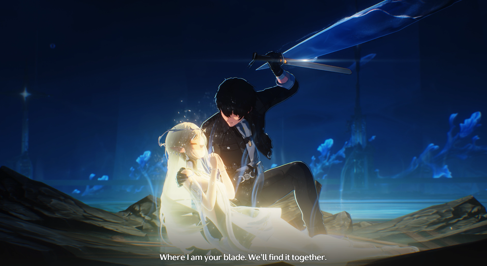<figcaption></figcaption></figure>

Sayangnya, Cartethyia gagal menghalau serangan Fleurdelys. Ia kalah. Tapi sebelum tubuhnya benar-benar tumbang, ia memberikan sisa kekuatannya kepada Rover.

Rover yang kini telah diperkuat langsung membalikkan keadaan. Dalam serangan terakhirnya, ia menusuk Fleurdelys dan membawa tubuhnya ke udara.

<figure>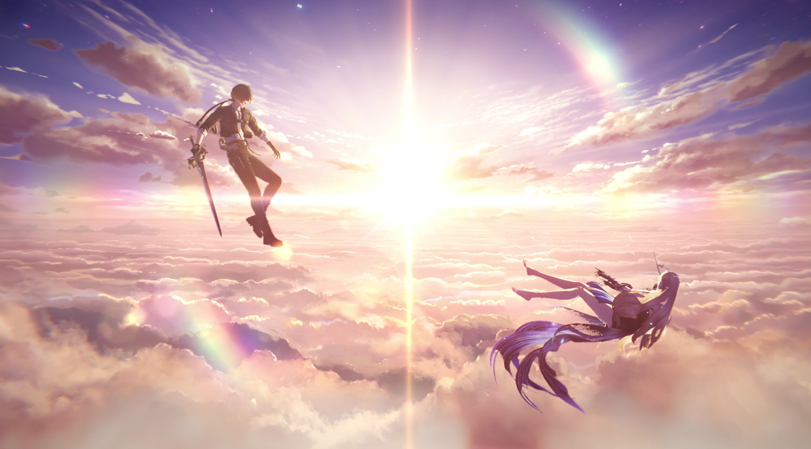<figcaption></figcaption></figure>

Fleurdelys mendekap Rover erat, lalu berbisik,

> “Kerja bagus…” sembari dengan tenang mendorong dirinya sendiri menjatuhkan ke laut.

Rover mengingat kata-katanya dahulu:

> “Carilah masa depan… di mana aku menjadi pedangmu. Kita akan temukan itu bersama.”

Dengan sigap, Rover menyelamatkan Fleurdelys dari kejatuhan dan membawanya ke sebuah pohon. Namun, menurut Abby, Frequency Cartethyia sudah…

Sebelum pembicaraan bisa dilanjutkan, tiba-tiba sebuah suara tenang terdengar—Imperator berbicara kepada Rover.

> “Arbiter, janganlah berputus asa, karena tak semuanya telah berakhir.”

Rover kini berada di dunia serba putih, tempat di mana Imperator menampakkan dirinya.

Imperator menjelaskan bahwa ia telah melindungi data intinya sebagai tindakan pencegahan bila penggabungan dengan Threnodian benar-benar terjadi. Ia diberi satu tugas penting: memahami sifat sejati Threnodian. Namun, ia hanya boleh melakukannya dengan satu syarat—bahwa ia tidak dibatasi.

Karena tak ada pilihan lain, Imperator mengizinkan dirinya bergabung dengan Threnodian. Menurutnya, Threnodian adalah noda dalam peradaban. Untuk benar-benar memahami pola pikirnya, ia harus melihat dari sudut pandang Threnodian sendiri.

Hasil yang ia temukan adalah sebagai berikut:

1. **Threnodian tak bisa dibunuh selama peradaban masih bertahan.** Bahkan Imperator sendiri tidak tahu bagaimana cara menghancurkannya.
2. **Threnodian hanya bisa dikunci atau disegel melalui Resonator.**
3. **Bagi Sentinel, Resonator adalah jangkar. Tapi bagi Threnodian, Resonator adalah belenggu.**

<figure>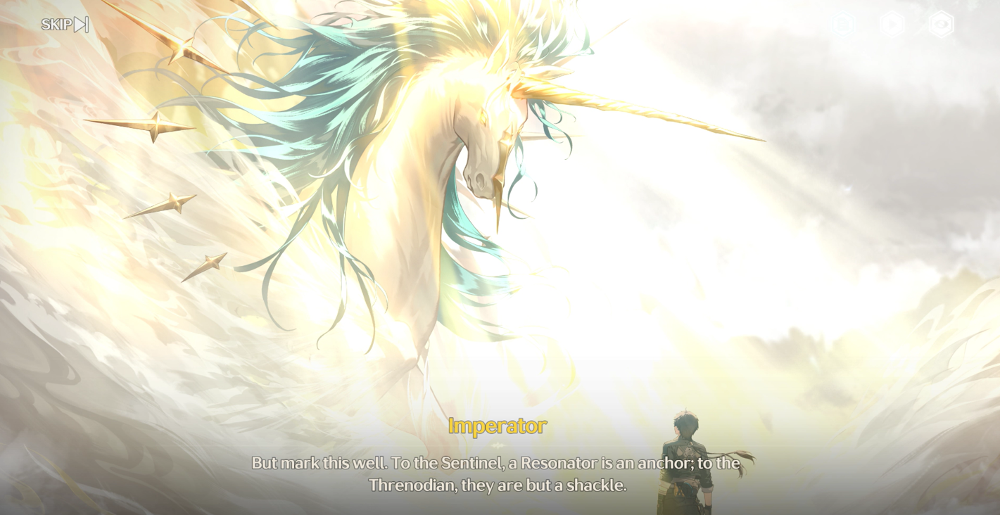<figcaption></figcaption></figure>

Ketika mereka akhirnya menyatu, Leviathan membobol pikirannya dan menyerap sebagian pengetahuan soal _Resonator_. Namun, Imperator berhasil menyembunyikan satu hal kecil—makhluk seperti dirinya tidak bisa memiliki lebih dari satu Resonator.

Threnodian, yang terkecoh, menggunakan _pod_ milik Imperator untuk menciptakan Fleurdelys setelah ratusan tahun kegagalan. Karena Imperator dan Threnodian berbagi tubuh, otomatis Fleurdelys menjadi Resonator bagi keduanya: Threnodian dan Sentinel.

Sementara itu, alasan _Tyrvine_ diberikan pada Fisalia adalah karena Imperator membutuhkan Resonator dengan keteguhan hati, sebagai jaminan terakhir. Bila suatu saat Fleurdelys jatuh ke tangan Threnodian, selama masih ada satu Resonator yang berhasil melewati ujian Tyrvine dan menjadi Sentinel Resonator, maka hukum dunia Solaris akan berlaku.

Hasilnya?

**Frequency Imperator, Leviathan, dan Fleurdelys akan dihapus secara permanen—tanpa sisa. Tak akan ada kebangkitan kembali.**

<figure><figcaption></figcaption></figure>

Itulah rencana awalnya. Namun, Cantarella memilih jalan lain. Ia memberikan kekuatan dari _Second Awakening_-nya pada Imperator, agar sang Imperator dapat mengendalikan tubuhnya sejenak dan membuka celah bagi Fleurdelys untuk membunuh sosok dirinya yang telah terkorupsi.

Ini bukanlah bagian dari rencana. Bahkan, ia adalah sebuah variabel tak terduga—sebuah harapan yang tak pernah diperhitungkan dalam kalkulasi Imperator. Tapi justru dari situ, takdir mulai bergeser. Fleurdelys melawan takdir Leviathan, dan Cantarella melangkah ke jalur yang belum pernah dibayangkan siapa pun.

Meskipun penuh rintangan, akhirnya… mereka menang.

Di sisa kehidupannya, Imperator ingin berbicara dengan Cartethyia, dan menolongnya. Ia menawarkan diri menjadi penghubung _Frequency_ Cartethyia yang tersisa, memanfaatkan _Tacet Mark_ di tubuh Rover sebagai jembatan untuk membangkitkan kembali _Frequency_-nya dalam tubuh yang baru. Bayarannya? Nyawanya sendiri.

> “Arbiter… apakah aku telah memenuhi tugas yang diberikan padaku?” tanyanya, nadanya rapuh, seperti menahan tangis.

> “Iya… kamu sudah bekerja keras,” jawab Rover dengan tenang.

> “Tolong sampaikan ini pada para Fisalia, Arbiter—‘Kamu… sudah bebas’.”

Itulah kata terakhir Imperator sebelum ia menghilang dalam kabut.

***

<figure>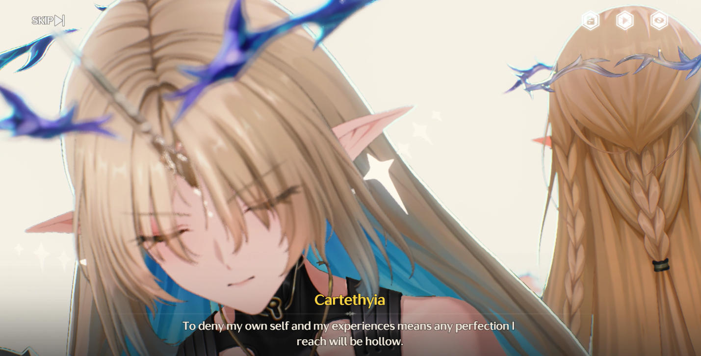<figcaption></figcaption></figure>

Cartethyia pun bertemu Imperator. Di sana, Imperator bertanya:

> “Apakah hidupku membuatmu kesal? Apakah kau sudah tak ingin percaya padaku? Apakah kau memikul dendam atas semua yang kulakukan?”

Ia menawarkan Cartethyia pilihan—jika ia mengiyakan, maka semua memori kelamnya akan dihapus.

Namun Cartethyia menolak.\
Ia ingin berdamai.\
Ia ingin menerima semua luka, semua pengkhianatan, semua kebenaran—karena menolak masa lalu berarti membuang siapa dirinya sesungguhnya.

> “Kalau aku menolak diriku sendiri, semua kesempurnaan yang kudapat hanyalah cangkang kosong,” ujarnya. “Aku kini sadar... aku sudah utuh.”

Imperator menunduk dan tersenyum. Dengan lembut, ia memberikan berkat terakhirnya.

> “Kamu memang pantas menyandang gelar _**Blessed Maiden**_.”

***

<figure><figcaption></figcaption></figure>

Ketika Cartethyia terbangun, Rover langsung menyadari sesuatu telah berubah—sifatnya, caranya bicara, sorot matanya. Ia tampak ceria dan riang, seperti legenda yang selama ini hanya jadi dongeng.

> “Jadi... aku harus memanggilmu Cartethyia atau Fleurdelys sekarang?” tanya Rover.

> “Sejak pertama kali kita bertemu, aku mengenalkan diriku sebagai Cartethyia. Jadi itulah diriku,” jawabnya dengan senyum lebar.

Kini, Cartethyia benar-benar hidup. Bebas. Ia bisa melakukan apapun yang ia inginkan.

Mereka berdua, yang telah melalui hidup dan mati bersama, akhirnya duduk dan beristirahat sejenak. Di tengah keheningan, Cartethyia berjanji:

> “Kalau suatu saat nanti kamu berada di posisiku… aku akan melampauimu. Aku akan menolak keinginanmu, mengabaikan permohonanmu, mengalahkanmu, dan menjadi penyelamatmu—seperti yang kamu lakukan untukku.”

<figure><figcaption></figcaption></figure>

Rover tertawa pelan.

> “Aku nggak semudah itu dikalahkan.”

Tapi untuk sekarang, Cartethyia hanya ingin memikirkan masa depan—dan melihat kembali tanah Ragunna.

Setelah semuanya usai, Rover kembali ke keluarga Fisalia. Di sana, ia menyampaikan hasil dari pertarungan terakhir itu, sekaligus menyampaikan pesan terakhir Imperator pada Cantarella.

Sebagai ucapan terima kasih… Cantarella menyerahkan sebuah plakat—simbol perjanjian antara Rover dan Fisalia.

<figure><figcaption></figcaption></figure>

***


:notebook: **GLOSARIUM**

* Avinoleum

> Tempat pendidikan The Order yang dulunya diisi Resonator, sekarang telah menjadi Sonoro Sphere sebagai "kandang" yang mengunci Dark Tide diatas langit.

* Divine Trial Fisalia

> Ujian beresonasi dengan Tyrvine dalam keadaan overclock yang memberikan berbagai penglihatan.

* Fisalia Family

> Keluarga Fisalia adalah salah satu garis keturunan tertua di Rinascita dan salah satu keluarga paling kuat di Ragunna yang mempertahankan hubungan erat dengan Order of the Deep.
>
> Mereka dianggap sebagai orang percaya "yang taat" dari Sentinel Imperator, oleh sebagian besar, dan sering dianggap sebagai bangsawan mistik, terampil dalam seni racun dalam skema kekuasaan.

* The Sword of Virtue — "Haultir"

> Pedang yang digunakan Cartethyia dahulu kala, sekarang adalah salah satu kunci segel Avinoleum.

* The Sword of Discord — "Hognis"

> Pedang yang bahkan Cartethyia tidak tahu asal usulnya, pembuka salah satu segel, pedang ini membawa aura misterius laut dalam.

* The Sword of Divinity — "Tyrvine"

> Pedang yang menyimpan kekuatan Sentinel Imperator yang digunakan sebagai artefak pemilihan Sentinel Resonator.

