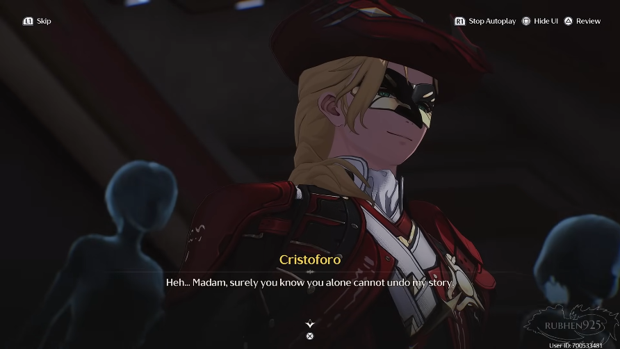

# Act 5: Shadow of Glory

<figure><figcaption></figcaption></figure>

Rover tiba-tiba merasakan getaran kuat yang menyeruak dari arah Sonoro milik Cartethyia—Inverted Tower. Energi itu terasa asing, seperti ada sesuatu yang tidak stabil di dalamnya.

“Her frequency… tidak stabil,” batinnya. Perasaan itu membuatnya gelisah. Ia segera bergegas, mengikuti jejak Resonance Energy yang tercecer di sekitarnya.

Tempat itu kacau. Sisa-sisa ledakan Resonance masih terlihat jelas.\
Abby mengibaskan tangannya, menatap sekeliling dengan heran. “Astaga… berantakan sekali. Seperti baru saja dihantam habis-habisan.”\
Ia mengernyit, lalu mengangguk. “Tidak salah lagi, ini sisa frekuensi Cartethyia. Tapi… ke mana dia pergi?”

Rover mencoba mencari tanda kehidupan, namun tak ada jawaban. Ia menoleh pada Abby. “Bisa tahu ke mana jejak ini mengarah?”\
Abby menutup mata sejenak, merasakan aliran energi. “Di sana. Tapi… agak kacau. Rasanya goyah.”\
Rover mengikuti arah yang ditunjukkan. “Itu… menuju ke sebuah kepulauan, seberang Ragunna.”

Jejak itu masih segar. Waktu mereka terbatas—jika tak segera diikuti, semuanya akan hilang.\
“Haruskah kita pergi sekarang?” tanya Abby, sedikit cemas.\
“Ya,” jawab Rover tegas. “Dengan Threnodian’s will sudah lenyap, seharusnya Cartethyia takkan kehilangan kontak… kecuali memang ada yang sangat salah.”

Namun sebelum berangkat, Rover memutuskan untuk menghubungi Cantarella. Suara lembut namun sinis itu terdengar di telinganya.\
“Oh, panggilan dari Laureate yang terhormat. Apa ini? Rindu ketenangan kastilku, hmm?”

Rover menjelaskan apa yang terjadi. Mendengar nama Cartethyia hilang, Cantarella terdiam sejenak.\
“Cartethyia hilang… mengerti. Itu memang masalah yang mendesak.”

Rover menegakkan tubuhnya. “Sebelum aku berangkat mencarinya, aku ingin tahu lebih banyak tentang kepulauan itu.”\
Cantarella tertawa kecil. “Berhati-hati, ya? Baiklah, aku takkan bertele-tele. Kepulauan itu bernama Septimont.”

Ia kemudian menjelaskan bahwa Septimont adalah salah satu city-state di Rinascita. Sama seperti Ragunna, orang-orangnya dahulu dipandu oleh Sentinel melintasi samudra untuk menetap di sana. Namun seiring waktu, perbedaan pandangan membuat keduanya berpisah jalan.

<figure><figcaption></figcaption></figure>

“Septimontians tidak percaya pada Sentinel,” jelas Cantarella.\
Rover mengernyit. “Kupikir itu keyakinan umum di seluruh Rinascita?”\
“Bahkan dari asal yang sama, hati dan pikiran manusia bisa melenceng ke arah yang tak terduga,” jawab Cantarella pelan.

Septimont, katanya, adalah kota para pejuang. Dengan semboyan sederhana: _“All for glory, fear no death.”_ Mereka memuja pahlawan, bukan ilahi.

Di bawah kendali The Order, Ragunna menutup perbatasannya dari orang-orang Septimont. Namun sebaliknya, Septimont tidak pernah menutup pintunya, bahkan lebih ramah kepada para pendatang.

“Sekarang, Septimont sedang menjadi tuan rumah <mark style="color:blue;">**Great Agon**</mark>,” tambah Cantarella. “Perayaan besar yang menjadi nadi perekonomian mereka. Musim seperti ini akan menarik orang dari berbagai penjuru.”

Rover menghela napas. “Sepertinya memang saat yang tepat untuk berkunjung ke Septimont. Terima kasih, Cantarella.”\
Cantarella tersenyum samar, suaranya terdengar hangat namun penuh teka-teki. “Kau adalah sekutu abadi Fisalias… dan tentu saja, tamu terhormatku. Tidak perlu formalitas di antara kita.”

***

Sepanjang perjalanan menuju Septimont, Abby tampak gelisah. Ia menggenggam dadanya, jantungnya berdegup kencang.\
“Aku nggak sakit,” katanya ketika Rover menoleh khawatir. “Cuma… rasanya aneh. Seperti ada sesuatu yang kusut, semua bercampur jadi satu.”

Rover tidak bisa mengabaikan firasat itu. Ia hanya menatap ke depan.

***

Saat akhirnya tiba di Septimont, udara asin laut menyambut. Rover menoleh ke Abby, tapi tak ada jawaban. Tacet Mark pun tidak bereaksi.\
&#xNAN;_(Tidur? Atau ada sesuatu yang lebih buruk…)_ pikirnya. Bayangan Cartethyia kembali muncul di benaknya. _Dulu dia pernah membantu Abby. Andai saja dia ada di sini…_

<figure><figcaption></figcaption></figure>

Mereka berbagi benang kekuatan dari Imperator. Rover mencoba memfokuskan diri, berusaha merasakan keberadaan Cartethyia. Sekilas, ia melihatnya—berdiri menghadapi makhluk setengah manusia setengah singa, entah Tacet Discord atau Echo yang unik.

Rover menelusuri jejak yang ditinggalkan Cartethyia, hingga tiba di sebuah gua. Saat tangannya menyentuh patung dingin di dalamnya, bisikan samar terdengar: teriakan perang, dentingan senjata, tawa para pejuang yang sudah gugur. Sebuah armor tua bergetar, seolah menyuarakan kerinduan abadi akan kejayaan.

> _Ini mungkin sebuah Echo… Echo yang menunggu seorang pejuang sejati._

Resonance itu beresonansi dengan Rover, seakan gembira mengenang pertempuran masa lalu.

> _Sepertinya aku sudah menemukan teman pertamaku di Septimont…_

Keluar dari gua, Rover menatap hamparan luas di depannya. “Jadi… inilah Septimont.”

***

<figure><figcaption></figcaption></figure>

Di tempat yang tak dikenal, Cartethyia berjalan pelan. “Jejak ini akan membawamu padaku, Rover. Dan ketika waktunya tiba, kau akan membawa kisah ini pada akhirnya yang semestinya.”

Ia menghirup dalam-dalam. “Aroma laut… ada di depan sana.”

***

Kembali ke Rove&#x72;_**.**_ Tak jauh dari sana, sebuah desa kecil berdiri. Rover melangkah masuk, berniat mencari informasi.

Warga desa menyambut riuh. Mereka berbincang seru soal pertandingan Great Agon yang sedang berlangsung. Nama _Blue Furies_ dielu-elukan, dianggap tak terkalahkan meski banyak yang meremehkan mereka. Suasana penuh taruhan dan spekulasi tentang siapa yang akan keluar sebagai juara.

<figure><figcaption></figcaption></figure>

Melihat Rover, salah seorang warga menyapanya ramah. Bajunya yang asing membuat mereka menebak-nebak asalnya. Rover menjawab singkat, lalu menanyakan seseorang—Cartethyia.

Sayang, tak ada yang mengenalnya. Warga hanya menyebut kalau kebanyakan Ragunnesi yang datang biasanya dari _Troupe of Fools_ atau bangsawan Montelli. Kalau ada anggota Order lewat, pasti sudah jadi perhatian.

Rover lalu bertanya tentang makhluk setengah manusia setengah singa yang ia rasakan sebelumnya. Mata warga itu berbinar. “Itu pasti <mark style="color:blue;">**Guardian Echo**</mark> Septimont! Lioness of Glory—Arsinosa!”

Mereka menjelaskan dengan bangga. Sejak leluhur mereka tiba di tanah ini, peperangan melawan alam keras dan Tacet Discord melahirkan banyak jiwa pemberani. Reverberation mereka menyatu dengan tanah, melahirkan Arsinosa—sosok singa perkasa yang lahir dari raungan pertempuran dan kebanggaan membara.

Sebagai pelindung Septimont, Arsinosa biasanya hanya muncul saat Great Agon. Mendapatkan restunya adalah kehormatan tertinggi bagi seorang Septimontian.

> _Tapi… kenapa Cartethyia harus menghadapi Guardian Echo milik Septimont?_

Sebelum berpisah, warga menyarankan Rover untuk mencoba mencari informasi di penginapan sekitar kota. Mereka juga mengingatkan bahwa final Great Agon akan digelar di Colosseum—satu-satunya kesempatan untuk menyaksikan Arsinosa.

***

**Tentang Sentinel dan Septimont**

> Saat bertanya pada warga, Rover mendengar kisah tentang **perbedaan keyakinan Septimont** dengan Ragunna.\
> Bagi Septimontians, Sentinel bukanlah dewa, melainkan kawan seperjuangan—pemandu yang menguatkan mereka di masa sulit. Keberanian manusia adalah inti kekuatan, bukan doa pada sesuatu yang tak terlihat.\
> Sebaliknya, mereka menilai Ragunnesi sudah melenceng, terlalu memuja Sentinel dan melupakan arti perjuangan itu sendiri.

**Tentang Arsinosa**

> Seorang warga senior dengan bangga menceritakan tentang **Lioness of Glory, Arsinosa**.\
> Dulu hanyalah patung gryphon, tetapi tekad rakyat Septimont untuk menang melahirkan Echo Iudicis yang agung. Bahkan Sentinel sendiri pernah datang setelah kelahiran Arsinosa—namun sejak saat itu, tak pernah kembali lagi.\
> “Dia adalah bukti semangat kami. Penjaga yang akan mengawasi Septimont selamanya,” ujar sang warga penuh hormat.

***

Rover mencoba meraba jejak Resonansi di sekitar Septimont.

> _Frekuensinya mirip Echo di Ragunna… mungkin juga lahir dari kekuatan Imperator. Tapi kenapa tidak stabil? Seolah ada sesuatu yang mengganggu. Sama persis seperti kata Abby…_

Jejak itu terasa dekat, tapi sulit ditentukan arahnya.

<figure><figcaption></figcaption></figure>

Tiba-tiba, seorang perempuan berpenampilan nyentrik menyapanya.\
“Boss, wajahmu serius sekali!” katanya ceria. Ia memperkenalkan diri sebagai **Buling**, seorang Taoist pengelana dari Mengzhou. Dengan gaya bercanda, ia menawarkan jasa ramalan, menyinggung soal Jianxin, dan mengingatkan Rover bahwa feng shui Rinascita sedang “buruk”—sebuah tanda ketidakberuntungan.

Rover hanya mendengarkan sambil menyimpan rasa waspada. (Sekilas percakapan mereka tidak memberi jawaban, tapi Buling jelas bukan orang biasa.)

***

Di jalanan kota, Rover melihat seorang **gladiator berambut merah twintail** mengejar sekelompok gladiator. Saat salah satu serangan gadis itu nyaris menghantamnya, Rover menangkis.\
Seketika, gladiator itu berhenti dan… mengendusnya seperti serigala.\
“Hm. Tidak buruk,” katanya dingin.

<figure><figcaption></figcaption></figure>

Beberapa gladiator mencoba menyerang dari belakang, namun dengan mudah gadis itu melumpuhkan mereka.\
Namanya **Lupa**. Ia memaki lawannya yang bernama Emilio, menuduhnya melakukan kecurangan menjelang Agon. Emilio membela diri dengan getir, sebelum akhirnya kabur bersama kelompoknya.

“Jangan salah sangka, Rover,” kata Lupa setelah suasana reda. “Septimont tidak semuanya busuk seperti mereka.”

Lupa menjelaskan, Emilio dulunya adalah rekannya. Namun kini ikut bermain kotor bersama keluarga bangsawan <mark style="color:blue;">**House of Silva**</mark>. Ia sendiri sudah lama dicampakkan dari nama besar itu karena menolak tunduk.

<figure><figcaption></figcaption></figure>

Lupa lalu menatap Rover tajam. “Kau kuat. Bagaimana kalau kita bertarung bersama di **final Agon**?”

Rover sempat tertegun. Ia merasakan **frekuensi Cartethyia** samar-samar dari Lupa, meski gadis itu mengaku tak mengenalnya. Ia juga menyebut nama **Arsinosa**, satu-satunya petunjuk yang Rover punya.

“Jika kau ingin mencari temanmu itu,” Lupa menambahkan, “final Agon adalah kesempatan terbaikmu. Arsinosa akan muncul di sana. Juara Agon akan diakui, dihujani hadiah, dan yang terpenting… mendapat perhatian semua pihak. Itu akan membantumu.”

Rover menimbang sejenak.

> _Kalau ingin menemukan Cartethyia, ini jalannya._

<figure><figcaption></figcaption></figure>

“Baik,” katanya akhirnya. “Aku ikut.”\
Lupa tersenyum puas. “Itu semangat yang kusuka! Kalau begitu… ayo kita daftarkan tim kita.”

Di hadapan terminal pendaftaran, Rover berdiri bersama Lupa. Boethia, petugas pendaftaran, sempat kaget melihat kedatangan Lupa—seorang Contender terkenal dari tim _Bough of Legions_.

Namun Lupa menegaskan bahwa masa lalunya bersama tim lama sudah berakhir. Kini ia datang bersama Rover, membentuk sebuah tim baru. Ia bahkan menyerahkan hak pemberian nama tim kepada Rover.

<figure><figcaption></figcaption></figure>

“Wuthering Waves,” jawab Rover mantap.\
Lupa tersenyum puas, merasa nama itu selaras dengan identitas Septimont yang selalu hidup berdampingan dengan suara ombak. Mereka pun resmi mendaftarkan diri, sekaligus mengajukan syarat khusus: ikut serta dalam _special qualifier_ demi lolos ke _Great Agon_, ajang gladiator terbesar yang hanya digelar setiap empat tahun sekali.

***

Arena pertama mempertemukan tim **Wuthering Waves** dengan tim **Vulcan Mining**. Pertarungan berlangsung sengit, penuh dentuman senjata dan sorakan penonton. Namun Rover dan Lupa berhasil menunjukkan kerja sama mematikan, menumbangkan lawan dengan gaya yang memukau.

“Perfection! Rasanya sudah lama aku tidak menikmati pertarungan seperti ini,” seru Lupa dengan senyum lebar. Rover hanya menanggapi rendah hati, tapi jelas ia pun menikmati adrenalin itu.

<figure><figcaption></figcaption></figure>

Sorak-sorai kecil makhluk penonton menambah riuh kemenangan mereka, dan Rover sempat membandingkan semangat mereka dengan bayi Gryphon yang pernah ditemuinya.

Namun suasana tiba-tiba berubah kacau. Penonton berkerumun, berusaha mendekati Lupa. Ada yang meminta tanda tangan, ada yang bertanya soal masa lalunya di _Bough of Legions_, ada pula yang mengumbar gosip tentang alasan Lupa membentuk tim baru. Rover akhirnya sadar: Lupa bukan hanya gladiator biasa, ia adalah seorang selebritas.

Mengetahui kerumunan tak bisa dihindari, Lupa menggenggam tangan Rover. “Ikuti aku, jangan lepas!” katanya sambil tertawa. Mereka pun kabur bersama, meninggalkan arena dengan napas terengah namun hati yang ringan.

***

Di perjalanan menuju kota, Lupa sempat menggunakan terminal pribadinya, mengirim pesan kepada “pihak tertentu.” Ia lalu menjelaskan pada Rover tentang keluarganya—_House Silva_—sebuah keluarga bangsawan yang berkuasa melalui kekuatan, ketenaran, dan juga bisnis taruhan ilegal.

“Di sini, semua orang ingin menggigit daging paling lezat,” katanya dengan perumpamaan tajam. “Dan kabar aku keluar dari tim lama akan segera membuat para pemburu keuntungan itu ribut.”

<figure><figcaption></figcaption></figure>

Tiba-tiba, seorang pria menunggu di jalannya. **Cartur**, mantan manajer Lupa di _Bough of Legions_. Dengan lidah manisnya, ia mencoba merayu Lupa agar kembali ke keluarga Silva. Namun Lupa menolak mentah-mentah, bahkan menuduhnya terlibat dalam praktik kotor _match-fixing_.

Cartur hanya tersenyum dingin. “Silvas membesarkanmu jadi bintang, dan mereka juga bisa memadamkanmu,” katanya sebelum pergi. Tapi Lupa tidak gentar—ia tahu aturan main di Septimont, dan siap melawannya.

***

Mereka melangkah melewati distrik bawah kota, menuju arena berikutnya. Di sana, tim **Blue Furies** sudah menunggu. Pertarungan kembali berlangsung sengit, namun Rover dan Lupa berhasil menang dengan gaya spektakuler.

<figure><figcaption></figcaption></figure>

Saat pertempuran berakhir, Rover merasakan sesuatu aneh: sebuah energi samar mengalir dari tangan Lupa ke dirinya, membawa sekilas gambaran tentang Cartethyia—sosok misterius yang berdiri di atas air. Hanya Rover yang menyadari hal ini.

Sementara itu, suara penonton terdengar bercampur: ada yang kagum, ada yang sinis, ada pula yang menyebarkan rumor tentang kepergian Lupa dari _Bough of Legions_. Namun Lupa tetap tersenyum santai.

“Biarlah mereka berkata apa pun,” ujarnya. “Yang penting aku punya rekan yang bisa kupercaya. Bersamamu, Rover, aku tak perlu lagi khawatir soal politik busuk. Hanya ada pertarungan… dan kemenangan.”

Setelah kemenangan itu, Rover meminta untuk mencari Cartethyia, merasa sosok itu pernah melewati sebuah wilayah berair di kota. Lupa pun membawanya ke area tua di dekat menara—wilayah yang pernah ditinggalkan sejak _Dark Tide_ pertama di Ragunna.

<figure><figcaption></figcaption></figure>

Di tepi air, Rover mencoba memanggil Cartethyia melalui resonansi Imperator. Namun sambungan itu terputus, meninggalkan rasa frustrasi.

Lupa menenangkannya, lalu bercerita tentang sejarah Septimont—tentang patung Tercules yang dulu berdiri megah, tentang lonceng kejayaan yang pernah bergema dari kota bawah.

<figure><figcaption></figcaption></figure>

Saat Rover naik elevator menuju kota atas, adegan beralih ke Cartethyia. Ia berjalan di reruntuhan yang diselimuti kabut. Di sana, ia menemukan seorang gadis berambut merah, terluka dan kelelahan, tanpa ingatan siapa dirinya.

<figure><figcaption></figcaption></figure>

Tiba-tiba, sekawanan Tacet Discord mendekat. Cartethyia menghunus pedangnya. “Jangan takut. Hadapilah aku.”

***

Adegan pun kembali pada Rover dan Lupa yang tiba di distrik atas—<mark style="color:blue;">**Capitoline Hill**</mark>, jantung kejayaan Septimont.

Lupa memperkenalkan Rover pada kota bangsawan dan gladiator itu, menjelaskan filosofi yang dipegang masyarakatnya:\
“Di sini, kekuatan adalah segalanya. Asal usulmu tidak penting. Jika kau menang, panggung dan sorotan akan menjadi milikmu. Tapi kalau kau gagal… kau akan ditelan bayang-bayang.”

***

<figure><figcaption></figcaption></figure>

Setelah dua pertandingan keras, perut mereka mulai protes. Lupa mengajak Rover ke sebuah restoran ramai di distrik bawah. Aroma masakan langsung menyambut mereka, dan tanpa ragu Lupa memesan dua porsi besar serta sebotol _Heartpour_, minuman yang pernah ia promosikan.

Kehadiran Lupa langsung mengundang perhatian. Beberapa warga berbisik, membicarakan kepergiannya dari _Bough of Legions_. Fulvia, sang pemilik restoran, menegur mereka dengan tegas agar tak ada gosip di luar arena.

Meski begitu, suasana tetap hangat. Lupa bercanda dengan Fulvia, bernostalgia soal masa lalu bersama keluarga Silva. Ia lalu memperkenalkan Rover. Dengan satu tatapan, Fulvia tahu bahwa Rover bukan orang biasa. “Naluri penjaga kedai,” ujarnya singkat.

Sayangnya, _Heartpour_ sudah ludes terjual—bukti bahwa nama Lupa masih cukup kuat untuk melariskan apapun yang ia endorse. Rover sempat penasaran soal minuman itu, dan Lupa dengan malu-malu mengaku bahwa sebagian besar produk yang ia promosikan rasanya “biasa saja.” Namun _Heartpour_ berbeda—itulah satu-satunya produk yang benar-benar ia sukai.

Di sela makan, Fulvia menyampaikan kabar bahwa rekaman pertandingan lama baru saja tiba, termasuk milik Contender Mya. Mendengar nama itu, mata Lupa berbinar. Ia menceritakan betapa Mya bukan sekadar gladiator berbakat, tapi seorang pejuang dengan hati sejati—setiap gerakannya di arena terasa penuh jiwa, bahkan lewat rekaman sekalipun.

Namun kisah Mya berakhir misterius. Ia menghilang di tengah _Great Agon_ bertahun-tahun lalu, dengan banyak rumor yang menyertainya—skandal taruhan, tekanan dari manajer, atau sekadar hilang tanpa jejak. Lupa mengaku kesal setiap kali memikirkannya. “Kalau gagal sampai akhir, orang hanya akan melihatmu sebagai pecundang,” ujarnya getir.

***

<figure><figcaption></figcaption></figure>

Usai makan, Lupa membawa Rover ke _Leonidas Hotel_, salah satu hotel paling bergengsi di kota. Dengan bangga ia mempersembahkan sebuah suite mewah—ruang pribadi yang bisa digunakan Rover sepanjang tinggal di Septimont. Rover sempat terkejut dengan kemewahannya, namun Lupa hanya tertawa. “Aku sudah bertahun-tahun hidup di arena. Rezekinya lumayan,” katanya ringan.

Namun di balik tawa itu, Lupa mulai membuka hatinya. Ia mengaku bahwa gladiator bukan sekadar profesi—itu adalah hidupnya. Ia mencintainya, meski terkadang ada rasa takut yang menghantui.

<figure><figcaption></figcaption></figure>

“Aku lahir untuk ini,” ujarnya lirih. “Tapi semakin aku mencintainya, semakin aku takut kehilangan segalanya. Apa yang sebenarnya kucintai? Pertarungannya? Atau perhatian yang menyertainya?”

Rover menenangkannya dengan kata sederhana: bila cinta itu tulus, maka tak akan pernah pudar. Lupa terdiam, lalu tersenyum. “Semoga saja. Sampai aku terkubur di _Vale of Glory_.”

Dengan itu, ia menyudahi percakapan. Besok adalah semifinal, dan mereka butuh istirahat.

***

<figure><figcaption></figcaption></figure>

Namun saat malam tiba, Rover tidak benar-benar tidur nyenyak. Ia tiba-tiba tersadar di sebuah ruang mimpi yang absurd—penuh lembaran kata-kata melayang, kertas berterbangan, dan jalanan yang terbuat dari buku merah raksasa. Di ujung jalan, sebuah panggung terapung dihiasi bunga spider lily merah. Di sana, seorang perempuan sudah menunggu: **Phrolova**.

Di dunia mimpi itu, Phrolova berbicara dengan tenang. Ia menyebut pertemuan itu bukan medan perang, melainkan panggung perbincangan. Rover menuduhnya terlibat dalam hilangnya Cartethyia, tapi Phrolova hanya tersenyum. Ia mengatakan bahwa hilangnya gadis itu, anomali di Septimont, dan bahkan nasib Lupa sendiri adalah bagian dari sebuah “kisah” yang ditulis oleh rekannya—seorang sosok misterius dengan obsesi terhadap kisah para pahlawan.

<figure><figcaption></figcaption></figure>

Phrolova menyerahkan sebuah naskah kepada Rover. “Jawaban yang kau cari ada di dalamnya,” katanya. Ia lalu mengungkap sesuatu yang mengejutkan: menurut kisah itu, Lupa—si gadis gladiator—akan menjadi pembawa _Dark Tide_ di Septimont.

<figure><figcaption></figcaption></figure>

“Pada akhir pertandingan, semua kejayaan akan hancur. Kebanggaan para pahlawan akan lenyap dalam pusaran hitam,” ujar Phrolova dingin. “Kau bisa mengubah akhir kisah ini dengan mengakhiri hidupnya… atau membiarkan tragedi terulang.”

Rover menolak begitu saja untuk percaya pada kata-katanya. Namun Phrolova hanya mengangkat bahu. “Percaya atau tidak, kisah akan berjalan sebagaimana ditulis. Pilihan ada padamu.”

Dengan itu, panggung mimpi memudar, meninggalkan Rover dengan kegelisahan yang tak bisa ia abaikan.

***

Rover terbangun dengan kepala berat. Bayangan mimpi semalam masih menempel jelas—Phrolova, panggung bunga merah, dan ramalan mengerikan tentang Lupa. Ia mencoba menyembunyikan keresahannya, namun Lupa langsung menyadari.

<figure><figcaption></figcaption></figure>

“Pagi, Rover! Hmm, kelihatannya kau kurang tidur.”\
“Cuma mimpi buruk,” jawab Rover singkat. “Ayo, tujuan kita berikutnya Colosseum Olymdos, kan?”\
“Betul sekali. Ayo kita menjemput kemenangan!”

Begitu mereka tiba, sorak sorai penonton menyambut dengan dahsyat. Arena itu megah—arsitektur klasik Septimont dipadukan dengan teknologi holografis modern, menciptakan pemandangan yang spektakuler.

<figure><figcaption></figcaption></figure>

Lupa menjelaskan bahwa mereka akan menghadapi _Bough of Legions_, rumah lama yang dulu menaunginya. Kekalahan bukan pilihan, apalagi dengan Domina Julia yang terkenal licik. “Hari ini kita buktikan kalau kemenangan bisa diraih tanpa rekayasa,” katanya penuh semangat.

<figure><figcaption></figcaption></figure>

Dari podium tertinggi, seorang wanita berambut jingga menyala berdiri. Dialah <mark style="color:blue;">**Ephor**</mark>**&#x20;Augusta**, pemimpin tertinggi Septimont. Dengan suara lantang, ia membuka Agon, mengingatkan semua orang bahwa gladiator adalah nadi kota ini dan hanya mereka yang kuat pantas mempertahankan kejayaan. “Biarkan Agon dimulai!” serunya, disambut riuh massa.

***

Dengan pengumuman dari Caia, pertandingan resmi dimulai: _Wuthering Waves versus Bough of Legions_. Arena pun bergemuruh.

Lupa menghadapi Emilio dengan penuh percaya diri. “Ayo kita selesaikan ini secara adil!” teriaknya. Rover dan Lupa bertarung serasi, bergerak seolah satu jiwa. Namun di tengah pertarungan, sesuatu yang ganjil terjadi.

<figure><figcaption></figcaption></figure>

Tombak merah milik Lupa tiba-tiba memancarkan aura kelam, bergetar seolah hidup. Mata Lupa membelalak—ia kehilangan kendali, dan ujung tombak itu justru mengarah ke Rover. Dengan refleks cepat, Rover menangkisnya. Saat itu, ia merasakan frekuensi asing—resonansi yang sama dengan _Dark Tide_ di Inverted Tower. Dengan kekuatannya, Rover berhasil meredam tombak itu, menyelamatkan Lupa.

“Terima kasih…” bisik Lupa dengan wajah pucat, sebelum mereka kembali melanjutkan pertarungan dan menumbangkan lawan hingga babak belur.

***

Begitu pertandingan usai, Lupa menghadap langsung Ephor Augusta. Ia menuduh House Silva menanamkan sesuatu pada tombaknya. Julia Silva maju, menyangkal keras. “Buktikan tuduhanmu!” ujarnya sinis, sambil mengungkit jasa keluarganya pada kejayaan Septimont.

Namun perdebatan itu terhenti ketika sebuah suara tegas menggema. Dari samping Augusta, seorang gadis berambut biru gelap turun dengan langkah anggun. Dialah **Iuno, Priestess of Septimont**. Tatapannya tajam menembus Julia.

<figure><figcaption></figcaption></figure>

“Kebohonganmu ternoda di hadapan roh bulan dan bintang. _Bersalah!_”\
Dengan satu kata itu, arena seakan membeku. Augusta menegaskan keputusan: House Silva diusir dari Septimont selamanya. Julia tak punya pilihan selain tunduk pada putusan tersebut.

Sebelum pergi, Iuno sempat menoleh pada Rover dan Lupa. “Pertunjukan kalian tadi tidak sepenuhnya gagal. Jangan kecewakan aku atau Augusta di final besok.”

<figure><figcaption></figcaption></figure>

***

Setelah drama itu, Lupa dan Rover menuju lounge untuk beristirahat. Di sana, mereka bertemu Cartur, seorang manajer cerdik yang sebelumnya menangani sponsor Silva. Ia langsung memotong pembicaraan: “Silvas sudah selesai. Aku bisa pastikan reputasimu aman, Lupa. Sebagai gantinya, izinkan aku jadi manajermu tahun depan.”

Lupa tertawa sinis tapi akhirnya menyetujui, dengan syarat kontrak baru disusun sesuai keinginannya. Percakapan berlanjut tentang keputusan Augusta dan pengaruh Iuno. Rover diam-diam merenungkan kembali resonansi tombak Lupa yang mirip Dark Tide—apakah benar seperti yang Phrolova ramalkan?

<figure><figcaption></figcaption></figure>

Lupa yang mulai lelah akhirnya bersandar di bahu Rover. “Besok final. Tapi sekarang… biar aku istirahat sebentar saja.” Lupa kemudian tertidur untuk beberapa waktu di pundak Rover.

Tak lama kemudian, para penonton, reporter, dan penyair mulai berdatangan, memuji kemenangan mereka. Namun Lupa dengan cepat menyingkirkan mereka. “Beri waktu untuk rekanku. Dia masih baru di Septimont. Jangan buat kesan buruk, ya?” katanya tegas.

<figure><figcaption></figcaption></figure>

Rover hanya bisa terdiam, menatap tombak merah yang kini tampak tenang di samping Lupa. Tapi hatinya penuh kegelisahan.

***

Setelah hiruk pikuk pertarungan dan drama House Silva, Rover menyelinap keluar mencari tempat sunyi. Di antara pilar-pilar Colosseum Olymdos yang megah, ia berdiri seorang diri, menatap langit yang mulai meredup.

<figure><figcaption></figcaption></figure>

> _Lupa… aku merasakan resonansi Threnodian dan Dark Tide pada tombaknya. Meski hanya sesaat, itu nyata. Tapi dia menganggapnya sekadar trik kotor keluarga Silva. Jika benar kata Phrolova, maka ada tangan lain yang sedang menenun jalannya cerita ini. Namun… seberapa jauh mereka bisa membelokkan takdir? Jika ini dunia nyata, aku tak mungkin sanggup mengangkat tangan melawan Lupa. Satu-satunya jalan adalah menunggu Arsinosa di final. Dia adalah benang yang bisa menghubungkanku ke Cartethyia…_

Pikiran itu terhenti saat suara riang yang familiar menembus kesunyian.\
“Boss! Wajahmu kusut banget. Ada yang bikin galau, ya?”

<figure><figcaption></figcaption></figure>

Buling muncul entah dari mana, senyum usilnya kontras dengan suasana serius. Dengan tinggi badan pendel, ia tampak seperti anak kecil yang terlalu santai menghadapi dunia.

“Apa yang kau tahu, Buling?” tanya Rover curiga. “Ini pertemuan kedua kita, bukan kebetulan, kan?”

“Aku bisa merasakannya,” jawab Buling, kali ini dengan nada lebih serius. “Septimont terperangkap dalam anomali. Setiap kali kucoba mendekat, ia menghilang seperti asap. Tapi kau… kau berbeda. Kalau aku ingin keluar dari kekacauan ini, aku harus pinjam sedikit kekuatanmu.”

Ia lalu menyerahkan sebuah benda berkilau tembaga. “Cermin Kebenaran. Anggap saja hadiah dari seorang Taoist. Melihat bukan berarti percaya, tapi kebenaran… ada di balik pantulan dunia.”

***

Begitu Rover menatap ke dalam cermin itu, dunia sekitarnya berubah kelabu. Suara-suara asing menggema—bukan milik orang masa kini, melainkan bisikan dari masa lalu.

<figure><figcaption></figcaption></figure>

Ia melihat para penonton yang membicarakan seorang gladiator bernama **Mya**. Gadis yang bukan bangsawan, namun berhasil menembus Agon. Ada yang mendukung, ada pula yang mencibir, dan sebagian lagi hanya peduli pada taruhan.

Lalu adegan bergeser. Seorang manajer licik bernama John berbicara dengan instruktur yang gusar. Mya dikisahkan mengalami tekanan mental, menangis di lounge, namun tetap dipaksa bertarung demi uang dan sensasi massa. Para bangsawan di sudut lain menertawakan nasibnya—menjadikan tragedi Mya sekadar hiburan dan peluang bisnis.

<figure><figcaption></figcaption></figure>

Hingga akhirnya, Rover melihat sosok Mya sendiri. Seorang wanita berambut biru, wajahnya penuh luka batin namun juga menyimpan semangat membara.\
“Aku ingin dilihat… Aku ingin menang… aku butuh uang… tolong, jangan biarkan aku mengecewakan siapa pun…” bisiknya dengan suara gemetar.

Namun bayangan itu mendistorsi. Mya berubah, matanya diliputi kegelapan, auranya pekat seperti Dark Tide. Dan dalam sekejap, sosok itu berganti menjadi Lupa. Rover tersentak—dan dunia kembali normal.

<figure><figcaption></figcaption></figure>

“Rover!” suara Lupa memanggil, memecah lamunannya. Ia tersenyum sambil menyodorkan sebuah botol minuman. “Ini Heartpour yang pernah kuceritakan. Cobalah, paling enak kalau dingin.”

Rover menatapnya lekat-lekat, hatinya dicekam kegelisahan.

> _Resonansi itu… Threnodian. Lupa, apa yang sebenarnya terjadi padamu?_

***

<figure><figcaption></figcaption></figure>

Sementara itu, di garis waktu lain, Cartethyia menopang seorang gadis berambut merah yang kelelahan. Mereka berbicara tentang anomali, tentang waktu yang terdistorsi hingga dua dekade lalu, tentang <mark style="color:blue;">**Tidal Blight**</mark> yang terus menyebar.\
“Aku akan menghadapinya,” kata Cartethyia dengan keyakinan tenang. “[Righteous One](#user-content-fn-1)[^1] akan segera tiba. Bersama, kita akan menutup semua celah kegelapan itu.”

***

<figure><figcaption></figcaption></figure>

Malam menjelang saat Rover dan Lupa kembali ke Hotel Leonidas. Di atap terbuka, angin sore menyapu lembut, sementara kota Septimont berkilauan di bawah cahaya senja. Lupa terhempas ke sofa besar, tubuhnya kelelahan.

“Lebih capek mengurus politik kotor daripada bertarung di arena,” keluhnya.

Rover duduk di sampingnya, lalu bertanya pelan, “Lupa, apa kau tahu banyak soal Mya?”

Lupa menoleh, terkejut dengan pertanyaan itu. Namun ia tetap bercerita—tentang Mya yang penuh dedikasi, tentang rumor keruntuhannya, tentang bagaimana Julia Silva memandang rendah gadis itu. “Semua orang punya batas,” ujarnya lirih. “Kalau dia lari karena tak tahan, aku tak bisa menyalahkannya.”

Ia lalu menatap langit Septimont yang mulai bertabur bintang.\
“Applause bisa hilang kapan saja. Tapi kesempatan, fasilitas, dan sumber daya… itu yang benar-benar berarti. Aku tak peduli dipakai siapa, asalkan mereka tahu batasnya. Tapi Silvas… mereka melewati garis itu. Karena itulah aku meninggalkan mereka.”

<figure><figcaption></figcaption></figure>

Lupa tersenyum samar, mengangkat gelas Heartpour-nya ke arah pemandangan kota.\
“Lihatlah. Indah, bukan? Untukmu, Kota Septimont.”

Rover menatapnya dalam diam. Hatinya masih terikat pada bayangan Mya, pada resonansi asing, dan pada ramalan Phrolova. Namun malam itu, ia hanya bisa menyimpan pertanyaan dalam hati, sembari bersiap menghadapi hari esok—final yang akan menentukan segalanya.

***

<figure><figcaption></figcaption></figure>

Hari penentuan pun tiba. Sorak sorai penonton membahana memenuhi Colosseum, menyambut final Agon. Dari atas tribun, Augusta berdiri anggun di sisi Arsinosa, sang Guardian Echo Septimont, yang diam-diam mengawasi jalannya pertandingan.

Rover memperhatikan Arsinosa itu dengan seksama. Ada sesuatu yang berbeda—ia tidak sama dengan sosok yang pernah ia lihat saat berhadapan dengan Cartethyia.

Sebelum pertarungan dimulai, Lupa sempat bercerita. Ia menjelaskan tentang masa lalu Agon yang jauh lebih brutal: ketika para gladiator dulu dijebloskan dalam pertempuran bebas, dikelilingi Tacet Discords, dan hanya satu orang yang berhak keluar hidup-hidup sebagai pemenang. Salah satu legenda besar kala itu adalah Mya—yang pernah memegang gelar “Bloody Agon” dan bahkan menerima berkah Arsinosa sebelum akhirnya menghilang secara misterius.

Kini, berkat reformasi Augusta, Agon telah berubah. Lebih teratur, lebih adil, meski tetap sarat akan pertaruhan hidup dan mati.

<figure><figcaption></figcaption></figure>

Augusta mengangkat suaranya, lantang dan penuh wibawa.

> “Hari ini adalah hari final. Arsinosa menyaksikan, dan seluruh Septimont menantikan siapa yang layak menerima berkat sang Guardian. Tunjukkan kekuatanmu, buktikan bahwa kau mampu menjaga kemuliaan kota ini!”

Sorak penonton menggema. Lupa menepuk bahu Rover dengan semangat. “Dengar itu? Mereka menunggu kita! Ayo menangkan ini bersama-sama!”

Pertarungan pun dimulai. Dua tim gladiator saling berhadapan, masing-masing ditemani oleh Echo mereka. Denting senjata dan riuh sorak menggetarkan udara.

<figure><figcaption></figcaption></figure>

Namun di tengah panasnya pertempuran, Rover merasakan sesuatu yang aneh. Waktu tiba-tiba melambat, penonton membeku, dan kabut merah menelan seluruh arena. Ia memanggil Lupa, tapi tak ada jawaban. Dari balik kabut, muncul gerombolan Tacet Discord yang mengerikan. Dan di saat bersamaan, Rover bisa merasakan frekuensi Cartethyia—semakin kuat, semakin dekat.

Layar bergeser ke dunia lain.

<figure><figcaption></figcaption></figure>

Di dimensi berbeda, Cartethyia sedang bertarung sengit melawan Arsinosa yang telah tercemar Dark Tide.

> “Sang Guardian yang dulu melindungi Septimont, kini hanya tinggal bayangan yang tercemar… Tragedi.”\
> “Aku akan memberimu pembebasan, sekaligus membongkar dalang di balik semua ini!”

Pertarungan dahsyat itu membuat tempat tersebut—yang dinaungi langit gelap—hancur oleh sabetan serangan Cartethyia.

<figure><figcaption></figcaption></figure>

Kembali ke arena Rover, ia berhasil menaklukkan semua Tacet Discord yang muncul dari kabut. Dan ketika kabut itu sirna, ia kembali mendapati dirinya berada di pertarungan gladiator. Tak lama berselang, Rover dan Lupa berhasil meraih kemenangan.

Lupa, sambil terengah tapi tersenyum lebar, berseru:

> “Sebagai gladiator, ini kehormatan besar bisa berdiri bersama dan menang bersamamu, Rover!”

<figure><figcaption></figcaption></figure>

Augusta mendekat, membawa aura karismanya. Ia mengalungkan medali kemenangan yang kini terbagi dua.

> “Ingatlah, gelar ini bukan sekadar lambang. Dahulu, hanya satu orang yang dinobatkan sebagai pemenang. Namun sekarang, medali ini kubagi, sebagai pengingat: kekuatan sejati bukan hanya milik mereka yang bertarung sendirian, melainkan mereka yang mampu melindungi satu sama lain.”

Sorak penonton kembali membahana. Colosseum dipenuhi cahaya kemenangan.

Namun di sisi lain, di dunia yang berbeda, Cartethyia terus melanjutkan pertempurannya. Ia kini berhadapan dengan Cristoforo, sosok manipulatif yang berdiri di balik tragedi ini.

> Cristoforo: “Para Septimontian sendirilah arsitek tragedi ini. Semua tangan berlumur darah, jadi siapa yang bisa menunjuk siapa?”
>
> Cartethyia: “Aku tidak butuh alasan besar untuk menebas seorang penjahat sepertimu. Kau akan gagal, sama seperti Threnodian gagal menenggelamkan Rinascita ke dalam Dark Tide.”
>
> Cristoforo: “Heh… Kau tahu, kau sendirian tak bisa menghentikan ceritaku.”
>
> Cartethyia: “Sendirian? Rover akan datang. Ia akan menemukan jalan untuk menyelesaikan semua ini.”

<figure><figcaption></figcaption></figure>

Dan dengan tatapan membara, Cartethyia mengucapkan kata-kata terakhirnya:

> “Semua yang kosong, semua yang dilanda Dark Tide… pada akhirnya akan tersapu angin di ujung cerita.”

<figure><figcaption></figcaption></figure>

***


:notebook: **GLOSARIUM**

* Capitoline Hill

> Kota pusat Septimont—rumah bagi Benteng Gryphon dan panggung Great Agon.

* Ephor

> Penguasa Septimont. Para Ephor memegang kekuasaan absolut, karena hanya yang kuat yang dianggap layak memimpin.

* Guardian Echo

> Lioness Glory, Arsinosa. Terlahir dari teriakan dan tawa pertempuran, menyatu menjadi wujud padat Echo, setengah manusia setengah singa yang perkasa. Sejak kelahirannya, ia telah mengawasi Kota Septimont.

* House of Silva

> Wangsa tempat Lupa berjuang. Sebagai salah satu garis keturunan pendiri Septimont, Wangsa Silva dulunya berakar kuat di puncak pengaruh kota. Namun, dengan munculnya Ephor baru, kejayaan masa lalu tersebut mulai memudar.

* The Great Agon

> Juga dikenal sebagai Agon of Champions adalah turnamen gladiator Septimont yang diadakan setiap 4 tahun. Ini adalah acara gladiator terbesar dan paling berpengaruh di Septimont, sekaligus pilar ekonomi utama kota, yang menarik banyak wisatawan yang ingin menyaksikan turnamen tersebut.

* Tidal Blight

> Bekas luka akibat sentuhan Dark Tide. Dapat muncul sebagai perubahan warna, pengapuran, atau bahkan pertumbuhan seperti karang, tergantung pada bagian mana yang rusak.


[^1]: Rover
