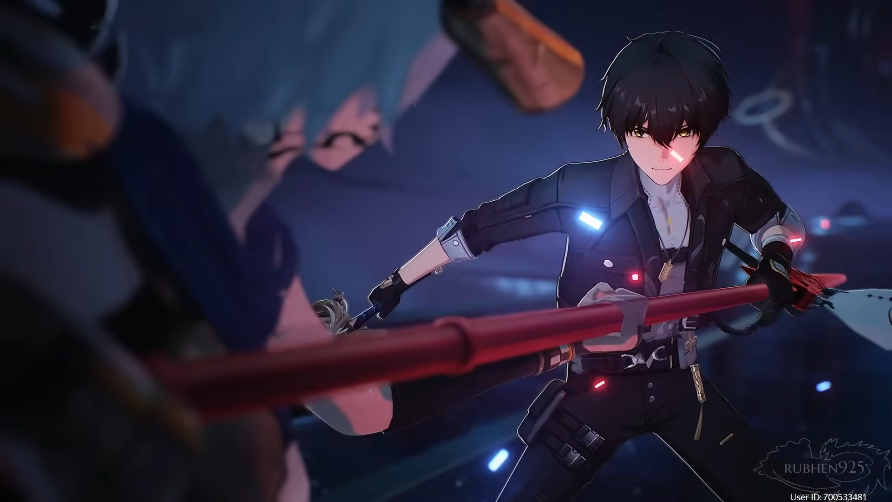
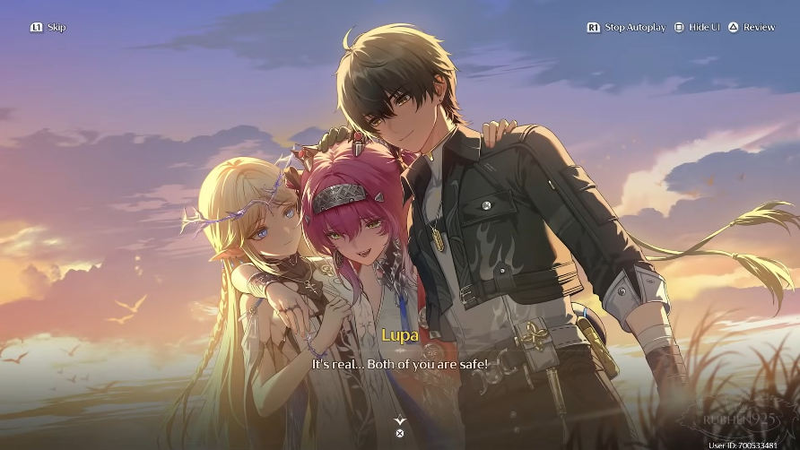
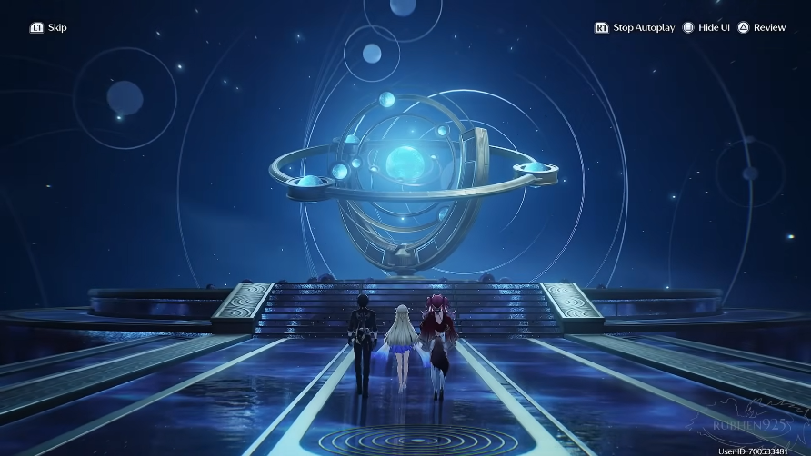

# Act 6: Flames of Heart

<figure><figcaption></figcaption></figure>

Rover mendatangi arena dan menemukan Lupa sudah menunggu di sana, bersama sosok besar nan gagah — Arsinosa.

Lupa menyambut Rover dengan semangat, menjelaskan bahwa Arsinosa bukanlah Echo yang hangat kepada keramaian. Sang “Singa Betina” hanya menerima mereka yang kuat, gigih, dan ditempa pertempuran. Meski tak mampu berbicara, Arsinosa tetap berkomunikasi lewat frekuensi yang dipancarkannya.

Rover sempat mendengar suara aneh, dan ketika ia menanyakan arah pandangan Arsinosa, Lupa menjawab: <mark style="color:blue;">**Vale of Glory**</mark> — tempat para pahlawan yang gugur beristirahat. Banyak dari mereka tak pernah kembali utuh; hanya senjata yang dibawa pulang, menyimpan sisa-sisa kehendak pemiliknya.

<figure><figcaption></figcaption></figure>

Lupa menjelaskan bahwa menyentuh senjata itu adalah ritual penting bagi para juara Septimont untuk menerima berkah sang Singa. Rover mulai menyadari bahwa suara yang dulu pernah ia dengar — frekuensi samar yang dibicarakan Abby — ternyata berasal dari tempat ini. Semakin dekat mereka ke Vale, semakin jelas gema itu.

Lupa pun mengajak Rover berangkat bersama. Rover menerima, yakin bahwa di sana ia akan menemukan jawaban.

***

Di sepanjang jalan, Lupa terkejut melihat Tacet Discord bermunculan di wilayah yang seharusnya aman. Rover menyadari kemunculan mereka bukan berasal dari sekitar, melainkan seakan muncul dari kehampaan.

<figure><figcaption></figcaption></figure>

Tak lama kemudian, penglihatan Rover berubah: sosok Lupa sekejap berganti rupa menjadi **Mya**, berjalan tertatih dengan wajah kesakitan.

> “Kamu… dari tanah airku… Septimont...”

Namun sesosok itu lenyap begitu saja, dan Lupa kembali seperti semula, seolah tidak ada yang terjadi.

Rover semakin yakin, semakin dekat ke Vale, batas antara dunia nyata dan anomali makin kabur. Ia mulai merenungkan benang merah yang menghubungkan Lupa, Mya, Cartethyia, Threnodian, hingga Phrolova. Semua tampak saling berkaitan.

Rover curiga Mya pernah hilang di Vale ini, mungkin terperangkap pengaruh Threnodian. Ia juga mengingat kata-kata Phrolova, bahwa semakin dekat seseorang dengan protagonis Agon, semakin besar pula pengaruhnya pada kisah.

Di sini, Lupa adalah protagonis. Namun bayangan Mya terus muncul seakan-akan perannya belum selesai.

***

<figure><figcaption></figcaption></figure>

Lupa menyadari Rover sedang tenggelam dalam pikirannya dan bertanya apakah ada sesuatu yang salah. Rover akhirnya menyinggung kemungkinan bahwa ia pernah bersinggungan dengan Cartethyia.

Lupa tidak yakin. Ia mengaku belakangan sering merasa kehilangan ingatan sesaat, seolah pikirannya dikaburkan oleh sesuatu. Jika benar itu ulah Threnodian, ia menggantungkan harapan pada Rover untuk membuat keputusan yang benar — bahkan jika itu berarti harus melindungi kehormatannya dengan cara paling pahit.

Rover menegaskan bahwa keberanian sejati tak selalu berarti mati demi kejayaan, tapi terkadang justru hidup dengan menanggung beban. Lupa tersenyum dan mengaku percaya padanya.

Dalam hati, Rover meneguhkan tekad: apa pun yang terjadi, ia akan menuntun kisah ini dengan pilihannya sendiri.

***

Akhirnya, mereka sampai di Vale of Glory. Di halaman luas tempa tersebut, tanah dipenuhi bilah pedang, tombak, dan senjata berkarat yang tertancap bagai prasasti. Rover bertanya pada Lupa tentang sebuah pedang kuno.

<figure><figcaption></figcaption></figure>

“Itu milik **Tercules**,” jawab Lupa. Pahlawan legendaris Septimont yang gugur melawan Dark Tide. Meski pedangnya sempat terkorupsi, pengikutnya tetap rela mati demi membawanya kembali. Kini pedang itu hanyalah kenangan.

Namun saat Rover menyentuhnya, ia merasakan frekuensi kuat yang berdenyut dari arah bawah tanah. Samar, ia mendengar suara **Cartethyia** yang seolah berbisik dari balik dimensi lain tentang “Genesis Nexus” dan kekuatan yang tengah dicari.

<figure><figcaption></figcaption></figure>

Tiba-tiba, Tacet Discord bermunculan. Dunia seakan bergeser, menyingkap Tidal Blight yang lahir dari Dark Tide. Bersama Lupa, Rover menghabisi semua makhluk itu, sebelum mendengar suara aneh yang memandu mereka menuju sebuah dinding batu raksasa.

<figure><figcaption></figcaption></figure>

Dengan bantuan Arsinosa, mereka membuka jalan menuju dalam gunung.

***

<figure><figcaption></figcaption></figure>

Di baliknya, mereka tiba di ruangan luas dengan ukiran astronomi melayang di udara. Atmosfernya tenang, namun di tengahnya berdiri sebuah perangkat raksasa, bundar, dengan inti bercahaya biru. Rover mengenalinya—**frekuensi Imperator**.

<figure><figcaption></figcaption></figure>

Mendadak, Lupa terhuyung. Kepalanya dihantam rasa sakit yang brutal, tubuhnya memberontak seolah dikendalikan. Dengan tombaknya sendiri, ia melempar inti perangkat itu hingga hancur. Namun dari celah retakan, frekuensi kegelapan Dark Tide menyembur, menyelimuti Lupa.

Tubuhnya berubah, berganti menjadi sosok **Mya**—namun jelas bukan dirinya lagi, melainkan bayangan Threnodian yang merasuki.

<figure><figcaption></figcaption></figure>

_"Kau membawa aroma Cartethyia..."_ suara itu bergema.\
Dengan tombak Lupa, Mya menyerang Rover.

Rover menangkis, mendorongnya mundur, dan berhasil memisahkan Mya dari tubuh Lupa. Ia tahu ini bukan sekadar pertempuran, tapi kisah yang sedang ditulis ulang. Dari sakunya, ia mengeluarkan **naskah** yang dulu diberikan Phrolova—buku tebal yang bisa membuka halaman baru dari cerita ini.

“Bacalah. Sesuaikan jika perlu. Aku percaya padamu, warrior,” kata Rover pada Lupa.

<figure><figcaption></figcaption></figure>

Tanpa ragu, Lupa melompat masuk ke dalam kitab raksasa itu. Dunia sekeliling pecah, berganti dengan potongan-potongan adegan—fragmen memori, kutukan, dan pengakuan dari para “pemeran” cerita. Suara Cristoforo, Cartethyia, Phrolova, bahkan Rover sendiri bergema, masing-masing berbicara tentang nasib, ilusi, dan keberanian untuk menulis ulang takdir.

<figure><figcaption></figcaption></figure>

***

Ketika sadar kembali, Lupa mendapati dirinya masih di Vale of Glory—namun jelas di dimensi lain.\
Nafasnya berat, namun hatinya mantap.

_"Ini bukan mimpi... Ini Sonoro, dunia cerita yang diciptakan Fractsidus,"_ pikirnya.

<figure><figcaption></figcaption></figure>

Ia teringat: kisah Great Agon selalu berulang tiga hari, halaman demi halaman. Setiap tindakan mengubah lapisan cerita berikutnya. Kini, berkat Cartethyia dan Rover, ia tidak lagi sendirian. Ingatannya kembali, begitu pula tekadnya.

Dengan tatapan yang menyala, Lupa berjanji dalam hati:\
“Rover, aku tidak akan mengecewakan kepercayaanmu. Aku akan menuntaskan kisah ini.”

***

<figure><figcaption></figcaption></figure>

Lupa melanjutkan perjalanan ke **Old District**, sambil mengingat pesan Cartethyia dari timeline sebelumnya tentang _Nameless Girl_—yang sebenarnya adalah dirinya sendiri—yang kehilangan namanya karena perannya dicuri.

<figure><figcaption></figcaption></figure>

Cartethyia menegaskan bahwa hanya dengan menghancurkan cerita palsu itulah eksistensinya bisa direbut kembali. Ia juga menyebut bahwa monster dan rahasia Septimont berhubungan dengan _submerged aqueducts_.

<figure><figcaption></figcaption></figure>

Dengan tekad baru, Lupa menuju **Bell Tower** untuk membuka jalur air bawah tanah. Dalam prosesnya, _**copper mirror**_ menyingkap masa lalu: Julia bekerja sama dengan Cristoforo dan Fractsidus untuk menggunakan jasad Mya sebagai bahan eksperimen di aqueducts. Terungkap pula bahwa Mya sebenarnya sudah mati, tubuhnya ditarik dari laut, namun Fractsidus memanfaatkannya sebagai “jantung” bagi rencana mereka. Cristoforo bermaksud menjadikan kisah Mya sebagai _play_ untuk memperkuat kekuatan Threnodian, bahkan menulis ulang realitas dengan Sonoro.

<figure><figcaption></figcaption></figure>

Lupa marah mengetahui Septimont diperlakukan seperti panggung sandiwara.

Perjalanan membawa Lupa semakin dalam hingga menemukan percakapan antara **Mya** yang asli dan **Leviathan** (_Lady of the Sea_). Leviathan, yang mengambil rupa Mya, mencoba menggoda Mya dengan kebencian terhadap manusia dan statusnya yang terlupakan. Namun Mya menolak, tetap setia pada kota dan kenangannya.

<figure><figcaption></figcaption></figure>

Di kedalaman aqueducts, Lupa merenungkan rasa malu dan keraguan yang pernah membebaninya. Namun, ia kini menyadari bahwa kekuatan sejati bukan hanya dari anugerah lahir, melainkan dari pilihan dan keberanian. Ia meneguhkan tekadnya dengan mengingat Rover yang mempercayainya, Cartethyia yang menanggung beban harapan, dan Mya yang bertarung hingga akhir.

<figure><figcaption></figcaption></figure>

Lupa menolak arogansi Leviathan: Septimont bukan milik Sentinel atau Threnodian, melainkan milik rakyatnya sendiri. Seperti cahaya yang selalu dicari manusia, meski ada bayangan, mereka akan terus mengejarnya. Lupa pun berdiri tegak, siap menghadapi kebenaran di kedalaman.

***

Langkah kaki Lupa menggema di lorong yang semakin menyempit. Cahaya remang memantul di genangan air tipis, seolah menuntunnya menuju ujung perjalanan. Saat lorong itu terbuka, ia mendapati sebuah ruangan luas, dinding-dindingnya basah oleh kelembapan, dan di tengah genangan berdiri sosok yang ia kenali—**Lady of the Sea**.

<figure><figcaption></figcaption></figure>

Namun pemandangan itu segera berubah menjadi mimpi buruk. Di hadapan Lupa, wanita itu mengubah wujud Mya, gadis yang seharusnya sudah tiada, menjadi monster raksasa. Tubuhnya menjelma Tacet Discord menjijikkan, namun dengan kepala yang masih menyerupai Mya. Pemandangan itu membuat darah Lupa mendidih.

Dengan suara lantang ia bersumpah, **“Demi matahari abadi, aku akan menebasmu!”**

Lady of the Sea membalas dengan nada datar namun menusuk, seolah setiap katanya adalah gelombang yang ingin menenggelamkan jiwa lawannya. Ia berbicara tentang asal-usulnya—lahir dari rasa takut dan kerinduan manusia, dari doa anak-anak hingga keluhan orang tua. Ia menuduh manusia tak pernah berubah: rakus, haus kuasa, dan senang pada pertumpahan darah.

Tombak Lupa bergetar di tangannya, bukan karena takut, melainkan karena amarah yang nyaris tak tertahan.\
&#xNAN;**“Apa hakmu menghakimi orang-orang Rinascita?!”** teriaknya.

<figure><figcaption></figcaption></figure>

Baginya, Mya memilih akhir dengan kehormatan. Namun Lady of the Sea mencemari nama itu, bersembunyi dalam “inkubator” ciptaannya hanya untuk lari dari kematian. Lupa menatap tajam, matanya menyala penuh api.\
&#xNAN;**“Kau tidak akan pernah mengerti bagaimana rasanya menatap kematian dan menerimanya dengan berani!”**

Lady of the Sea hanya menjawab dengan dingin: **“Hidup manusia hanyalah jeritan singkat di antara kelahiran dan kematian.”**

Ucapannya menjadi gong yang memicu pertarungan dahsyat.

Arena bawah tanah itu berguncang ketika tombak Lupa menghantam permukaan air, menciptakan gelombang energi yang mengoyak ruangan. Lady of the Sea membalas dengan pusaran arus yang menghantam keras, namun Lupa terus maju. Serangannya tajam, gerakannya lincah, tiap ayunan tombak bagai badai merah yang siap merobek laut itu sendiri.

<figure><figcaption></figcaption></figure>

Pertempuran berlangsung sengit, namun tekad Lupa lebih keras daripada ombak terdahsyat. Dengan teriakan penuh semangat, ia menembus pertahanan terakhir musuhnya. Tebasan terakhir tombaknya menghantam telak, membuat wujud Lady of the Sea runtuh bersama bayangan Mya yang dipaksakan padanya.

Air kembali tenang. Nafas Lupa berat, tapi senyum puas terukir di wajahnya. Ia telah menepati sumpahnya.

<figure><figcaption></figcaption></figure>

Sementara itu, di sisi lain Rover juga menyaksikan sosok Mya yang sempat muncul… menghilang bersama runtuhnya ilusi. Di dimensi berbeda, Cristoforo—sang _playwright_ Fractsidus—terkejut. Ia bisa merasakan salah satu bidak permainannya jatuh, terhapus dari panggung.

Ketika cerita itu runtuh, halaman demi halaman seolah terbakar cahaya, dan dari dalamnya Lupa berjalan keluar. Ia menatap senja yang menyinari Septimont, udara hangat menyambutnya kembali ke dunia nyata. Dan di sanalah, untuk pertama kalinya setelah sekian lama, ia berdiri di hadapan Rover dan Cartethyia.

<figure><figcaption></figcaption></figure>

Mata Lupa berkilat lembut, nyaris tak percaya.\
&#xNAN;**“Ini nyata… Kalian berdua selamat!”**

Percakapan pun mengalir, di mana Rover mengucapkan selamat, Cartethyia berseloroh tentang kisah yang mirip legenda gladiator, hingga Abby muncul dengan rengekan khasnya setelah lama pingsan. Lupa hanya terkekeh, menyamakan semangat Echo itu dengan keriuhan arena.

Namun di balik kelegaan, diskusi serius pun dimulai. Cartethyia menjelaskan asal mula kekacauan—bagaimana ia masuk ke Sonoro, bagaimana Lupa sempat kehilangan perannya, dan bagaimana Fractsidus bersama Threnodian memutar balik kenyataan dengan menjadikan Mya pion mereka. Rover mendengarkan, menanyakan tentang “role”, Sonoro, hingga keberadaan pemimpin Fractsidus lain seperti Phrolova dan Scar.

Misteri demi misteri terungkap: bahwa Mya sesungguhnya sudah lama tiada, bahwa Lupa lah yang sejatinya memenangkan _Agon_ tiga hari itu, namun namanya dihapus dari naskah. Bahwa tubuh Mya dijadikan wadah Threnodian, dan penderitaannya berlangsung selama puluhan tahun.

<figure><figcaption></figcaption></figure>

Lupa menceritakan kembali kisah “kematiannya”, perjalanannya bersama Cartethyia, dan bagaimana setiap kali ia kehilangan peran, hidupnya berulang-ulang terjerumus dalam tragedi. Ia terdiam sejenak, mengenang Mya yang tersiksa tanpa akhir, namun Rover mengingatkan bahwa dengan mengalahkan Threnodian, ia sekaligus membebaskan sahabat lamanya itu.

Akhirnya, dengan senyum tegar, Lupa menatap Rover.\
&#xNAN;**“Berkatmu dan Cartethyia, aku bisa menulis ulang akhir yang tragis. Terima kasih, rekanku, karena percaya padaku.”**

Cahaya senja semakin meresap, dan dengan itu mereka menatap ke depan. Masih ada misteri yang harus dipecahkan, mereka kembali menuju The Central Hub untuk menggali informasi lagi.

***

<figure><figcaption></figcaption></figure>

Sesampainya di Central Hub, Cartethyia menceritakan pada Rover bagaimana ia menghancurkan unit eksperimen, mengalahkan Lioness of Glory yang dikuasai Threnodian, lalu menemukan rahasia di Central Hub. Ia menjelaskan bahwa Sentinel, sebelum kehilangan ingatannya, sempat menitipkan sebagian pengetahuan ke sana. Pengetahuan itu bukan sembarangan—sebuah rahasia yang tak boleh diketahui Threnodian.

Dari sana, Cartethyia menemukan sebuah frekuensi aneh, terasa seperti milik Rover. Ketika Rover menyentuhnya, ia merasakan desir angin dingin yang sekejap menunjukkan arah menuju suatu tempat jauh di Septimont—tempat rahasia yang benar-benar ditinggalkan Sentinel untuknya. Cartethyia meyakini inilah tujuan sebenarnya Threnodian memburu Central Hub.

Lupa menyebutkan arah itu mengarah ke _hunting grounds_, kawasan yang masih diselimuti <mark style="color:blue;">**Blightcloud**</mark>, tempat para Septimontian biasanya berburu Tacet Discord saat <mark style="color:blue;">**High Tide**</mark>. Cartethyia menekankan bahwa Rover sendiri yang harus menemukan pesan Sentinel di sana. Namun sebelum berangkat, ia meminta waktu untuk beristirahat dan menikmati Septimont. Ia pun meminta Lupa menjadi pemandu mereka.

<figure><figcaption></figcaption></figure>

Lupa setuju, tapi terlebih dahulu membawanya ke Vale of Glory. Di sana, ia meletakkan pedang milik Mya sebagai penghormatan terakhir. Meski tubuh Mya tak pernah ditemukan, Lupa ingin mengembalikan senjatanya di tempat ia gugur. Ia mengenang perkataan Mya tentang _Bloodleaf Viburnum_, bunga penghormatan bagi gladiator, lalu menatap kota dengan penuh emosi.

<figure><figcaption></figcaption></figure>

“Septimont, City of Glory,” ucap Lupa. Sebuah kota yang dipenuhi tawa, pesta, patung, perburuan, kemenangan, dan juga kekalahan. Tempat di mana harapan dan kekecewaan hidup berdampingan, menyala seperti api yang tak pernah padam.

***

Beberapa hari setelah pertarungan besar itu, Rover kembali ke hotel tempatnya menginap. Di sana, ia mendapati Lupa duduk dengan wajah memerah, jelas mabuk meski mencoba menyangkalnya. Ia menyebut minumannya hanya “jus gandum”, namun langkahnya yang terhuyung segera membantah klaim itu. Rover pun membantunya ke sofa.

<figure><figcaption></figcaption></figure>

Meski tertawa kecil, Lupa tak bisa menyembunyikan beban di hatinya. Ia bercerita bahwa laporan tentang Domina Julia sudah ia kirim ke Istana Ephor, namun pengejaran keluarga Silva yang melarikan diri masih akan memakan waktu. Ingatannya lalu melayang pada Mya, pada masa lalu bersama Silvas, dan tentang jalan hidup yang seolah dipaksa kepadanya sejak kecil. Sesaat ia bertanya-tanya, bagaimana jika hidupnya berbeda? Namun akhirnya ia menggeleng pelan—“Aku sudah cukup dengan apa yang kupunya,” katanya.

<figure><figcaption></figcaption></figure>

Bagi Lupa, hidup adalah arena. Ada kemenangan, ada kekalahan. Tak seorang pun bisa menang selamanya; semakin tinggi kemenangan, semakin berat pula beban ketika kalah. Ia menatap Rover dengan keseriusan yang jarang terlihat sebelumnya, bertanya apakah ia pernah takut suatu hari akan mengalami kekalahan. Rover mengaku “ya.”

Dengan senyum getir, Lupa menepuk dadanya sendiri. “Kalau saat itu tiba, ingatlah satu hal,” ucapnya. “Orang-orang yang sudah kamu tolong tidak akan membiarkanmu menghadapi kekalahan sendirian. Aku mungkin tak sekuatmu, Rover, tapi jika kau memanggil, aku akan datang. Di medan perang. Tak peduli sejauh apa jaraknya. Aku bersumpah demi matahari abadi.”

<figure><figcaption></figcaption></figure>

***

Suatu sore, Rover mendapati Cartethyia di restoran, sedang makan dengan lahap sambil tersenyum. Mereka berbincang ringan soal rasa makanan, hingga Cartethyia mengaku bahwa indra pengecapnya sudah kembali. Ia pun mengingat janjinya—menikmati hal-hal yang ia rindukan, mengunjungi tempat yang ia inginkan, dan bertemu orang yang ia dambakan.

<figure><figcaption></figcaption></figure>

Namun kebahagiaan itu bercampur getir. Cartethyia menoleh pada sepasang orang tua yang tengah berfoto bersama seorang gadis muda—mereka adalah orang tua angkatnya. Ia baru menemukannya kembali di Septimont, tapi mereka tak lagi mengenalinya. Ingatan tentang dirinya ternyata hanyalah memori palsu yang ditanamkan Threnodian, lenyap bersamaan ketika makhluk itu tersegel.

<figure><figcaption></figcaption></figure>

Meski demikian, Cartethyia menerima kenyataan itu dengan lapang dada. “Lebih baik begini,” ucapnya, “daripada mereka hidup dengan derita kehilangan seorang anak.” Ia merasa tiga keinginannya telah terpenuhi: bisa menikmati makanan, punya tahun-tahun untuk menjelajah dunia, dan dipertemukan dengan orang-orang penting dalam hidupnya.

Cartethyia tersenyum tulus, dan Rover hanya bisa membalas dengan senyum hangat—menghargai keteguhan hati yang terpancar dari dirinya.

<figure><figcaption></figcaption></figure>

***


:notebook: **GLOSARIUM**

* Blightcloud

> Sebuah pertanda datangnya Dark Tide, yang telah menyelimuti Septimont selama bertahun-tahun. Wilayah yang diselimutinya dikenal oleh penduduk Septimont sebagai "tempat berburu (_hunting grounds_)".

* High Tide

> Salah satu pertanda datangnya Dark Tide. Dark Tide terjadi ketika Tacet Discord yang tak terhitung jumlahnya berkerumun di bawah Blightcloud, menghantam Septimont dalam gelombang kehancuran.

* Vale of Glory

> Tempat peristirahatan terakhir para pahlawan Septimont dan gladiator legendaris. Monumen-monumen batu, yang dibentuk sesuai dengan senjata khas masing-masing pahlawan yang gugur, berdiri tegak sebagai penghormatan untuk memastikan nama dan jasa mereka tetap abadi sepanjang masa.

