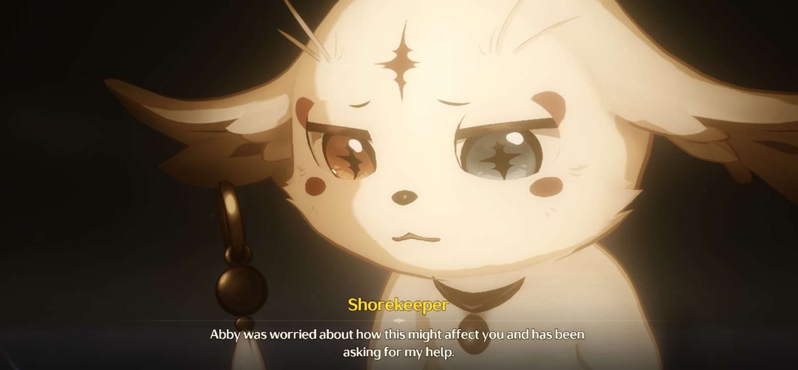
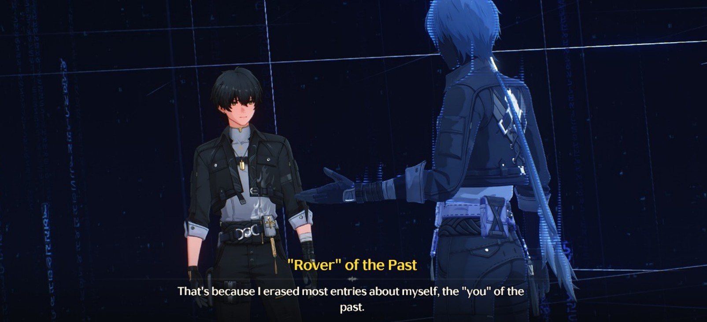
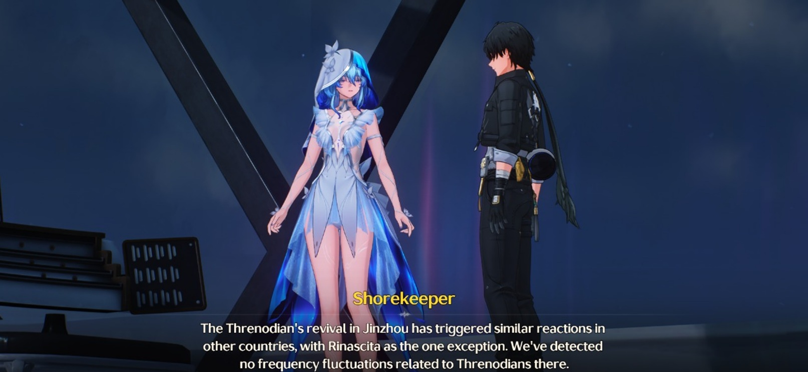
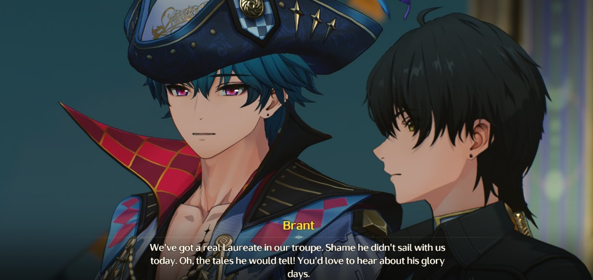
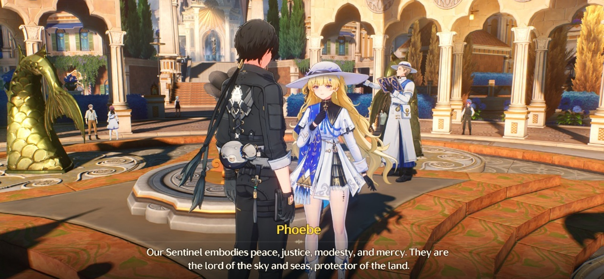

# Prologue: Through the Sea Thou Break

<figure><figcaption></figcaption></figure>

Huru-hara di Black Shores dan konflik ideologi dengan _Tethys System_ akhirnya usai.

Shorekeeper, yang selama ini telah banyak membantu, kini fokus menganalisis kondisi Abby—atas permintaan Abby sendiri. Ia memohon bantuan agar _Frequency_-nya yang melemah bisa dipulihkan, agar tak terus menjadi beban bagi Rover. Setelah menelaahnya, Shorekeeper menyarankan satu hal: pergilah ke Rinascita.

Sebagai perwakilan dari Black Shores, mereka telah diundang secara resmi ke _<mark style="color:blue;">**Carnevale**</mark>_ oleh Montelli Family—salah satu keluarga paling berpengaruh di sana. Dan mungkin, di sanalah jawaban berikutnya menanti.

Sebelum keberangkatan, Shorekeeper memberi Rover akses pada catatan masa lalu yang tersimpan dalam sistem Tethys—sebuah rekaman lama dari dirinya sendiri, sebelum amnesia.

Dalam catatan itu, Rover dari masa lalu menjelaskan bahwa meskipun sistem Tethys telah diperbaiki dan semua data terbuka, tidak ada satu pun informasi yang berkaitan dengan identitas atau masa lalunya.

<figure><figcaption></figcaption></figure>

> “Itu karena aku… _kita_… tidak ingin tahu,” ujarnya.\
> “Aku memilih menghapus semuanya, karena aku ingin kamu—diriku yang baru—mengalami perjuangan peradaban manusia dari awal. Aku ingin kamu menjelajahi Solaris-3 tanpa beban masa lalu. Berjalan, bertarung, dan hidup bersama orang-orang.”

Namun, catatan itu belum bisa menjawab semua pertanyaan yang pasti mulai memenuhi benak Rover. Ia hanya meninggalkan satu petunjuk terakhir: temui Imperator, Sentinel yang ada di Rinascita. Karena dahulu, mereka pernah membuat suatu perjanjian.

> **Rover dari Masa Lalu:**\
> “Lama setelah ingatanku terhapus, _aku_ akan terbangun untuk pertama kalinya… dan menjadi _kamu_. Sekali lagi, _kita_ akan menjelajahi Solaris-3, berjalan di antara manusia.
>
> Yang kamu lihat sekarang bukanlah pesan… melainkan suar. Sebuah tanda kecil yang kutinggalkan untuk diriku sendiri. Aku ingin tahu…
>
> Bagaimana kamu akan menghadapi benturan antara kebaikan kolektif dan semangat kemanusiaan?”

<figure><figcaption></figcaption></figure>

Rinascita—tanah para _Echo_ dan pesta tanpa akhir. Satu-satunya tempat yang tidak menunjukkan gejolak _Frequency_ saat Threnodian bangkit di Jinzhou. Sementara kota-kota lain terjerat dalam ketakutan dan chaos, Rinascita tetap sunyi… nyaris tak tersentuh.

Merasa ini bukan kebetulan, Rover pun memulai perjalanan ke sana, meninggalkan Black Shores dari pelabuhan utama. Kapalnya—dipinjamkan oleh Aalto secara pribadi—melaju menembus perairan Rinascita.

Namun, belum sempat menyentuh pelabuhan, kapal itu mendadak terlempar ke udara—disepak oleh sosok kolosal: _Cetus the Tidebreaker_, seekor TD berbentuk paus raksasa. Tubuhnya menjulang dari air dengan kekuatan menggetarkan, membelah gelombang hanya dengan satu gerakan ekor.

Beruntung, sebelum kapal sepenuhnya karam, datang bantuan: Brant, kapten _<mark style="color:blue;">**The Fool’s Troupe**</mark>_. Dengan gerakan cekatan dan nyaris teatrikal, mereka menyelamatkan Rover dari amukan lautan.

<figure><figcaption></figcaption></figure>

Menurut Brant, Cetus sebenarnya makhluk damai. Ia jarang menyerang tanpa alasan. Namun, Brant juga mengaku melihat sesuatu di bagian ekor Cetus—semacam luka, atau mungkin… sesuatu yang menempel.

Di atas dek kapal, Brant memberi penjelasan lebih jauh.

> “Di Rinascita, tiap tahun ada _Festival_ terbesar di seluruh Solaris. Di sinilah para seniman, pemain, dan mimpi-mimpi bertarung untuk satu kehormatan tertinggi—_Laurel_. Siapa pun yang dianugerahi Laurel, akan disebut _Laureate_, dan… mereka mendapat kemampuan untuk berbicara dengan Sentinel.”

Saat itu pula, Rover bertemu kembali dengan Roccia. Namun ia tampak gugup dan segera bersembunyi—entah karena malu, atau karena sesuatu yang belum siap ia ungkap. Tak ingin memaksa, Rover melanjutkan perjalanan dan diantar langsung menuju pelabuhan utama Rinascita.

Begitu tiba, pemandangan aneh menyambutnya: para pendosa sedang disiapkan untuk _<mark style="color:blue;">**Pilgrim Sail**</mark>_—sebuah ritual kuno. Mereka yang dianggap menanggung dosa akan dikirim melintasi laut untuk mencari penebusan, sebuah tradisi yang menurut Cristoforo—seorang dramawan flamboyan—berasal dari zaman para pencari Sentinel sejati.

Setelah itu, Rover melanjutkan perjalanan ke Ragunna, pusat administratif Rinascita. Namun ia segera dihadang penjaga karena tidak memiliki izin masuk baru. Untungnya, setelah menunjukkan surat dari Montelli Family, ia diperbolehkan masuk.

<figure><figcaption></figcaption></figure>

***


:notebook: **GLOSARIUM**

* Carnevale

> Sebuah festival terbesar di Rinascita dengan hadiah utama adalah gelar Laurel. Gelar ini dipercaya oleh masyarakat Rinascita sebagai kesempatan bagi mereka untuk dapat berinteraksi langsung dengan Imperator.

* Pilgrim's Sail

> Mereka yang dianggap tidak setia oleh _The Order of The Deep_ dikirim untuk melakukan pelayaran di atas layar peziarah, mengikuti jalan kuno orang -orang yang pernah menantang kabut dan pusaran demi mencari bimbingan Sentinel.
>
> Perintah tersebut mengklaim bahwa hanya Imperator yang dapat memberikan absolusi kepada para pelanggar ini. Mereka harus mengalami ziarah yang melelahkan, membuat tubuh dan jiwa menderita hingga nantinya pertobatan mereka selesai. Di akhir perjalanan, dikatakan bahwa Sentinel Imperator akan menawarkan pengampunan dan janji kehidupan baru kepada mereka.
>
> Tetapi tidak ada seorang pun di Ragunna yang pernah mendengar tentang "peziarah" yang tidak setia yang kembali dari perjalanan sakral ini.

* The Fool’s Troupe

> Mereka adalah kelompok yang tampil dalam tur di seluruh Rinascita, tetapi tempat perlindungan tersembunyi mereka terletak jauh di dalam gua bawah tanah yang luas di pulau _Penitent's End_. Keyakinan mereka adalah kebebasan, harta mereka adalah tawa, dan hadiah mereka untuk setiap kota yang mereka kunjungi adalah kisah baru.
>
> Kelompok ini dibentuk oleh mereka yang selamat dari ritual Pilgrim's Sail.

