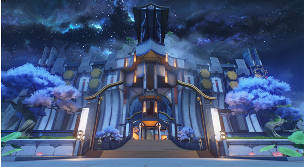
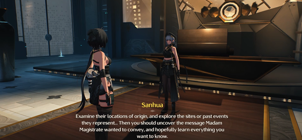
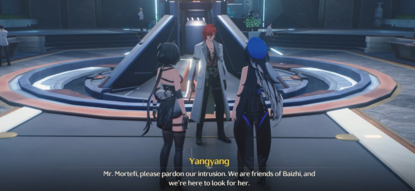
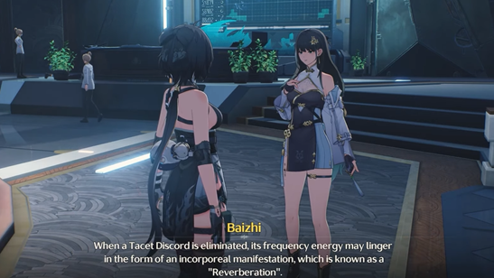
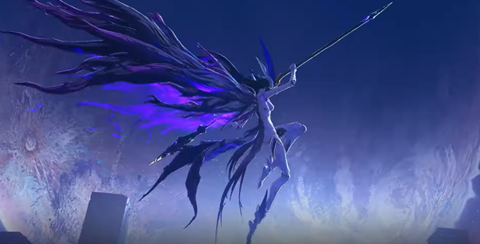
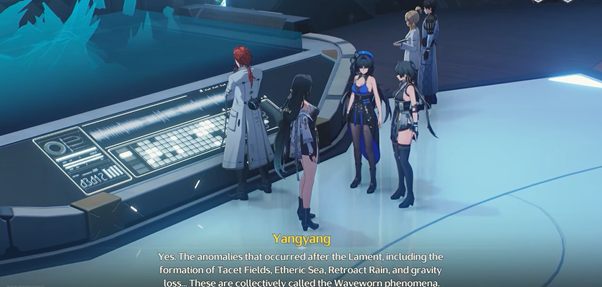
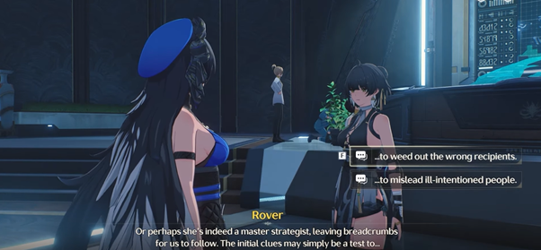

---
layout:
  title:
    visible: true
  description:
    visible: false
  tableOfContents:
    visible: true
  outline:
    visible: true
  pagination:
    visible: true
---

# Act 1: First Resonance

Sesampainya mereka di **Resonance Nexus**, Chixia menjelaskan kepada Rover kalau **Resonance Nexus** itu semacam server besar pusat informasi yang menyimpan berbagai data mulai dari pemetaan hingga pertahanan. Setelah mendaftarkan Terminalnya di **Jinzhou**, Yangyang menunggu Rover dan Chixia di _<mark style="color:blue;">**City Hall**</mark>_ yang mana mereka berniat untuk bertemu dengan **Magistrate** untuk memenuhi undangan darinya sekaligus mencari petunjuk mengenai amnesia yang ia alami.

Di dalam City Hall hanya Rover yang diperbolehkan masuk, di sana ia bertemu Sanhua seorang _bodyguard_ dari **Magistrate** yang nampak dingin dan kaku. Sanhua memberitahukan bahwa Nyonya **Magistrate** baru akan kembali 3 hari kemudian karena masih ada tugas yang dikerjakan. Sebagai permintaan maaf, **Magistrate** memberikan akses bebas kepada **Rover** agar bisa kemana saja di **Jinzhou** termasuk token sebagai hadiah penyambutan dengan niat agar Rover mengeksplor **Jinzhou** dan akomodasi gratis ketika dia butuh tempat beristirahat.

<figure><figcaption></figcaption></figure>

Penentuan apakah **Rover** adalah tamu yang dicari **Magistrate** atau tidak memang ditentukan oleh **Magistrate** sendiri namun Sanhua sendiri sepertinya nampak yakin dengan keputusan sang **Magistrate** karena di dalam matanya yang hanya mampu melihat “frekuensi”. Sanhua melihat **Rover** dan **Magistrate** memiliki frekuensi yang mirip, ia mendeskripsikan mereka sebagai “tak terdistorsi”.

Setelah itu Sanhua lanjut menjelaskan mengenai _<mark style="color:blue;">**Midnight Rangers**</mark>_ yang merupakan militer **Jinzhou** yang didominasi oleh **Resonator** dan dipimpin oleh seorang bernama Jiyan. Lalu menjelaskan nama **Magistrate Jinzhou** adalah Hsi tapi namanya menjadi Jinhsi setelah ia menjabat dan diketahui juga sebagai “_Loong Maiden_” karena koneksinya dengan Sentinel yang berbentuk naga (_Loong_).

<figure><figcaption></figcaption></figure>

Rover pun pergi dari **City Hall** untuk kembali ke Yangyang dan Chixia dimana mereka mendiskusikan kekhawatiran Yangyang tentang keanehan belakangan ini yang kemudian ditepis Chixia dengan optimisnya karena mereka sedang membicarakan **Jinzhou** dari semua tempat yang jelas terkenal sebagai kota terpencil yang dekat dengan medan perang. Setelah itu mereka berdiskusi sebentar mengenai token yang diterima dari Jinhsi yaitu _**Sundial**_ yang menunjukan arah mata angin dan waktu; _**Manggis**_ yang biasanya tak ditemukan di Jinzhou; **Daun** yang terdampak waveworn; serta obat vaksin **Sugar Pearl** yang digunakan untuk sebuah penyakit yang ada di masa lalu Jinzhou. Mereka kemudian pergi ke **Huaxu Academy**.

<figure><figcaption>
Mangosteen Token Jinhsi: I
</figcaption></figure> <figure><figcaption>
Leaf affected by "Waveworn" Token Jinhsi: II
</figcaption></figure> <figure><figcaption>
Sundial Token Jinhsi: III
</figcaption></figure> <figure><figcaption>
Sugar Pearl Token Jinhsi: IV
</figcaption></figure>

Ketika mereka akan masuk, Chixia ternyata sudah memasuki shift patrolinya jadi ia meninggalkan Yangyang dan Rover untuk pergi ke **Huaxu Academy** berdua. Di sana mereka bertemu Mortefi seorang peneliti yang tampak garang setelah memarahi seseorang. Mortefi kemudian mengontak Baizhi agar Yangyang dan Rover bisa bertemu dengannya. Ketika bertemu Baizhi, ia sudah menyiapkan alat untuk pemeriksaan fisiknya. Sementara token–token yang **Rover** bawa diteliti oleh Mortefi.

<figure><figcaption></figcaption></figure>

Ketika ingin memulai pemeriksaan, Baizhi memberitahukan bahwa yang diserap Rover sebelumnya adalah Tacet Discord kelas _**Overlord**_ yang mana merupakan kelas 2 paling kuat dari hirarki kelas Tacet Discord. Secara berurutan dari yang paling lemah adalah _**Common Class,**_ kemudian _**Elite Class,**_ dilanjut dengan _**Overlord Class**_, dan terakhir adalah _**Calamity Class**_ yang sangat kuat. Namun ada juga Tacet Discord spesial yang disebut _<mark style="color:blue;">**Threnodian**</mark>_.

Menurut semua catatan yang pernah ada, manusia umumnya hanya bisa menyerap atau mereplikasi frekuensi echo apabila mereka punya Terminal karena itu perlu dilakukan pemeriksaan agar menghindari perubahan internal yang sulit diketahui. Ketika mati, Tacet Discord mungkin meninggalkan energi frekuensi tak berwujud atau diketahui sebagai “_**Reverberations**_” yang ketika dikumpulkan dalam Terminal dapat digunakan dalam pertarungan bahkan merubah bentuk Resonator menjadi Tacet Discord untuk sementara waktu.

<figure><figcaption></figcaption></figure>

Ketika mencoba memanifestasikan kekuatan _<mark style="color:blue;">**Crownless**</mark>_, Rover hanya menemui kekecewaan karena tak dapat mengeluarkan apapun. Menurut Baizhi seperti ada mekanisme lain didalam tubuh Rover yang mampu “memakan” frekuensi. Rover yang agak khawatir bertanya “Apakah aku akan menjadi monster?”. Baizhi menjawab bahwa itu tergantung bagaimana kita melihat definisi “_**Monster**_”. Apabila kasusnya adalah Resonator, maka yang paling mendekati adalah “_<mark style="color:blue;">**Overclocking**</mark>_” yaitu sebuah kondisi dimana seseorang mengalami lepas kendali akan _<mark style="color:blue;">**Forte**</mark>_-nya, Baizhi kemudian menenangkan Rover dengan bilang bahwa risiko **Overclocking** dari Rover itu sangat kecil.

Baizhi kemudian memulai pemeriksaan fisik Rover melalui simulasi pertarungan. Di sana Rover menjalankanya dengan lancar hingga tiba–tiba koneksinya terputus dan ia melihat sesosok Tacet Discord dengan sabit yang menyerangnya sekaligus menendangnya keluar dari simulasi. Baizhi terkejut dengan hasilnya karena hal ini tidak pernah terjadi sebelumnya.

<figure><figcaption></figcaption></figure>

Menurut Baizhi simulasi pelatihan ini dibangun atas dasar struktur _<mark style="color:blue;">**Sonoro Sphere**</mark>_ yang mampu merekam apapun yang terjadi di sebuah waktu dan lokasi yang spesifik entah itu baik atau buruk, sayangnya karena itu pula mereka tidak bisa menjamin apakah ada frekuensi “abnormal” yang tertinggal. Menurut Baizhi anomali ini bersembunyi dalam simulasi dan bangun ketika alam bawah sadar Rover masuk ke dalam simulasi. Tapi itu hanya tebakan dan Baizhi akan lanjut meneliti ini sembari memberitahu Rover bahwa selain hal ini fungsi tubuhnya baik–baik saja.

Yangyang dan Baizhi kembali ke Mortefi untuk melihat hasil mengenai token _**Sundial**_ yang telah diberi sebelumnya. Setelah Mortefi berkonsultasi dengan Xiangli Yao di telepon, dapat disimpulkan bahwa _**Sundial**_ ini adalah puzzle yang tidak memiliki komponen inti. Untungnya komponen inti ini ada di kantor Xiangli Yao. Setelah mereka mengambil komponen dan memberikanya pada Mortefi untuk diteliti lagi, Baizhi datang memberikan hasil tes dari token lainya. **Manggis**nya tidak ada apa–apa, sementara Daunnya adalah Daun dari area yang terdampak **Waveworn Phenomenon** yang mana adalah sebutan dari segala anomali seperti **Tacet Field**, **Etheric Sea**, _<mark style="color:blue;">**Retroact Rain**</mark>_, dan lain sebagainya yang muncul akibat _<mark style="color:blue;">**The Lament**</mark>_ pertama. Sementara **Sugar Pearl** adalah vaksin dari wabah 20 tahun lalu.

<figure><figcaption></figcaption></figure>

Kemudian Mortefi datang dengan **Sundial** yang sudah diperbaiki. Ternyata mekanisme dari **Sundial** ini menggunakan sistem pengarsipan sama yang digunakan di _<mark style="color:blue;">**Grand Library**</mark>_. Setelah ini Rover dan Yangyang lanjut mencoba memecahkan puzzle **Sundial** ini yang membawa mereka ke rak “Wei” di ruangan arsip. Menurut Yangyang, **City Hall** **Jinzhou** dan **Huaxu Academy** dibangun di tahun yang sama dengan “Wei” yang mana tepat setelah kejadian _<mark style="color:blue;">**Battle of Gorges of Spirits**</mark>_. Kejadian ini menceritakan di mana sang **Sentinel** datang bersama dengan pahlawan bermata emas mengalahkan **Crownless.** Setelah kejadian ini, barulah Jinzhou benar – benar terlahir.

> _Arsip: Laporan Evaluasi Resonansi Pada "Resonator Pertama"_
>
> _Waktu Evaluasi: Tahun Wei, AL █████_
>
> _Nama Resonator: DISUNTING_
>
> _\[Penilaian Resonansi RA1OO1-G]_
>
> _\[Laporan Evaluasi Resonansi]_
>
> _Resonator █████ melaporkan amnesia terkait fortenya, tanpa waktu kebangkitan yang jelas. Tacet Mark ada di tangan kanan mereka. Tidak ada perubahan fisik yang terlihat setelah kebangkitan. Tacet Mark dan pupil mata mereka menunjukkan lingkaran cahaya keemasan ketika mereka menggunakan Forte. Tes Spektrum Resonansi menunjukkan Syntony yang kuat dengan berbagai pola frekuensi, tetapi penyebab Kebangkitan Resonator █████ masih belum dapat disimpulkan. Pemeriksaan lebih lanjut diperlukan untuk menentukan asal usul forte mereka._
>
> _Analisis sampel uji telah mengungkapkan Rabelle’s Curve yang non-konvergen dengan bentuk gelombang periodik yang nyata, yang mengklasifikasikan █████ sebagai Resonator Congenital._
>
> _\[Laporan Diagnosa Overclocking]_
>
> _Grafik bentuk gelombang Resonator █████ menunjukkan fluktuasi berbentuk bulat panjang. Pola Time Doman stabil tanpa ada bentuk gelombang abnormal. Hasil pemeriksaan ditentukan terhitung dalam parameter normal, dan █████ tidak memiliki risiko Overclocking._
>
> _Selama Pertempuran Gorges of Spirits, seorang Resonator terlibat dalam pertempuran dengan Tacet Discord yang tidak teridentifikasi ("The Crownless"), yang membawa kemenangan dengan risiko tinggi sekaligus menandakan berakhirnya krisis di Gorge of Spirits. Moral pasukan terdongkrak dan mereka mencapai kemenangan yang tak terkalahkan. Tiga hari kemudian, pertempuran berakhir dengan kemenangan, dengan para prajurit melaporkan bahwa mereka melihat Resonator tersebut berdiri di samping "Jué". Peristiwa ini menandai pendirian Jinzhou pada tahun yang sama._
>
> _Lampiran : Seremoni Pendirian Jinzhou \[DISUNTING]_\
> \
> \&#xNAN;_Komentar dari Peneliti #31:_\
> \&#xNAN;_Hilangnya data harus ditangani sebelum pemeliharaan database selanjutnya untuk menghindari masalah lebih lanjut_
>
> _-Archive : “The First Resonator”_

Tapi ini belum cukup untuk memecahkan Puzzlenya. Yangyang menyarankan untuk melihat semua tokennya lagi. Di sana mereka membicarakan Jinhsi yang memberikan token ini pada mereka. Yangyang bilang bahwa dia tidak kenal langsung tapi kebijakan Jinhsi memang berdampak positif pada warga Jinzhou menurutnya. Jinhsi dibantu Penasihat Changli sekaligus gurunya dulu. Changli adalah petinggi di seketariat ibukota Huanglong namun meminta dimutasi ke Jinzhou.

Rover kemudian memutuskan untuk lanjut membicarakan tokennya. intinya 1 token bisa merujuk ke beberapa poin dan poin itu mungkin punya beberapa informasi. **Magistrate** punya informasi untuk dibagi dan **Rover** punya pertanyaan untuk ditanyakan. Namun token ini kesannya memang berbelit–belit karena hanya memberi remahan petunjuk saja untuk diikuti. Terlihat bahwa **Magistrate** harus memastikan akses yang ditunjuk oleh token ini hanya bisa diberikan pada orang yang mampu menerjemahkan makna sesungguhnya dari token tersebut demi mengeliminasi orang dengan niat buruk.

<figure><figcaption></figcaption></figure>

Mereka pun akhirnya pergi dari **Huaxu Academy** dan bertemu dengan Chixia lagi yang sayangnya belum menemukan petunjuk apapun. Karena hari sudah larut maka mereka memutuskan untuk bertemu lagi di restoran milik Panhua untuk sarapan besok kemudian. Yangyang bertanya apakah Rover punya tempat untuk istirahat dan menawarkan ruang tamu kosong dirumahnya. Namu ide ini ditepis Chixia dengan mengingatkan Yangyang bahwa Rover sudah diberi akomodasi oleh Jinhsi. Kemudian mereka berpisah dan Rover beristirahat untuk hari ini.


:notebook: **GLOSARIUM**

* Battle of Gorges of Spirits

> Perang besar yang terjadi di masa lalu melawan TD Outbreak. 6 kota besar Huanglong mengirim pasukan masing-masing untuk bertempur di sini. Kemenangan bagi umat manusia akhirnya diperolah setelah Sentinel dan Resonator bermata emas ikut membantu pertempuran. Pasca peristiwa ini kemudian melahirkan kota bernama Jinzhou

* City Hall

> Pusat politik Jinzhou yang terletak di pusat kota.

* Crownless

> Crownless adalah **Whisperin Tacet Discord** yang lahir di luar **Gorges of Spirits** bersamaan dengan meletusnya Tacet Field yang aneh. Campuran frekuensi manusia yang luas terdeteksi dalam bentuk fisiknya. Misalnya, kegembiraan dan kehausan akan kemenangan, ketakutan dan kebencian terhadap korban. Kebiadaban manusia yang telah lama ditekan, diwujudkan dalam Crownless.

* Forte

> Adalah sebutan untuk kemampuan unik yang dimiliki Resonator.

* Grand Library

> Adalah tempat pustaka dan _database_ terlengkap yang ada di Huanglong. Berbagai macam informasi dapat dicari di sini.

* Midnight Rangers

> Pasukan baris depan Huanglong yang menjaga keamanan masyarakat dari serangan luar. Jiyan adalah jenderal Midnight Rangers wilayah Jinzhou.

* Overclock

> Ketika kapasitas mental Resonator kewalahan, mereka dapat kehilangan kendali atas **Forte** mereka yang menyebabkan meluapnya **Resonance Energy**. Dampak dari overclocking adalah bisa merubah bentuk fisik Resonator (bermutasi) dan yang terparah adalah kematian. Dalam kasus dimana beberapa resonator mengalami overclocking bersamaan di suatu tempat juga dapat menimbulkan formasi baru **Tacet Field**.

* Sonoro Sphere

> Adalah ilusi di mana lingkungan di dalamnya terus berubah. Bola ini terbuat dari frekuensi **Remnant** tetapi sering terkontaminasi oleh frekuensi tidak murni juga, yaitu **Reverberations**. Perubahan lingkungan ini disebabkan oleh adanya frekuensi asing yang masuk ke dalam Sonoro Sphere, yang bergabung dan mengubah realitas. Memasuki Sonoro Sphere menyebabkannya bermutasi, sehingga menyulitkan peneliti untuk mempelajari sifat aslinya. Hal ini disebabkan oleh fakta bahwa alam bawah sadar manusia dapat 'beresonansi' dengan frekuensi abnormal tersebut.
>
> Sonoro Sphere dipercaya sebagai tempat yang memiliki frekuensi **Remnant** dengan energi paling murni.

* The Lament

> Adalah istilah umum untuk sebutan semua bencana yang terjadi di Solaris-3. Sejak **The Lament** pertama, kehancuran terus terjadi tanpa henti dan tak kenal ampun. Gelombang kehancuran terus berlanjut tanpa henti, tanpa ada tanda-tanda akan melambat.

* Threnodian

> Adalah musuh peradaban manusia, yang lahir dari sisi gelap kesadaran kolektif manusia. Mereka adalah makhluk tangguh yang memiliki kekuatan untuk menghancurkan jiwa manusia. Mereka adalah cerminan keinginan negatif kumpulan manusia yang dipadatkan menjadi bentuk fisik.

* Retroact Rain

> Retroact Rain merupakan fenomena unik yang tergolong sebagai salah satu bentuk **Waveworn Phenomenon**. Hujan ini terdiri dari **Energi Remnant** yang terkondensasi dari **Etheric Sea**, energi yang merekam peristiwa lintas waktu dan ruang. Karakteristik yang menentukan dari hujan ini adalah kemampuannya untuk memunculkan ilusi peristiwa masa lalu, yang diproyeksikan sebagai **Phantom** (hantu) bagi mereka yang terpapar olehnya. Hantu-hantu ini sering kali dikaitkan dengan hubungan emosional yang kuat dengan area yang terkena dampak, yang menyebabkan halusinasi yang lebih intens dan personal bagi individu.

